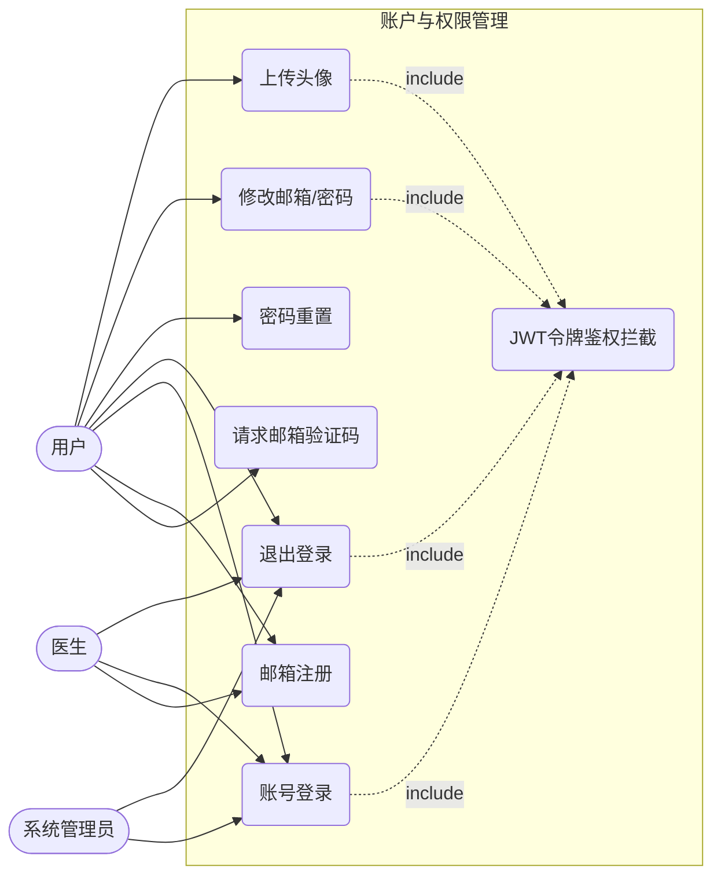
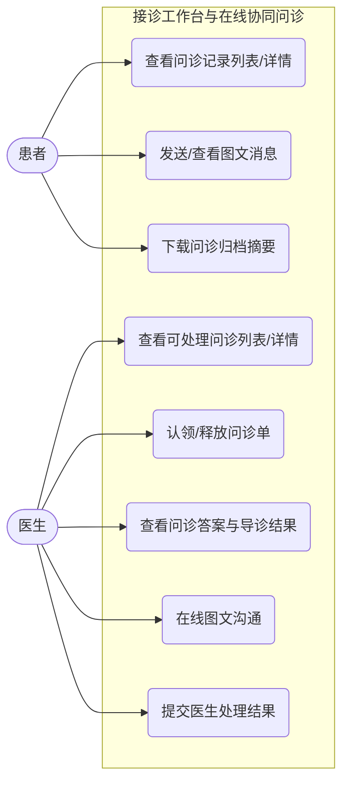
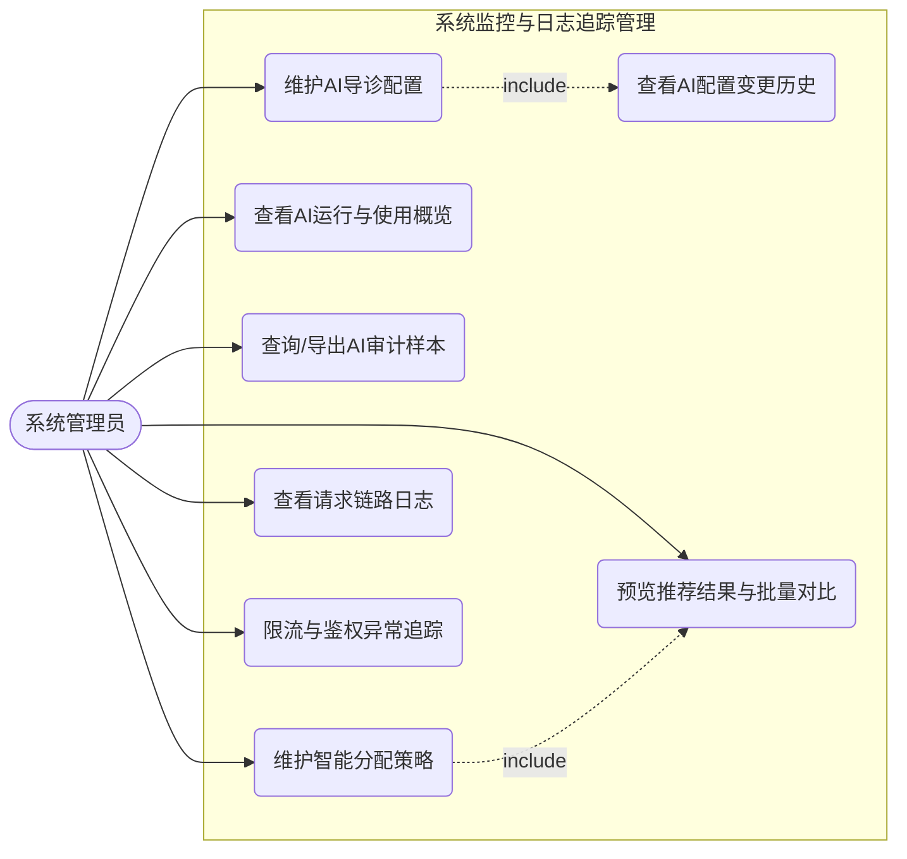
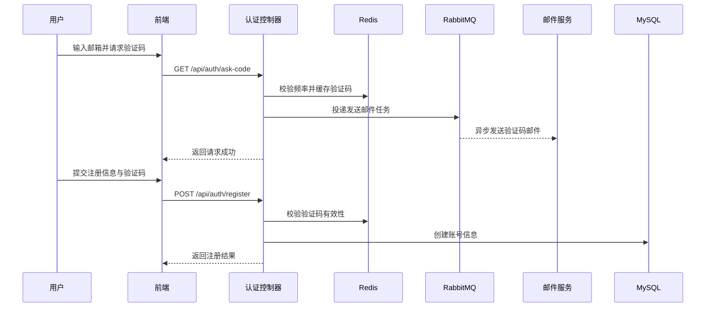
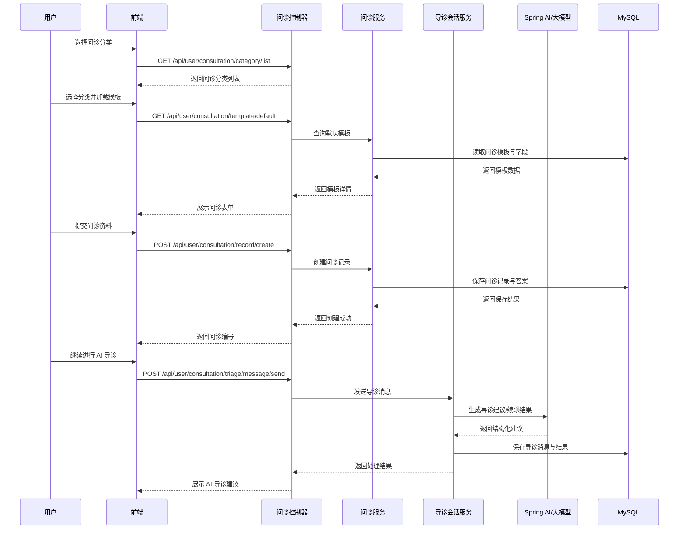
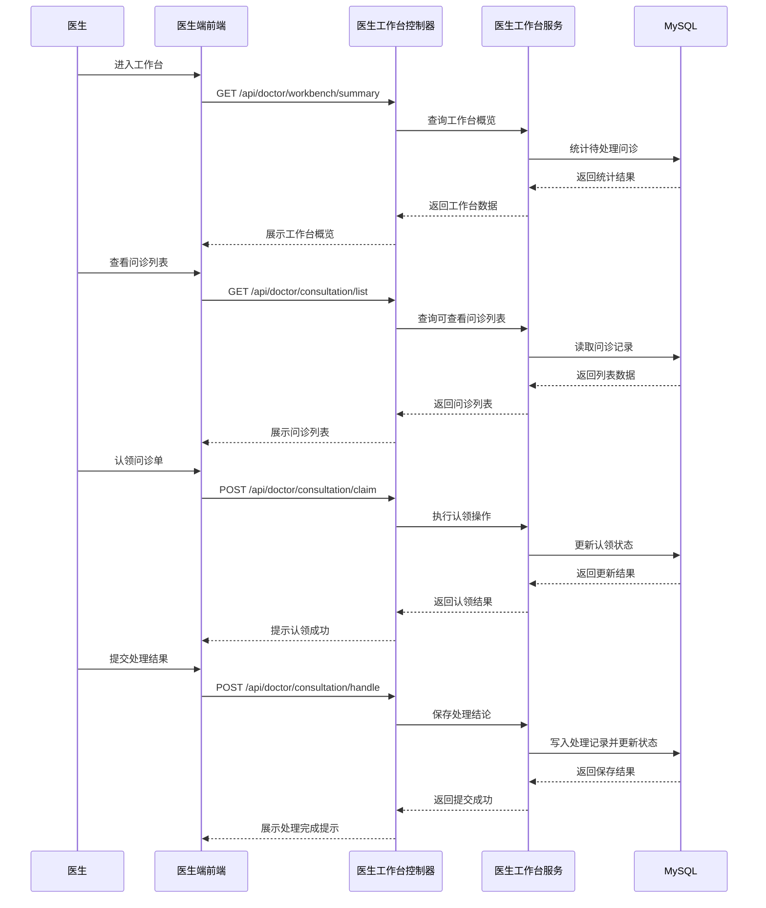
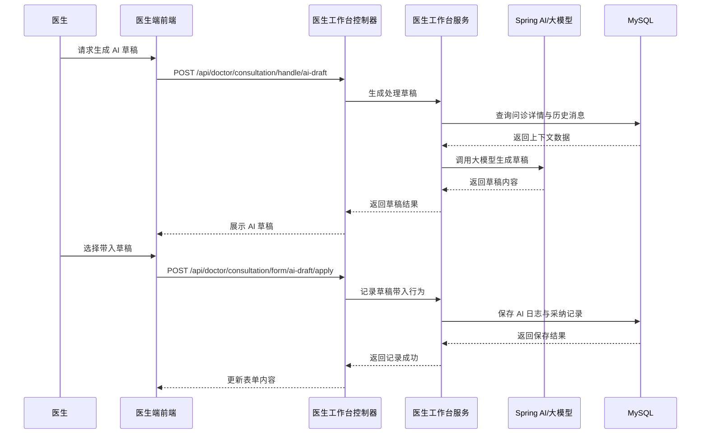
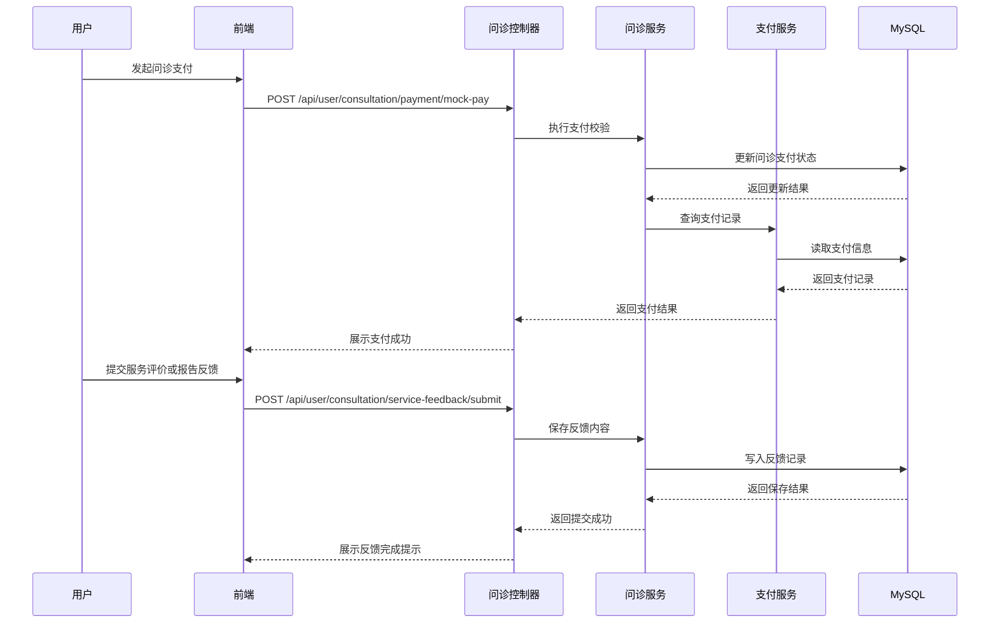
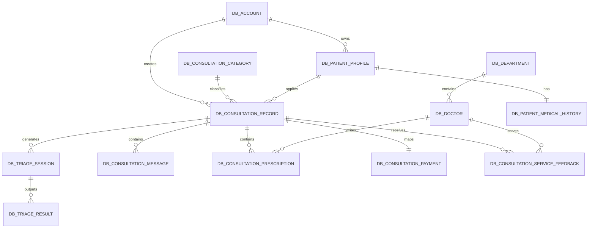

智能医疗问诊系统

摘 要

当前，随着人们健康意识的提高和医疗需求的增加，传统线下医疗机构面临着挂号难、候诊时间长以及医疗资源分配不均等问题，给患者就医带来了不便。同时，医生在诊疗过程中需要处理大量重复性的病历和问诊记录，工作负担繁重。为了解决上述问题，缓解线下就医压力并提高医生的诊疗效率，本文设计并实现了一套基于SpringBoot和Vue3框架的智能医疗问诊系统。

该智能医疗问诊系统主要实现了以下功能：在患者端，系统提供了在线问诊、费用支付、电子处方开具以及服务评价等功能，患者足不出户即可完成轻问诊流程，极大地提升了就医体验；在医生端，系统设计了专属的接诊工作台，支持智能分诊排班和患者追踪随访。同时，系统创造性地引入了AI辅助诊疗功能，包括AI患者病情匹配审查、AI问诊消息分析追踪、AI医生回复模板推荐以及AI病历上下文重写与字段重生成等。通过AI技术的深度赋能，系统能够自动提取和总结关键病情信息，大幅度减轻医生的文书工作负担，让医生将更多精力投入到核心诊疗环节。

本系统采用前后端分离的架构进行设计与实现。前端系统采用Vue3框架和Element-Plus组件库构建；后端采用SpringBoot3框架，结合Mybatis-Plus进行数据访问，使用SpringSecurity和JWT实现访问权限校验，并利用Redis和RabbitMQ中间件进行系统性能优化与异步任务处理。经过单元测试与集成测试，该系统各项功能运行稳定，达到了预期的设计目标。

关键词　智能医疗问诊系统；AI辅助诊疗；SpringBoot框架；Vue3；前后端分离

Intelligent Medical Consultation System

**Abstract**

At present, with the improvement of people's health awareness and the increase in medical demand, traditional offline medical institutions are facing problems such as difficulty in registration, long waiting times, and uneven distribution of medical resources, which have brought inconvenience to patients. At the same time, doctors have a heavy workload of handling a large number of repetitive medical records and consultation logs during the diagnosis and treatment process. In order to solve the above problems, alleviate the pressure of offline medical treatment, and improve the diagnosis and treatment efficiency of doctors, this paper designs and implements an intelligent medical consultation system based on the SpringBoot and Vue3 frameworks.

The intelligent medical consultation system mainly achieves the following functions. For patients, the system provides online consultation, payment processing, electronic prescription issuing, and service evaluation, allowing patients to complete primary care or online follow-up consultations without leaving home, which greatly improves the medical experience. For doctors, the system designs an exclusive consultation workspace that supports intelligent triage scheduling and patient follow-up. Meanwhile, the system innovatively introduces AI-assisted medical treatment functions, including AI patient condition matching review, AI consultation message analysis and tracking, AI doctor reply template recommendation, and AI medical record context rewriting and field regeneration. Empowered by AI technology, the system can automatically extract and summarize key condition information, drastically alleviating the documentation workload on physicians and allowing them to focus more energy on core diagnosis and treatment processes.

The system is designed and implemented using a front-end and back-end separation architecture. The front-end management system and user interface are built with the Vue3 framework and Element-Plus component library. The back-end adopts the SpringBoot3 framework, combined with Mybatis-Plus for data access, uses SpringSecurity and JWT for permission verification, and utilizes middleware such as Redis and RabbitMQ for performance optimization and asynchronous task processing. After unit testing and integration testing, the platform runs stably and fully achieves the expected design goals.

> **Keywords　**Intelligent medical consultation system, AI-assisted diagnosis, SpringBoot, Vue3, Front-end and back-end separation

# 绪论

## 课题目的和意义

### 课题目的

随着社会经济的快速发展和人们生活水平的不断提高，大众对医疗健康服务的需求日益增长，导致传统线下医疗资源面临巨大的压力。从我国现阶段医疗现状来看，优质医疗资源相对集中在大型三甲医院，并且分布不均，导致“看病难、看病贵”的问题依然存在。患者前往医院就诊往往需要花费大量时间在挂号、候诊、排队缴费等环节上，不仅降低了就医效率，更容易导致交叉感染的风险。同时，由于缺乏便捷的在线就医渠道，许多症状轻微的患者或需要慢性病复诊的患者依然需要线下跑医院。另一方面，对于医生而言，日常诊疗过程中需要处理大量重复的病历书写、患者病情询问以及复诊跟踪等繁杂的工作，严重占用了核心的诊疗时间，极大地增加了医生的工作负荷并降低了接诊效率。因此，本文旨在设计并实现一套基于SpringBoot和Vue的智能医疗问诊系统，旨在通过线上问诊的方式解决上述痛点，提高医疗服务的可及性和效率，并通过AI技术的引入进一步减轻医生的工作负担，具有十分重要的现实意义。

### 课题研究意义

当前，除了加强基层医疗卫生机构建设外，推广应用带有智能化和信息化特征的“互联网+医疗”服务是解决传统就医困难问题的重要途径^[1]。本文根据医疗问诊的实际场景调研和广大患者、医生的需求，提出了涵盖在线问诊、电子处方开具、智能分诊排班、患者回访追踪等多项核心功能的智能医疗问诊系统。基于本系统，患者可以直接在线上进行图文问诊并完成挂号支付，避免了传统线下漫长的“三长一短”体验，特别是对于轻症及复诊患者节省了大量的交通和时间成本；同时，药品还能结合电子处方直接生成，极大地便利了患者的后续治疗。此外，本系统创新性地引进了AI辅助诊疗模块，包括患者病情信息自动匹配分析、问诊消息语义追踪以及病历数据的AI提取和重写生成功能。这一举措从根本上改变了医生被动且繁重的手动文书撰写模式，能够帮助医生快速且精准地定位患者的病因，借助推荐的回复模板更高效地服务患者。这不仅充分提升了医生个人的工作效率，增加了医疗机构的社会和经济效益，同时也让患者体验到更加便捷、智慧、人性化的医疗服务。通过前后端分离的现代化架构，本系统实现了高并发下的稳定运行，使得传统问诊模式向更加高效的智能化、线上化转变，推动了智慧医疗在实际场景中的落地应用与发展。

## 国内外研究现状分析

### 国内研究现状分析

随着“健康中国”战略的深入推进和人工智能技术的跨越式发展，智能医疗问诊系统作为缓解医疗资源供需矛盾、提升诊疗效率的重要抓手，已成为国内学术界和产业界的研究热点。近年来，以深度学习和大语言模型为代表的新一代AI技术，正在深刻重塑传统医疗服务的模式与形态。下面简要介绍国内关于智能医疗问诊系统的研究现状。

在智能问诊系统的早期探索阶段，国内研究主要聚焦于基于规则和知识图谱的医疗问答系统构建[3]。研究者通过构建中医知识图谱、设计意图识别与命名实体识别模型，初步实现了对患者症状的自动化解析和分诊导诊功能[3]。这一时期的研究为后续智能化问诊系统的建设奠定了数据基础和技术框架，但受限于自然语言处理技术的瓶颈，系统对开放性问题和非结构化文本的理解能力较为有限。

近年来，随着深度学习技术的成熟和大语言模型的爆发式发展，智能医疗问诊系统的研究进入了全新阶段。国内学者围绕医疗垂类大模型的研发与应用展开了广泛探索，涌现出华佗GPT、MedGPT、灵医大模型、岐黄问道大模型等一批代表性成果。肖革新等系统梳理了医疗大模型在智能问诊、治疗流程优化等领域的应用现状，指出大模型技术正推动整个健康服务体系向更智能化的方向发展[6]。陈玲等从场景治理的视角出发，分析了生成式人工智能大模型在智能问诊助手、临床决策支持等场景中的应用梗阻与治理路径，强调高质量数据集供给和算法攻关的重要性[5]。这些研究表明，AI大模型已从辅助工具逐步演进为诊疗流程的核心驱动力。

在AI辅助诊疗的具体应用层面，国内研究呈现多元化发展态势。一方面，AI技术在医学影像分析、介入诊疗等领域的深度融合显著提升了诊断的精准度与效率[7]；另一方面，对话式人工智能在患者问诊、临床决策支持、健康科普等场景中的应用日益广泛[4]。吴玉奇的研究聚焦于基于大模型的中医问诊平台，探讨了AI在症状分析、方剂推荐及中医文献支持等方面的实现路径，为传统医学的智能化转型提供了有益参考[1]。申维玺等则从更宏观的视角综述了AI在临床医学中的应用进展，指出多模态大模型正成为推动精准医学发展的关键技术[2]。然而，当前研究也面临着数据隐私保护、算法透明度、伦理安全等多重挑战，亟需建立科学的评估范式与监管体系[4]。

综上所述，国内智能医疗问诊系统的研究已从初期的知识工程阶段迈入以大模型技术为驱动的智能化新阶段。尽管在技术落地和临床应用方面仍存在诸多挑战，但AI赋能医疗的前景已获得学界和产业界的广泛共识。本课题正是在这一背景下，探索将AI辅助诊疗功能深度融入在线问诊流程，力求在减轻医生文书负担、提升问诊效率方面实现技术突破。

[1] 吴玉奇.基于大模型的中医问诊平台研究综述[N].安徽科技报,2025-05-16(012).DOI:10.27992/n.cnki.nahkj.2025.000241.

[2] 申维玺，张　建.人工智能在临床医学中的应用进展[J].中国临床新医学,2026,19(1):1-5.

[3] 谭威.基于知识图谱的智能医疗问答及导诊系统的研究[D].上海交通大学,2022.DOI:10.27307/d.cnki.gsjtu.2022.000136.

[4] 廖委真,韩优莉,马骋宇.医疗健康领域中对话式人工智能的评估范式：系统综述[J].中国卫生政策研究,2025,18(07):78-86.

[5] 陈玲,孔文豪.生成式人工智能大模型的场景治理：以医疗大模型为例[J].当代经济管理,2026,48(04):40-52.DOI:10.13253/j.cnki.ddjjgl.2026.04.005.

[6] 肖革新,陈善吉,王博远,等.医疗大模型的应用现状与展望[J].中国数字医学,2025,20(02):39-45.

[7] 周寿军,彭永军,李茂全,等.介入医学影像联合人工智能诊疗方法研究进展[J].中国介入影像与治疗学,2025,22(09):609-612.DOI:10.13929/j.issn.1672-8475.2025.09.011.

### 国外研究现状分析

在国际层面，智能医疗问诊与AI辅助诊疗系统的研究起步较早，技术演进脉络清晰。从早期基于规则的专家系统，到深度学习驱动的智能诊断工具，再到当前以大语言模型为核心的新一代对话式医疗AI，国外研究始终引领着该领域的技术创新与应用范式变革。下面简要介绍国外关于智能医疗问诊系统的研究现状。

在技术演进的早期阶段，基于规则的专家系统曾主导医疗AI的研究方向。早期研究显示，医生对AI系统在常规咨询和行政任务中的应用价值持肯定态度，但对其处理复杂临床需求的能力仍存疑虑[4]。这一时期的研究为后续智能问诊系统的发展奠定了理念基础，但受限于知识工程的可扩展性，规则系统难以实现规模化应用。

近年来，随着深度学习技术的突破和大语言模型的涌现，国外智能医疗问诊研究进入了全新的发展阶段。2026年1月，OpenAI正式发布了ChatGPT Health，允许用户连接个人医疗记录和健康应用程序数据，实现个性化的医疗健康问答服务[1]。据统计，全球每周有超过2.3亿人向ChatGPT提出健康相关问题，患者端对AI工具的快速接纳，正在倒逼医疗系统重新审视AI辅助诊疗的定位与边界。

在临床预测与分析领域，大语言模型的应用取得了显著进展。Wang等学者利用结构化电子健康记录数据训练医疗大语言模型，在30天全因再入院预测、90天全因死亡率预测等临床任务中取得了优异表现，验证了大语言模型作为临床预测引擎的可行性[3]。

在AI辅助诊疗的具体应用层面，国外研究呈现出技术与临床深度融合的趋势。华盛顿大学医学院成立了计算与AI赋能影像科学中心，致力于开发基于AI的影像诊断工具，用于癌症、心血管疾病等多种疾病的精准诊疗[2]。此外，Philips公司协调的SHERPA研究联盟启动了七项临床研究，验证AI辅助技术在微创脑动脉瘤和肝脏肿瘤治疗中的价值[7]。这些实践表明，AI技术正从辅助工具演变为诊疗流程的核心驱动力。

然而，国外研究也揭示了当前技术的局限性。一项针对GPT-4o和Gemini 2.0在肺栓塞CTPA图像识别能力的基准测试发现，两种模型呈现出相反的诊断偏差，凸显了当前大语言模型在放射学诊断中的固有局限[8]。系统性综述指出，对话式AI在医疗场景中的应用面临共情能力不足、临床接受度差异等多重挑战[4]。

在评估范式与治理框架方面，国外学者提出了系统的思考。研究显示，全球已有58个国家的700项临床研究注册探索AI在诊断中的应用[5]。与此同时，学界呼吁建立科学的健康对话式AI质量评价指标体系，加强数据隐私保护和算法透明度建设[4][6]。

综上所述，国外智能医疗问诊系统的研究已从早期的规则系统阶段演进至以大语言模型和多模态AI为驱动的智能化新阶段。本课题正是在这一国际研究背景下，借鉴国外先进经验，探索将AI辅助诊疗功能深度融入在线问诊流程的技术路径与实现方案。

**参考文献**

[1] ATLAS. A watershed moment for AI agents in health care?[EB/OL]. (2026-01-26). 

[2] Siteman Cancer Center. New center to develop AI-based imaging tools to improve diagnosis, care[EB/OL]. (2025-11-03). 

[3] Wang Y, Dai Y, Wang R, et al. Integrating large language models for enhanced predictive analytics in healthcare[J]. npj Digital Medicine, 2026.

[4] 廖委真,韩优莉,马骋宇.医疗健康领域中对话式人工智能的评估范式：系统综述[J].中国卫生政策研究,2025,18(07):78-86.

[5] Wang Z H, Wei M Q, Yang G. Global trends and national strategies in clinical trials of AI for diagnosis[J]. International Journal of Surgery, 2026, 112(2): 5237-5239. 

[6] Frontiers in Medical Technology. IoMT–Fog–Cloud-based AI frameworks for chronic disease diagnosis[J/OL]. Front Med Technol, 2026. 

[7] Philips. SHERPA research consortium initiates seven clinical studies[EB/OL]. (2026-03-03). 

[8] National Institutes of Health. Benchmarking two leading large language models for pulmonary embolism identification on CT pulmonary angiography[J/OL]. Cureus, 2025, 17(9): e92719. 

## 论文的主要内容

本论文主要研究如何建设高效、智能化的线上医疗问诊系统解决方案。结合当前医疗痛点及信息化发展趋势，本文重点研究并实现以下几个方面的核心内容：

第一，AI导诊与医生侧智能辅助能力的工程化落地。系统将AI能力拆解为可独立执行、可追踪的业务单元。患者侧，导诊模块支持多轮会话追问，后端将患者答案、历史导诊记录及候选医生信息联合送入大模型，输出包含导诊总结、风险提示、建议就诊方式、补充追问要点的结构化结果。医生侧，系统提供处理意见草稿、随访计划草稿、沟通回复草稿三类AI生成能力，并记录医生对AI建议的采纳行为，为后续模型效果评估与迭代优化提供数据支撑。针对医疗场景中AI建议不得替代临床决策的合规要求，系统在提示词工程与输出结构中强制嵌入风险升级提示、线下就医建议及人工接管指引，确保AI输出在可用性、可控性与可审计性之间取得平衡。

第二，线上问诊全流程闭环的业务建模与实现。系统围绕真实就诊场景，构建了覆盖问诊前、问诊中、问诊后三阶段的完整业务链路。患者可选择问诊分类、加载动态问诊模板、提交资料、查看消息并继续补充。医生在工作台完成问诊认领/释放、病情处理、处方预览、随访记录和服务评价处理。患者端还支持问诊费用支付、导诊反馈、检查报告反馈、用药反馈与服务评价提交。系统提供问诊归档摘要的一键导出功能，便于医疗质量复盘与纠纷追溯。该闭环设计有效提升了线上问诊的流程连续性与业务可管理性。

第三，面向医疗场景的工程化架构与高可用设计。前端基于Vue3与Element-Plus构建组件化交互界面。后端采用SpringBoot3与MyBatis-Plus实现分层服务架构。安全方面，集成Spring Security与JWT实现无状态身份认证与角色鉴权。接口层引入基于Redis的滑动窗口限流与验证码时效校验机制，有效防御恶意请求与重复提交。异步任务通过RabbitMQ进行削峰解耦，避免AI生成、短信通知等耗时操作阻塞主业务链路。数据库层采用“初始化脚本 + 按日期增量升级脚本”的演进方式持续扩展导诊、派单、AI配置、支付与处方等数据表结构，使系统在功能快速迭代时仍保持可维护性和可回滚性。

# 系统需求分析

## 可行性论证

### 系统目标

本文设计并实现的智能医疗问诊系统，以“患者端便捷就医”和“医生端高效接诊”两条主线为目标，采用 SpringBoot3 与 Vue3 的前后端分离架构，构建覆盖问诊前、问诊中与问诊后的线上服务流程。患者端侧重于实现问诊分类选择、动态问诊模板填写、图文消息沟通、费用支付、导诊反馈与服务评价等能力；医生端侧重于实现工作台概览、问诊认领与释放、病情处理、处方预览、随访记录及归档导出等能力。在此基础上，系统引入 AI 导诊会话与医生侧 AI 草稿辅助能力，用于生成结构化导诊建议、补充追问要点和沟通草稿，降低重复性文本处理成本，并在风险场景下强化线下就医与人工接管提示，从而提升线上问诊的规范性与连续性。

### 可行性分析

#### 经济可行性分析

本系统的成本结构主要由服务器、数据库、对象存储与消息中间件等基础资源构成，整体可依托公有云按量付费模式进行弹性部署，避免一次性硬件投入过高。软件栈方面，项目采用 SpringBoot3、Vue3、MyBatis-Plus、Redis、RabbitMQ 等开源技术，减少商业授权支出，具备较好的实施性与扩展性。业务层面，系统已形成“线上发起问诊—医生处理—处方与随访—诊后反馈”的闭环流程，可减少线下重复挂号、重复问询与非必要现场就诊，提升医生单位时间内的有效处理量。综合建设成本与预期效益，项目在本科毕业设计范围内具有可执行的经济可行性。若该系统投入实际运营，其对挂号资源浪费的减少与医生单位时间产出效率的提升，可进一步转化为医疗机构的人力成本节约与服务容量扩展，具备长期的经济价值潜力。

#### 技术可行性分析

本系统后端基于 SpringBoot3 构建分层服务，结合 MyBatis-Plus 完成数据持久化与业务查询；前端采用 Vue3、Vue-Router、Axios 与 Element-Plus 实现页面组织与接口交互，技术路线成熟且学习资料完备，适合本科课题开发。安全与稳定性方面，系统已实现 Spring Security + JWT 的角色鉴权机制，并通过 Redis 实现验证码时效管理与接口限流，通过 RabbitMQ 完成异步任务解耦，降低主链路阻塞风险。数据库层采用“初始化脚本 + 增量升级脚本”方式迭代，能够支撑导诊、派单、处方、支付与评价等模块的持续演进。

在智能能力实现方面，系统通过 Spring AI 框架统一抽象层对接大模型API（如通义千问/文心一言/OpenAI），屏蔽不同厂商接口差异，已落地 AI 导诊建议生成、导诊会话追问、医生侧处理/随访/消息草稿生成等功能，并对输出结果进行结构化约束与风险提示控制，以保证结果可解释、可落库、可追踪。该方案避免了本地训练与部署大模型的高算力成本，同时满足毕业设计阶段对功能完整性与实现可行性的要求。综上，项目在技术选型、开发复杂度与实现路径上具有明确的技术可行性。

## 系统需求分析

### 系统功能需求概述

结合医疗就诊的实际业务流程以及系统实现范围，本文系统围绕“患者发起与补充—导诊分流—医生接诊处理—诊后随访反馈”的主链路展开，整体划分为账户与权限管理、就诊人/健康档案管理、问诊建档与导诊管理、医生工作台与在线协同问诊、AI辅助能力、处方与随访管理、支付与反馈以及后台运营审计与日志追踪七类功能模块，现对各模块需求做简要归纳如下：

1．账户与权限角色管理功能

本系统采用基于角色的访问控制策略，主要划分为系统管理员、医生与普通用户三类角色。系统提供邮箱验证码注册、登录态鉴权与密码重置等基础能力，并支持用户侧基础资料维护（如修改邮箱、修改密码）。后端通过 Spring Security 与 JWT 的无状态鉴权机制，在过滤器链路对接口访问进行统一校验与权限隔离，保障问诊数据在不同角色之间的访问边界。

2．就诊人/健康档案管理功能

为适配“一账号管理多位就诊人”的常见场景，系统提供就诊人档案维护能力，并支持用户对就诊人的健康档案与病史信息进行补充与更新。该模块为后续问诊建档、导诊评估与医生接诊提供结构化底座数据，避免患者在每次问诊中重复填写基础信息。

3．问诊建档与导诊管理功能

患者侧支持选择问诊分类、读取对应动态问诊模板并提交问诊资料，系统形成可追踪的问诊记录。导诊环节在规则评估结果的基础上，可在启用 AI 时生成导诊总结与风险提示，并支持患者在同一导诊会话中继续补充信息与接受追问，从而为后续医生接诊提供更完整的背景信息。

4．医生工作台与在线协同问诊功能

医生侧提供工作台概览与问诊列表/详情查询能力，支持对问诊单进行认领与释放，并在接诊过程中完成图文消息沟通、病情处理结果提交与问诊归档摘要导出。该模块强调对问诊处理过程的状态化管理与信息聚合展示，使医生能够在一个工作台内完成从接手到闭环的关键操作。

5．AI辅助能力功能

系统在导诊与医生接诊链路中引入 AI 辅助能力：导诊侧可生成结构化导诊建议与补充追问要点；医生侧可生成处理表单草稿、随访草稿与沟通消息草稿，并记录医生对 AI 草稿的带入/采纳行为，便于后续统计分析与审计复核。为降低医疗场景风险，系统在提示词与输出结构中对风险升级、线下就医建议与人工接管提示进行约束，保证 AI 输出可解释、可追踪。

6．处方与随访管理功能

医生端支持药品选项查询与处方明细维护，并在提交前提供处方禁忌与联用风险预览能力，提示单药注意事项及潜在相互作用风险，降低用药不合理的概率。问诊结束后，系统支持随访记录维护与随访草稿生成，形成诊后连续管理的结构化补充信息。

7．支付与反馈、后台运营审计与日志追踪功能

系统提供问诊费用支付记录能力，并支持导诊反馈、服务评价、检查报告反馈与用药反馈等多维度数据回收，为服务质量评估与流程改进提供依据。后台侧提供导诊配置与变更历史、AI 导诊运行概览与输出审计样本导出、智能分配策略配置与预览等运营功能；同时通过请求日志与全链路唯一请求标识记录关键访问与响应信息，支撑问题定位与安全追踪。

### 系统功能需求分析

#### 账户与权限管理

账户与权限管理模块是整个系统安全运行的基础保障，采用基于角色的访问控制（RBAC）策略，将用户划分为系统管理员、认证医生和普通患者三类角色，各角色拥有严格隔离的操作权限边界。

**用户侧功能**：支持邮箱验证码注册与密码重置，并通过统一登录接口完成认证；登录成功后服务端签发 JWT 令牌，前端在后续请求中携带令牌完成无状态访问控制。用户可在个人中心修改邮箱、修改密码，并支持上传头像等基础资料维护能力。

**医生侧功能**：医生使用账号登录后进入医生端工作台，可查看本人可处理的问诊列表与详情，完成问诊认领/释放、图文沟通、处理结果提交、随访记录提交等核心操作，并可查询排班列表与可用药品选项。

**管理员侧功能**：管理员主要负责维护基础业务数据与运营策略，包括科室、医生档案与账号绑定选项、医生排班、导诊知识与字典、红旗规则、问诊模板、药品目录、AI 配置与审计、智能分配策略等。

系统后端基于 SpringSecurity 框架与 JWT 无状态令牌机制，在请求链路的过滤器层对每次接口调用进行角色鉴权拦截，防止越权访问，确保患者医疗隐私数据的访问安全边界。账户与权限管理功能的用例图如图2-1所示：

图2-1 账户与权限管理用例图

#### 就诊人/问诊建档与导诊管理

本模块覆盖患者侧“就诊人信息维护—问诊资料提交—导诊评估与推荐”的关键流程。系统支持同一账号维护多位就诊人档案及其健康档案/病史信息，在发起问诊时由患者选择就诊人并填写问诊模板，从而形成结构化问诊答案，为导诊评估与医生接诊提供统一的数据基础。

在导诊评估方面，系统首先基于已配置的导诊字典、红旗规则与分诊等级策略对问诊资料进行规则化评估，并生成导诊结果、风险提示与候选医生列表；在启用 AI 时，系统可进一步生成结构化导诊建议与补充追问要点，并支持患者继续在导诊会话中补充信息，形成多轮导诊记录。患者可查看导诊结果与推荐医生，并提交导诊反馈，作为规则与模型效果评估的依据。就诊人/问诊建档与导诊管理功能的用例图如图2-2所示：

图2-2 就诊人/问诊建档与导诊管理用例图

#### 接诊工作台与在线协同问诊

接诊工作台与在线协同问诊模块是系统医患交互的核心通道，是整个问诊业务流程的主体执行环节。该模块为医患双方提供了一个高度专业化的在线协同工作空间，打通了从问诊申请、接诊处理到实时沟通、问诊结束的完整流程链路。

**患者端**：患者可查询个人问诊记录与详情，并在问诊会话中与医生进行图文沟通；当启用 AI 导诊时，患者也可在导诊会话中继续补充信息。系统支持导出问诊归档摘要，便于患者留存与复盘。

**医生端**：医生工作台提供问诊列表与详情视图，支持对问诊单进行认领与释放，并在接诊过程中查看患者问诊答案、导诊结果与沟通消息，完成处理结果提交与归档导出。系统提供消息列表与发送接口，支持医生在同一问诊记录下完成持续沟通。接诊工作台与在线协同问诊功能的用例图如图2-3所示：

图2-3 接诊工作台与在线协同问诊用例图

#### AI辅助能力

AI 辅助能力模块用于在导诊与医生接诊环节提供可解释、可约束的生成式辅助，减少医生在重复性文本整理与沟通回复上的时间成本，同时为导诊信息补全提供结构化支持。本系统采用 Spring AI 对接大模型服务，在后端以结构化输出约束 AI 结果形态，确保输出可落库、可追踪。

**AI 导诊建议生成与多轮追问**：系统基于问诊记录、问诊答案、历史导诊消息与候选医生列表生成导诊总结、风险提示、建议就诊方式与补充追问要点，并支持患者继续发送补充信息以推进导诊会话。

**医生侧 AI 草稿生成**：医生可在接诊工作台中触发 AI 生成三类草稿，包括医生处理表单草稿、随访表单草稿与沟通消息草稿，并可记录“草稿带入/采纳”行为，形成后续使用分析与效果评估的依据。

**AI 配置与审计**：管理员可维护 AI 导诊配置及变更历史，查看 AI 运行概览与医生侧 AI 使用概览，并导出审计样本用于复核与治理。AI辅助能力功能的用例图如图2-4所示：

图2-4 AI辅助能力用例图

#### 电子处方与随访管理

电子处方与随访管理模块用于承接医生在问诊处理后的用药建议与复诊随访信息沉淀。系统支持医生端维护处方明细，并在提交前提供用药风险预览能力；随访部分支持医生记录复诊随访信息，形成问诊后的连续管理补充。

**电子处方与风险预览**：医生可查询可用药品选项并维护处方条目，在提交前系统基于药品注意事项与联用相互作用规则进行预览，输出单药提示与联用禁忌提示，若检测到不可联用风险则阻止提交；处方保存后，患者可在问诊详情中查看处方清单。

**随访记录**：医生可在问诊结束后提交随访记录，系统按问诊维度保留随访历史，并支持结合 AI 生成随访草稿，便于医生快速整理随访要点。电子处方与随访管理功能的用例图如图2-5所示：

图2-5 电子处方与随访管理用例图

#### 计费与评价反馈管理

计费与评价反馈管理模块统一管控系统内全部金额流转与服务质量评价链路，是系统商业闭环与质量管控的关键保障模块。本模块的设计原则是"收费透明、流程可溯、评价真实"，确保平台在商业运营层面的可持续性与可信度。

**计费管理**：系统对问诊费用提供支付记录与状态查询能力，并在当前实现中提供模拟支付接口用于前后端联调与流程演示。支付信息与问诊记录关联保存，便于在问诊列表与详情页展示支付状态与费用信息。

**评价反馈**：系统支持患者提交多类反馈数据，包括导诊反馈、问诊服务评价、检查报告反馈与用药反馈等。医生端支持对服务评价进行处理与回复，管理员可在后台侧汇总查看相关数据，为服务质量改进与流程优化提供依据。计费与评价反馈管理功能的用例图如图2-6所示：

图2-6 计费与评价反馈管理用例图

#### 系统监控与日志追踪管理

系统监控与日志追踪管理模块承担整个智能医疗问诊平台的底层运维配置与业务链路安全追查职能，是保障平台合规运营与稳定运行的基础设施层模块，主要面向系统管理员使用。

**AI配置与审计治理**：系统支持管理员维护 AI 导诊配置与变更历史，查看 AI 导诊运行概览与医生侧 AI 使用概览，并提供 AI 输出审计样本查询与导出能力，便于对高风险样本进行复核与治理。

**智能分配策略维护**：系统提供智能分配策略的参数配置，并支持对指定问诊样本进行推荐结果预览与批量对比，便于运营侧在不影响线上数据的情况下进行策略调优。

**请求链路日志与异常追踪**：系统在过滤器层为每次请求生成全链路唯一标识并记录请求路径、参数、用户身份与响应耗时；同时对鉴权失败、越权访问、参数校验失败等场景进行统一错误响应，便于问题定位与追溯。

系统监控与日志追踪管理功能的用例图如图2-7所示：

图2-7 系统监控与日志追踪管理用例图

### 其它非功能需求分析

#### 系统性能需求分析

本系统面向线上问诊场景，核心链路包括：患者侧问诊记录/消息查询、导诊会话交互、医生侧工作台列表与详情读取、处方风险预览与提交，以及管理员侧配置查询与导出。性能目标强调“高频接口快速响应、AI接口可感知等待、突发流量可控降级”，以保障问诊沟通的连续性与可用性。

**接口响应时延目标**：对问诊列表、问诊详情、消息列表、基础资料等高频接口，应保持稳定的快速响应，目标控制在 500ms 以内；对导诊建议生成、导诊会话续聊、医生端 AI 草稿生成等依赖外部大模型推理的接口，允许更长处理时间，目标控制在 30s 以内，并在前端给出明确的加载状态与失败重试提示，避免用户误判系统卡死。

**并发与限流需求**：考虑到验证码请求、登录、消息轮询等接口可能出现突发访问，系统应提供基于缓存的限流与封禁策略，对同一来源在时间窗口内的访问频率进行控制；当触发限流时返回明确提示信息，保证正常问诊请求不被异常流量挤占。

**异步处理需求**：对邮箱验证码发送等非核心同步任务，通过消息队列异步投递并由后台消费者处理，避免邮件发送耗时阻塞主链路接口响应，从而提升登录/注册等入口流程的整体体验。

#### 系统安全性需求分析

医疗信息系统对数据安全有极高要求，本系统在身份认证、接口鉴权和数据访问三个层面均有具体的安全实现。

**身份认证与会话安全**：系统采用基于 JWT 的无状态认证机制，登录成功后签发带有效期的访问令牌；服务端对令牌的合法性与有效期进行校验，并在退出登录时使令牌立即失效，例如将失效令牌写入缓存黑名单，降低令牌泄露后的持续滥用风险。

**角色权限隔离**：系统按管理员、医生、普通用户三类角色划分访问边界，后台运维与配置类接口、医生接诊类接口与患者问诊类接口相互隔离；对未认证访问与越权访问返回标准化错误响应，避免横向越权导致的患者隐私泄露。

**医疗数据最小权限**：问诊记录、导诊会话、处方、随访与评价等数据均与具体账号/医生绑定，接口需校验“是否属于当前访问主体”后再返回数据，确保医生只能查看授权范围内的问诊，患者只能查看本人名下的问诊与就诊人资料。

**文件存储与访问控制**：患者上传的病历/检查图片等文件在上传时进行格式与大小校验，并存入对象存储；对外访问通过后端代理路径获取，避免将底层存储地址直接暴露给前端，从而降低被直接扫描与越权下载的风险。

**输入校验与异常处理**：系统对关键业务入参进行统一校验，避免非法参数造成数据异常；同时对异常场景采用统一返回结构，便于前端统一处理并减少信息泄露风险。

#### 系统易用性需求分析

系统易用性需求主要面向患者快速上手、医生高效处理与开发联调便捷三个目标。

**界面与交互一致性**：前端界面保持统一的视觉规范与交互反馈，关键流程包括选择问诊分类与模板、提交问诊资料、查看导诊建议、图文沟通、医生提交处理、处方预览、随访与评价等，并具备清晰入口与状态提示，减少用户学习成本。

**流程可理解性**：对耗时操作如 AI 导诊生成、医生端 AI 草稿生成、图片上传与导出下载等提供明确的加载状态与完成提示；对失败场景给出可执行的提示信息，如重新提交、稍后重试、检查网络，避免用户重复操作或中断流程。

**开发联调便利性**：系统提供接口文档与在线调试能力，便于前后端联调；同时保持统一的返回结构与错误码约定，减少前端对不同接口的差异化处理，提高迭代效率。

#### 系统可维护性和可拓展性需求分析

系统可维护性与可扩展性需求强调“模块解耦、配置外置、结构可演进”。

**分层与模块化设计**：系统按照前后端分离与后端分层架构实现，控制层负责接口与参数绑定，业务层承载问诊、导诊、处方、随访与运营配置等核心逻辑，数据访问层聚焦持久化查询；通过明确的职责边界降低跨模块耦合，便于在不影响主链路的前提下扩展新功能，例如新增导诊规则、扩展反馈类型、增加新的运营统计口径。

**AI能力可配置与可治理**：AI 能力通过统一接入层对接外部大模型服务，关键参数包括启用开关、提示词版本、候选医生数量、审计抽样策略等，可在后台配置并保留变更历史；同时提供运行概览与审计导出，便于对高风险样本进行复核，满足医疗场景对“可解释、可追踪、可审计”的要求。

**数据库可演进性**：系统在迭代过程中持续扩展导诊、派单、消息、支付、处方与反馈相关的数据表，数据库结构需支持按版本升级与兼容，保证开发环境、测试环境与部署环境之间的结构一致性，降低上线过程中的数据迁移风险。

**运行配置可运维性**：系统关键参数包括限流阈值、消息队列、对象存储、AI 接入与安全参数等，通过配置文件与环境变量进行外部化管理，支持按环境差异灵活调整，满足开发调试与生产部署的不同需求。

## 本章小结

本章对智能医疗问诊系统进行了完整的需求分析。在可行性论证方面，从经济可行性与技术可行性两个维度论证了本系统研发的可执行性，其中开源技术栈降低授权成本、按量资源部署可控，且采用 SpringBoot3、Vue3 与 Spring AI 的工程化组合具备明确落地路径。在功能需求分析方面，结合系统实际实现的功能模块划分、导诊评估与会话交互、医生工作台接诊处理等业务功能，以及后台侧的医生与基础数据维护、AI 配置与审计、智能分配策略管理等运营管理功能，将系统功能按业务链路分解为账户与权限管理、就诊人/问诊建档与导诊管理、接诊工作台与在线协同问诊、AI辅助能力、电子处方与随访管理、计费与评价反馈管理、系统监控与日志追踪管理七大模块，并以 Mermaid 用例图对各模块的角色与功能边界进行了呈现。在非功能需求方面，结合项目中已落地的限流、鉴权、链路日志、文件存储与邮件异步等能力，从性能、安全性、易用性和可维护性四个维度给出质量目标，为后续系统设计章节的展开提供依据。

# 系统设计

## 系统概要设计

### 系统体系结构设计

本系统采用前后端分离的 B/S 架构，整体由前端表现层、后端业务服务层、数据存储层以及外部支撑服务四部分构成。前端以 Vue3、Vite 和 Element-Plus 为核心技术栈，分别面向普通用户、医生与管理员提供多角色工作台页面，实现登录注册、导诊问诊、医生接诊、后台配置等业务交互。前端通过 Axios 统一封装网络请求，并结合 Vue-Router 完成不同角色路由划分和页面跳转控制。

后端采用 SpringBoot3 作为核心开发框架，以 Spring Security + JWT 完成身份认证与角色鉴权，以 MyBatis-Plus 实现数据持久化访问，并按 Controller、Service、Mapper 分层组织系统代码。控制层主要负责接口暴露、参数接收与结果返回；业务层承担问诊建档、导诊评估、医生处理、处方随访、反馈回收、后台配置等核心业务逻辑；数据访问层则负责实体对象与数据库表之间的映射和读写操作。该分层结构能够有效降低模块耦合度，便于后续功能扩展与维护。

在支撑组件方面，系统使用 MySQL 保存账号、医生、就诊人、问诊记录、导诊结果、处方、反馈等核心业务数据；使用 Redis 存储验证码、限流状态及令牌失效信息，提高系统访问效率与安全性；使用 RabbitMQ 处理邮件验证码发送等异步任务，避免耗时操作阻塞主业务流程；使用 MinIO 存储患者上传的病历图片、检查附件等文件资源；通过 Spring AI 对接外部大模型服务，实现 AI 导诊初次建议生成、导诊会话续聊以及医生侧处理草稿、随访草稿、消息草稿生成等智能能力。系统总体架构如图3-1所示。

图3-1 系统总体架构图

### 系统功能结构设计

按照系统的功能需求分析结果，并结合模块化程序设计思想，本文设计的智能医疗问诊系统主要由七个核心功能模块组成，即账户与权限管理模块、就诊人及健康档案管理模块、问诊建档与导诊管理模块、医生工作台与在线协同问诊模块、AI 辅助能力模块、处方与随访管理模块，以及支付反馈与后台运营管理模块。各模块既相对独立，又通过问诊记录、导诊会话、医生处理结果等关键业务对象实现数据关联，共同构成完整的线上医疗问诊服务闭环。

其中，账户与权限管理模块负责用户注册登录、验证码校验、角色鉴权与基础资料维护；就诊人及健康档案管理模块负责维护患者本人及家庭成员的就诊信息和病史档案；问诊建档与导诊管理模块负责问诊分类选择、动态模板填写、导诊会话交互与导诊结果生成；医生工作台与在线协同问诊模块用于支撑医生认领问诊、查看详情、图文沟通和提交处理结论；AI 辅助能力模块面向患者导诊和医生接诊两个场景提供智能建议与草稿生成，具体包括 AI 导诊建议、导诊续聊、医生处理草稿、随访草稿和回复草稿；处方与随访管理模块负责药品选择、处方预览、随访记录和诊后管理；支付反馈与后台运营管理模块则涵盖问诊支付、服务评价、报告回传、用药反馈以及管理员对科室、医生、规则、模板、AI 配置等内容的维护。系统的功能结构如图3-2所示：

### 系统时序图设计

系统时序图用于描述系统中各参与对象在典型业务场景下的交互过程。结合本项目的实现内容，本文选取注册验证、问诊建档、AI 导诊、医生接诊处理以及诊后支付反馈等典型流程进行设计，以展示系统在不同模块之间的数据传递关系和业务执行顺序。

#### 用户注册与验证码发送时序图

当用户首次使用系统时，需要先输入邮箱并请求验证码。后端在完成频率校验后，将验证码写入缓存，并通过消息队列异步触发邮件发送服务，待用户输入验证码和注册信息后，再完成账号创建。该过程既保证了注册安全性，也避免了邮件发送阻塞主链路。用户注册与验证码发送时序图如图3-2所示。

图3-2 用户注册与验证码发送时序图

#### 问诊建档与 AI 导诊时序图

用户选择问诊分类后，系统先加载对应的默认问诊模板，待用户填写问诊资料并提交后生成问诊记录。随后用户可以继续进入 AI 导诊会话，系统结合历史问答、模板答案与导诊上下文调用大模型生成初始建议或续聊结果，并将导诊消息及结果落库，供后续医生查看。问诊建档与 AI 导诊时序图如图3-3所示。

图3-3 问诊建档与 AI 导诊时序图

#### 医生认领与接诊处理时序图

问诊单创建完成后，医生可以在工作台中查看可处理的问诊列表，并对目标问诊单进行认领。认领成功后，医生进入问诊详情页查看患者资料和历史消息，在完成沟通后提交处理结果、诊断建议或处理意见，系统同步更新问诊状态。医生认领与接诊处理时序图如图3-4所示。

图3-4 医生认领与接诊处理时序图

#### 医生侧 AI 草稿生成时序图

为提升医生文书处理效率，系统在接诊环节提供处理草稿、随访草稿和消息草稿三类 AI 辅助能力。医生在问诊详情页发起草稿生成请求后，后端会整理患者问诊资料、既往消息和当前上下文信息，通过 Spring AI 调用大模型生成建议文本，再返回给医生进行人工审核与带入。医生侧 AI 草稿生成时序图如图3-5所示。

图3-5 医生侧 AI 草稿生成时序图

#### 问诊支付与诊后反馈时序图

在医生完成接诊后，用户可以对问诊订单进行支付，并在服务结束后提交导诊反馈、服务评价、检查报告反馈或用药反馈。系统在支付成功后更新问诊支付状态，在反馈提交后写入对应业务表，为后续质量评估和运营分析提供数据支撑。问诊支付与诊后反馈时序图如图3-6所示。

图3-6 问诊支付与诊后反馈时序图

## 系统功能模块设计

系统功能模块设计是在前文功能需求分析和功能结构设计的基础上，对系统各核心模块的职责边界、主要功能和实现方式进行进一步细化。结合项目实际实现内容，本文将系统进一步细分为首页展示、账户与权限、个人资料与图片上传、就诊人管理、健康档案管理、问诊建档、AI 导诊、问诊记录与消息、医生工作台与接诊处理、医生 AI 辅助与回复模板、处方与随访、支付与评价反馈、后台运营管理等十三个功能模块。

### 首页展示模块设计

首页展示模块主要面向未登录用户和普通访问者，用于展示平台首页聚合信息，包括推荐医生、首页案例、科室入口和平台概览等内容，为用户进入系统后的问诊、导诊与医生浏览提供统一入口。首页展示模块接口设计表如表3-7所示：

表3-7 首页展示模块接口设计表

| 接口名 | 请求路径 | 传入参数 | 传出参数 |
|:-------|:---------|:---------|:---------|
| landing | `/api/homepage/landing` | `void` | `RestBean<HomepageLandingVO>` |

### 账户与权限管理模块设计

账户与权限管理模块主要负责用户注册、登录认证、密码重置、验证码校验以及不同角色登录后的访问控制，是整个系统的统一身份入口。系统采用 Spring Security 和 JWT 实现无状态鉴权，并通过角色区分普通用户、医生和管理员三类访问主体。账户与权限管理模块接口设计表如表3-8所示：

表3-8 账户与权限管理模块接口设计表

| 接口名 | 请求路径 | 传入参数 | 传出参数 |
|:-------|:---------|:---------|:---------|
| askVerifyCode | `/api/auth/ask-code` | `email,type` | `RestBean<Void>` |
| register | `/api/auth/register` | `EmailRegisterVO` | `RestBean<Void>` |
| login | `/api/auth/login` | `username,password` | `RestBean<AuthorizeVO>` |
| resetConfirm | `/api/auth/reset-confirm` | `ConfirmResetVO` | `RestBean<Void>` |
| resetPassword | `/api/auth/reset-password` | `EmailResetVO` | `RestBean<Void>` |
| logout | `/api/auth/logout` | `token` | `RestBean<Void>` |

### 个人资料与图片上传模块设计

个人资料与图片上传模块主要用于用户资料维护与头像、图片资源上传。用户可查询当前登录账号信息、修改邮箱与密码，并上传头像或业务图片。该模块为个人中心、问诊资料补充和平台图片资源管理提供支持。个人资料与图片上传模块接口设计表如表3-9所示：

表3-9 个人资料与图片上传模块接口设计表

| 接口名 | 请求路径 | 传入参数 | 传出参数 |
|:-------|:---------|:---------|:---------|
| me | `/api/user/me` | `token` | `RestBean<AccountInfoVO>` |
| changeEmail | `/api/user/change-email` | `ChangeEmailVO` | `RestBean<Void>` |
| changePassword | `/api/user/change-password` | `ChangePasswordVO` | `RestBean<Void>` |
| uploadAvatar | `/api/image/avatar` | `MultipartFile` | `RestBean<String>` |
| uploadCacheImage | `/api/image/cache` | `MultipartFile` | `RestBean<String>` |

### 就诊人管理模块设计

就诊人管理模块用于维护患者本人及家庭成员的基础就诊信息，支持一个账号维护多个就诊人，便于在家庭问诊场景下复用基础资料。该模块的设计使后续问诊建档能够直接选择既有就诊人信息。就诊人管理模块接口设计表如表3-10所示：

表3-10 就诊人管理模块接口设计表

| 接口名 | 请求路径 | 传入参数 | 传出参数 |
|:-------|:---------|:---------|:---------|
| patientList | `/api/user/patient/list` | `token` | `RestBean<List<PatientProfileVO>>` |
| patientCreate | `/api/user/patient/create` | `PatientProfileCreateVO` | `RestBean<Void>` |
| patientUpdate | `/api/user/patient/update` | `PatientProfileUpdateVO` | `RestBean<Void>` |
| patientDelete | `/api/user/patient/delete` | `patientId` | `RestBean<Void>` |

### 健康档案管理模块设计

健康档案管理模块主要维护与就诊人对应的病史、过敏史、慢病史、手术史、家族史及妊娠哺乳状态等健康信息，为 AI 导诊和医生接诊提供更完整的病情背景。健康档案管理模块接口设计表如表3-11所示：

表3-11 健康档案管理模块接口设计表

| 接口名 | 请求路径 | 传入参数 | 传出参数 |
|:-------|:---------|:---------|:---------|
| historyList | `/api/user/medical-history/list` | `token` | `RestBean<List<PatientMedicalHistoryVO>>` |
| historyDetail | `/api/user/medical-history/detail` | `patientId` | `RestBean<PatientMedicalHistoryVO>` |
| historySave | `/api/user/medical-history/save` | `PatientMedicalHistorySaveVO` | `RestBean<Void>` |
| historyDelete | `/api/user/medical-history/delete` | `patientId` | `RestBean<Void>` |

### 问诊建档模块设计

问诊建档模块用于支撑患者发起正式问诊流程。用户先查询可用问诊分类，再读取默认问诊模板，填写问诊资料后生成问诊记录。该模块是患者进入业务主链路的起点。问诊建档模块接口设计表如表3-12所示：

表3-12 问诊建档模块接口设计表

| 接口名 | 请求路径 | 传入参数 | 传出参数 |
|:-------|:---------|:---------|:---------|
| categoryList | `/api/user/consultation/category/list` | `void` | `RestBean<List<ConsultationEntryCategoryVO>>` |
| templateDefault | `/api/user/consultation/template/default` | `categoryId` | `RestBean<ConsultationIntakeTemplateVO>` |
| recordCreate | `/api/user/consultation/record/create` | `ConsultationRecordCreateVO` | `RestBean<Void>` |

### AI 导诊模块设计

AI 导诊模块是患者侧智能能力的核心体现。用户在问诊前或问诊中可继续发送导诊消息，系统根据症状描述、模板答案和历史上下文调用大模型生成导诊建议、补充追问和风险提示，同时支持导诊反馈收集。AI 导诊模块接口设计表如表3-13所示：

表3-13 AI 导诊模块接口设计表

| 接口名 | 请求路径 | 传入参数 | 传出参数 |
|:-------|:---------|:---------|:---------|
| triageMessageSend | `/api/user/consultation/triage/message/send` | `ConsultationTriageMessageSendVO` | `RestBean<Void>` |
| triageFeedbackSubmit | `/api/user/consultation/feedback/submit` | `ConsultationTriageFeedbackSubmitVO` | `RestBean<Void>` |
| feedbackOptions | `/api/user/consultation/feedback/options` | `void` | `RestBean<ConsultationFeedbackOptionsVO>` |

### 问诊记录与消息模块设计

问诊记录与消息模块主要用于患者侧查看问诊单、问诊详情、消息记录和归档摘要，并支持继续与医生进行图文沟通。该模块保证用户能够持续跟踪当前问诊进度。问诊记录与消息模块接口设计表如表3-14所示：

表3-14 问诊记录与消息模块接口设计表

| 接口名 | 请求路径 | 传入参数 | 传出参数 |
|:-------|:---------|:---------|:---------|
| recordList | `/api/user/consultation/record/list` | `token` | `RestBean<List<ConsultationRecordVO>>` |
| recordDetail | `/api/user/consultation/record/detail` | `recordId` | `RestBean<ConsultationRecordVO>` |
| archiveExport | `/api/user/consultation/record/archive/export` | `recordId` | `txt文件/RestBean` |
| messageList | `/api/user/consultation/message/list` | `recordId` | `RestBean<List<ConsultationMessageVO>>` |
| messageSend | `/api/user/consultation/message/send` | `ConsultationMessageSendVO` | `RestBean<Void>` |

### 医生工作台与接诊处理模块设计

医生工作台与接诊处理模块主要服务于医生角色，用于支撑医生查看工作台概览、查询问诊列表、认领或释放问诊单、查看问诊详情、发送消息和提交处理结论。该模块是医生端最核心的业务模块。医生工作台与接诊处理模块接口设计表如表3-15所示：

表3-15 医生工作台与接诊处理模块接口设计表

| 接口名 | 请求路径 | 传入参数 | 传出参数 |
|:-------|:---------|:---------|:---------|
| workbenchSummary | `/api/doctor/workbench/summary` | `token` | `RestBean<DoctorWorkbenchVO>` |
| consultationList | `/api/doctor/consultation/list` | `token` | `RestBean<List<AdminConsultationRecordVO>>` |
| consultationDetail | `/api/doctor/consultation/detail` | `id` | `RestBean<AdminConsultationRecordVO>` |
| consultationClaim | `/api/doctor/consultation/claim` | `DoctorConsultationAssignSubmitVO` | `RestBean<Void>` |
| consultationRelease | `/api/doctor/consultation/release` | `DoctorConsultationAssignSubmitVO` | `RestBean<Void>` |
| consultationMessageSend | `/api/doctor/consultation/message/send` | `ConsultationMessageSendVO` | `RestBean<Void>` |
| consultationHandle | `/api/doctor/consultation/handle` | `DoctorConsultationHandleSubmitVO` | `RestBean<Void>` |

### 医生 AI 辅助与回复模板模块设计

医生 AI 辅助与回复模板模块主要用于降低医生文书处理成本，包括 AI 处理草稿、AI 随访草稿、AI 消息草稿生成，以及个人常用回复模板的维护与调用。该模块体现了系统在医生端的智能辅助特色。医生 AI 辅助与回复模板模块接口设计表如表3-16所示：

表3-16 医生 AI 辅助与回复模板模块接口设计表

| 接口名 | 请求路径 | 传入参数 | 传出参数 |
|:-------|:---------|:---------|:---------|
| aiHandleDraft | `/api/doctor/consultation/handle/ai-draft` | `DoctorConsultationAiDraftGenerateVO` | `RestBean<DoctorConsultationHandleDraftVO>` |
| aiFollowUpDraft | `/api/doctor/consultation/follow-up/ai-draft` | `DoctorConsultationAiDraftGenerateVO` | `RestBean<DoctorConsultationFollowUpDraftVO>` |
| aiMessageDraft | `/api/doctor/consultation/message/ai-draft` | `DoctorConsultationMessageDraftGenerateVO` | `RestBean<DoctorConsultationMessageDraftVO>` |
| replyTemplateList | `/api/doctor/reply-template/list` | `token` | `RestBean<List<DoctorReplyTemplateVO>>` |
| replyTemplateCreate | `/api/doctor/reply-template/create` | `DoctorReplyTemplateCreateVO` | `RestBean<Void>` |
| replyTemplateUpdate | `/api/doctor/reply-template/update` | `DoctorReplyTemplateUpdateVO` | `RestBean<Void>` |
| replyTemplateDelete | `/api/doctor/reply-template/delete` | `id` | `RestBean<Void>` |

### 处方与随访模块设计

处方与随访模块用于支撑医生在问诊处理结束后的继续管理工作。处方部分提供药品选项查询和处方风险预览，随访部分支持随访记录提交与排班查看，实现诊后持续管理。处方与随访模块接口设计表如表3-17所示：

表3-17 处方与随访模块接口设计表

| 接口名 | 请求路径 | 传入参数 | 传出参数 |
|:-------|:---------|:---------|:---------|
| medicineOptions | `/api/doctor/medicine/options` | `token` | `RestBean<List<MedicineCatalogVO>>` |
| prescriptionPreview | `/api/doctor/consultation/prescription/preview` | `ConsultationPrescriptionPreviewRequestVO` | `RestBean<ConsultationPrescriptionPreviewVO>` |
| followUpSubmit | `/api/doctor/consultation/follow-up` | `DoctorConsultationFollowUpSubmitVO` | `RestBean<Void>` |
| scheduleList | `/api/doctor/schedule/list` | `token` | `RestBean<List<DoctorScheduleVO>>` |

### 支付与评价反馈模块设计

支付与评价反馈模块主要承担问诊闭环收尾功能。用户可在问诊结束后完成支付，并提交服务评价、检查报告反馈和用药反馈，为后续服务质量评估和诊后分析提供数据来源。支付与评价反馈模块接口设计表如表3-18所示：

表3-18 支付与评价反馈模块接口设计表

| 接口名 | 请求路径 | 传入参数 | 传出参数 |
|:-------|:---------|:---------|:---------|
| consultationPay | `/api/user/consultation/payment/mock-pay` | `ConsultationPaymentMockPayVO` | `RestBean<ConsultationPaymentVO>` |
| serviceFeedbackSubmit | `/api/user/consultation/service-feedback/submit` | `ConsultationServiceFeedbackSubmitVO` | `RestBean<Void>` |
| reportFeedbackSubmit | `/api/user/consultation/report-feedback/submit` | `ConsultationReportFeedbackSubmitVO` | `RestBean<Void>` |
| medicationFeedbackSubmit | `/api/user/consultation/medication-feedback/submit` | `ConsultationMedicationFeedbackSubmitVO` | `RestBean<Void>` |

### 后台运营管理模块设计

后台运营管理模块主要面向管理员，用于维护系统基础数据和运营策略，包括首页内容、科室、医生、服务标签、排班、问诊分类与模板、症状词典、红旗规则、导诊知识、病例参考、药品目录、AI 配置与审计、智能派单配置等内容。后台运营管理模块接口设计表如表3-19所示：

表3-19 后台运营管理模块接口设计表

| 接口名 | 请求路径 | 传入参数 | 传出参数 |
|:-------|:---------|:---------|:---------|
| homepageConfig | `/api/admin/homepage/config` | `HomepageConfigSaveVO` | `RestBean<HomepageConfigVO>` |
| departmentList | `/api/admin/department/list` | `void` | `RestBean<List<DepartmentVO>>` |
| doctorList | `/api/admin/doctor/list` | `void` | `RestBean<List<DoctorVO>>` |
| categoryListAdmin | `/api/admin/consultation-category/list` | `void` | `RestBean<List<ConsultationCategoryVO>>` |
| templateListAdmin | `/api/admin/consultation-template/list` | `categoryId` | `RestBean<List<ConsultationIntakeTemplateVO>>` |
| aiConfig | `/api/admin/consultation-ai/config` | `void/ConsultationAiConfigSaveVO` | `RestBean<ConsultationAiConfigVO>` |
| aiOverview | `/api/admin/consultation-ai/overview` | `void` | `RestBean<ConsultationAiOverviewVO>` |
| dispatchConfig | `/api/admin/consultation-dispatch/config` | `void/ConsultationDispatchConfigSaveVO` | `RestBean<ConsultationDispatchConfigVO>` |

## 数据库设计

### 数据库概念模型设计

#### 数据库E-R图设计

结合系统实际实现内容，并考虑论文篇幅与业务重点，数据库概念模型主要围绕账号、医生、就诊人、问诊记录、导诊结果、问诊消息、处方、支付与评价反馈等核心业务对象展开。对于运行日志、AI 调用留痕、自动审计记录等辅助性数据表，本文不作为重点设计对象展开说明。系统核心 E-R 关系如图3-7所示。

图3-7 系统核心E-R图

#### 核心实体模型说明

1. 账号实体  
账号实体是系统最基础的数据对象，用于保存用户名、密码、邮箱、角色和头像等信息，是权限鉴别和业务归属的基础。

2. 医生实体  
医生实体与科室实体关联，保存医生姓名、职称、简介、擅长方向和账号绑定信息，是医生工作台、派单、处方与评价等业务的核心主体。

3. 就诊人实体  
就诊人实体用于支持一个账号管理多个家庭成员，主要保存姓名、性别、出生日期、关系类型、联系电话等基础信息。

4. 健康档案实体  
健康档案实体与就诊人实体一一对应，记录既往史、过敏史、慢病史、家族史及妊娠哺乳状态等信息，为导诊和接诊提供背景资料。

5. 问诊记录实体  
问诊记录实体是整个系统的主业务对象，关联账号、就诊人、问诊分类和模板信息，记录主诉、问诊状态、导诊等级和时间信息。

6. 导诊会话与导诊结果实体  
导诊会话实体用于记录患者与 AI 的多轮交互过程，导诊结果实体用于保存风险等级、建议科室、推荐医生、原因说明等结构化输出。

7. 问诊消息实体  
问诊消息实体用于保存医生与患者之间的图文沟通内容，包括发送方、消息类型、正文内容、附件和已读状态等信息。

8. 处方实体  
处方实体记录药品名称、剂量、频次、疗程和风险提示等内容，与问诊记录和医生实体关联，用于支撑诊后用药管理。

9. 支付实体  
支付实体记录问诊费用、支付流水号、支付状态、支付时间等信息，用于描述问诊收费业务。

10. 服务评价实体  
服务评价实体保存患者对问诊服务的评分和文字反馈，是后续服务质量分析和问题处理的重要依据。

### 数据库物理模型设计

考虑系统数据库中存在模板字段、派单配置、排班、AI 配置历史等支撑性表结构，本文在物理模型设计部分仅保留最核心的业务表进行说明，以体现系统数据库设计的主干结构。

1. 账号数据库表设计  
账号表主要用于保存系统登录账号信息，是所有业务数据归属和权限控制的基础。其主要字段设计如表3-20所示。

表3-20 账号数据库表

| 字段名 | 类型 | 长度 | 允许空值 | 主外键 | 说明 |
|:-------|:-----|:-----|:---------|:-------|:-----|
| id | INT | 11 | 不空 | 主键 | 账号主键 |
| username | VARCHAR | 20 | 不空 | 唯一 | 用户名 |
| password | VARCHAR | 100 | 不空 |  | 登录密码 |
| email | VARCHAR | 100 | 不空 | 唯一 | 邮箱 |
| role | VARCHAR | 20 | 不空 |  | 角色类型 |
| avatar | VARCHAR | 191 | 空 |  | 头像地址 |
| register_time | DATETIME | 19 | 不空 |  | 注册时间 |

2. 医生数据库表设计  
医生表用于维护医生信息，并与账号和科室建立关联，是医生接诊、处方、评价等业务的重要基础。其主要字段设计如表3-21所示。

表3-21 医生数据库表

| 字段名 | 类型 | 长度 | 允许空值 | 主外键 | 说明 |
|:-------|:-----|:-----|:---------|:-------|:-----|
| id | INT | 11 | 不空 | 主键 | 医生主键 |
| department_id | INT | 11 | 不空 | 外键 | 所属科室 |
| account_id | INT | 11 | 空 | 外键 | 绑定账号 |
| name | VARCHAR | 50 | 不空 |  | 医生姓名 |
| title | VARCHAR | 50 | 空 |  | 医生职称 |
| photo | VARCHAR | 191 | 空 |  | 医生照片 |
| expertise | VARCHAR | 500 | 空 |  | 擅长方向 |
| status | TINYINT | 1 | 不空 |  | 状态 |

3. 就诊人数据库表设计  
就诊人表用于保存患者本人及家庭成员的基础资料，是问诊记录和健康档案的直接关联对象。其主要字段设计如表3-22所示。

表3-22 就诊人数据库表

| 字段名 | 类型 | 长度 | 允许空值 | 主外键 | 说明 |
|:-------|:-----|:-----|:---------|:-------|:-----|
| id | INT | 11 | 不空 | 主键 | 就诊人主键 |
| account_id | INT | 11 | 不空 | 外键 | 所属账号 |
| name | VARCHAR | 50 | 不空 |  | 姓名 |
| gender | VARCHAR | 10 | 不空 |  | 性别 |
| birth_date | DATE | 10 | 空 |  | 出生日期 |
| phone | VARCHAR | 20 | 空 |  | 联系电话 |
| relation_type | VARCHAR | 20 | 不空 |  | 关系类型 |
| is_default | TINYINT | 1 | 不空 |  | 是否默认 |

4. 健康档案数据库表设计  
健康档案表与就诊人一一对应，用于记录患者病史和健康背景信息，为导诊和接诊提供参考。其主要字段设计如表3-23所示。

表3-23 健康档案数据库表

| 字段名 | 类型 | 长度 | 允许空值 | 主外键 | 说明 |
|:-------|:-----|:-----|:---------|:-------|:-----|
| id | INT | 11 | 不空 | 主键 | 健康档案主键 |
| patient_id | INT | 11 | 不空 | 外键 | 就诊人ID |
| allergy_history | TEXT | - | 空 |  | 过敏史 |
| past_history | TEXT | - | 空 |  | 既往史 |
| chronic_history | TEXT | - | 空 |  | 慢病史 |
| family_history | TEXT | - | 空 |  | 家族史 |
| pregnancy_status | VARCHAR | 20 | 不空 |  | 妊娠状态 |
| lactation_status | VARCHAR | 20 | 不空 |  | 哺乳状态 |

5. 问诊记录数据库表设计  
问诊记录表是系统最核心的业务表，用于记录患者发起问诊后的完整主单信息。其主要字段设计如表3-24所示。

表3-24 问诊记录数据库表

| 字段名 | 类型 | 长度 | 允许空值 | 主外键 | 说明 |
|:-------|:-----|:-----|:---------|:-------|:-----|
| id | INT | 11 | 不空 | 主键 | 问诊主键 |
| consultation_no | VARCHAR | 32 | 不空 | 唯一 | 问诊编号 |
| account_id | INT | 11 | 不空 | 外键 | 发起账号 |
| patient_id | INT | 11 | 不空 | 外键 | 就诊人ID |
| category_id | INT | 11 | 不空 | 外键 | 问诊分类 |
| template_id | INT | 11 | 不空 | 外键 | 使用模板 |
| title | VARCHAR | 100 | 不空 |  | 问诊标题 |
| chief_complaint | VARCHAR | 500 | 空 |  | 主诉 |
| status | VARCHAR | 20 | 不空 |  | 问诊状态 |
| triage_level_name | VARCHAR | 50 | 空 |  | 导诊等级 |

6. 导诊结果数据库表设计  
导诊结果表用于保存 AI 导诊输出结果，是连接患者提问与医生接诊的重要中间数据。其主要字段设计如表3-25所示。

表3-25 导诊结果数据库表

| 字段名 | 类型 | 长度 | 允许空值 | 主外键 | 说明 |
|:-------|:-----|:-----|:---------|:-------|:-----|
| id | INT | 11 | 不空 | 主键 | 导诊结果主键 |
| session_id | INT | 11 | 不空 | 外键 | 导诊会话ID |
| consultation_id | INT | 11 | 不空 | 外键 | 问诊ID |
| result_type | VARCHAR | 30 | 不空 |  | 结果类型 |
| triage_level_name | VARCHAR | 50 | 空 |  | 导诊等级 |
| department_name | VARCHAR | 50 | 空 |  | 建议科室 |
| doctor_name | VARCHAR | 50 | 空 |  | 推荐医生 |
| reason_text | VARCHAR | 500 | 空 |  | 导诊原因 |
| confidence_score | DECIMAL | 5,2 | 空 |  | 置信度 |

7. 问诊消息数据库表设计  
问诊消息表用于保存患者与医生之间的沟通内容，是在线协同问诊的关键数据表。其主要字段设计如表3-26所示。

表3-26 问诊消息数据库表

| 字段名 | 类型 | 长度 | 允许空值 | 主外键 | 说明 |
|:-------|:-----|:-----|:---------|:-------|:-----|
| id | INT | 11 | 不空 | 主键 | 消息主键 |
| consultation_id | INT | 11 | 不空 | 外键 | 问诊ID |
| sender_type | VARCHAR | 20 | 不空 |  | 发送方类型 |
| sender_id | INT | 11 | 不空 |  | 发送方ID |
| message_type | VARCHAR | 20 | 不空 |  | 消息类型 |
| content | VARCHAR | 2000 | 空 |  | 消息正文 |
| attachments_json | TEXT | - | 空 |  | 附件信息 |
| read_status | TINYINT | 1 | 不空 |  | 已读状态 |

8. 处方数据库表设计  
处方表用于记录医生开具的药品明细和用药建议，是诊后管理的重要组成部分。其主要字段设计如表3-27所示。

表3-27 处方数据库表

| 字段名 | 类型 | 长度 | 允许空值 | 主外键 | 说明 |
|:-------|:-----|:-----|:---------|:-------|:-----|
| id | INT | 11 | 不空 | 主键 | 处方主键 |
| consultation_id | INT | 11 | 不空 | 外键 | 问诊ID |
| doctor_id | INT | 11 | 不空 | 外键 | 医生ID |
| medicine_name | VARCHAR | 100 | 不空 |  | 药品名称 |
| dosage | VARCHAR | 100 | 不空 |  | 剂量 |
| frequency | VARCHAR | 100 | 不空 |  | 频次 |
| duration_days | INT | 11 | 不空 |  | 疗程天数 |
| medication_instruction | VARCHAR | 255 | 空 |  | 用药说明 |
| warning_summary | VARCHAR | 1000 | 空 |  | 风险提示 |

9. 支付数据库表设计  
支付表用于记录问诊费用和支付状态，是收费闭环的重要载体。其主要字段设计如表3-28所示。

表3-28 支付数据库表

| 字段名 | 类型 | 长度 | 允许空值 | 主外键 | 说明 |
|:-------|:-----|:-----|:---------|:-------|:-----|
| id | INT | 11 | 不空 | 主键 | 支付主键 |
| consultation_id | INT | 11 | 不空 | 外键 | 问诊ID |
| account_id | INT | 11 | 不空 | 外键 | 支付账号 |
| patient_id | INT | 11 | 不空 | 外键 | 就诊人ID |
| amount | DECIMAL | 10,2 | 不空 |  | 支付金额 |
| status | VARCHAR | 20 | 不空 |  | 支付状态 |
| payment_no | VARCHAR | 40 | 不空 | 唯一 | 支付流水号 |
| paid_time | DATETIME | 19 | 空 |  | 支付时间 |

10. 服务评价数据库表设计  
服务评价表用于记录患者对医生服务的评分和意见反馈，是服务质量分析的重要依据。其主要字段设计如表3-29所示。

表3-29 服务评价数据库表

| 字段名 | 类型 | 长度 | 允许空值 | 主外键 | 说明 |
|:-------|:-----|:-----|:---------|:-------|:-----|
| id | INT | 11 | 不空 | 主键 | 评价主键 |
| consultation_id | INT | 11 | 不空 | 外键 | 问诊ID |
| account_id | INT | 11 | 不空 | 外键 | 评价账号 |
| patient_id | INT | 11 | 不空 | 外键 | 就诊人ID |
| doctor_id | INT | 11 | 不空 | 外键 | 医生ID |
| service_score | TINYINT | 1 | 不空 |  | 服务评分 |
| is_resolved | TINYINT | 1 | 不空 |  | 是否解决问题 |
| feedback_text | VARCHAR | 1000 | 空 |  | 评价内容 |

## 本章小结

本章围绕智能医疗问诊系统的总体结构、功能划分与数据库组织方式完成了系统设计工作。在系统概要设计部分，给出了前后端分离的总体架构、系统功能结构以及多个关键业务场景的时序图；在系统功能模块设计部分，按照项目真实实现内容将系统细化为首页展示、账户权限、就诊人、健康档案、问诊建档、AI 导诊、医生工作台、处方随访、支付反馈和后台运营等多个模块；在数据库设计部分，则重点说明了账号、医生、就诊人、问诊记录、导诊结果、问诊消息、处方、支付和服务评价等核心业务表结构，并有意省略了自动日志、审计留痕等辅助表的展开描述。上述设计为后续系统实现与测试提供了清晰的数据与结构基础。

# 系统实现与测试

## 核心算法实现

迪杰斯特拉(Dijkstra)算法^(\[12\])是本系统的核心算法，主要完成车位引导功能，算法的基本流程是：首先获取每一个片区的空车位信息，先锁定片区，在通道采用迪杰斯特拉算法获取最近路线，在每个通道交汇处定义一个通道ID，由于无法显示动态画面，且没有车位查询机设备，系统将通道ID按照行驶顺序打印在前端页面(车主页面)。

算法具体流程如图4-1所示：

图4-1Dijkstra算法流程图

迪杰斯特拉(Dijkstra)算法的代码实现如下：

public int\[\] dijstra(int\[\]\[\] matrix, int source) {

int\[\] shortest = new int\[matrix.length\];

//判断该点的最短路径是否求出

int\[\] visited = new int\[matrix.length\];

//存储输出路径

String\[\] path = new String\[matrix.length\];

//初始化输出路径

for (int i = 0; i \< matrix.length; i++) {

path\[i\] = new String(source + "-\>" + i);

}

//初始化源节点

shortest\[source\] = 0;

visited\[source\] = 1;

for (int i = 1; i \< matrix.length; i++) {

int min = Integer.MAX_VALUE;

int index = -1;

for (int j = 0; j \< matrix.length; j++) {

//已经求出最短路径的节点不需要再加入计算并判断加入节点后是否存在更短路径

if (visited\[j\] == 0&& matrix\[source\]\[j\] \< min) {

min = matrix\[source\]\[j\];

index = j;

}

}

//更新最短路径

shortest\[index\] = min;

visited\[index\] = 1;

//更新从index跳到其它节点的较短路径

for (int m = 0; m \< matrix.length; m++) {

if (visited\[m\] == 0&& matrix\[source\]\[index\] + matrix\[index\]\[m\] \< matrix\[source\]\[m\]) {

matrix\[source\]\[m\] = matrix\[source\]\[index\] + matrix\[index\]\[m\];

path\[m\] = path\[index\] + "-\>" + m;

}

}

}

//打印最短路径

for (int i = 0; i \< matrix.length; i++) {

if (i != source) {

if (shortest\[i\] == MaxValue) {

System.out.println(source + "到" + i + "不可达");

} else {

System.out.println(source + "到" + i + "的最短路径为：" + path\[i\] + "，最短距离是：" + shortest\[i\]);

}

}

}

return visited;

}

}

## 系统实现效果

1．系统登录页面主要\*\*\*\*\*，实现效果如图4-2所示：

图4-2 系统登录页面

2．车主绑定银联卡页面主要\*\*\*\*\*\*\*\*\*\*\*\*\*\*\*\*\*\*\*\*\*\*\*\*\*\*\*\*\*，实现效果如图4-3所示：

图4-3 车主绑定银联卡页面

3．车主修改密码页面实现效果如图4-4所示：

图4-4 车主修改密码页面

4．车主停车消费明细页面实现效果如图4-5所示：

图4-5 车主停车消费明细页面

5．车主预约停车页面实现效果如图4-6所示：

图4-6 车主预约停车页面

6．车主信息页面实现效果如图4-7所示：

图4-7 车主信息页面

7．车位引导页面实现效果如图4-8所示：

图4-8 车位引导页面

8．车主信息管理页面实现效果如图4-9所示：

图4-9 车主信息管理页面

9．停车场信息查看页面实现效果如图4-10所示：

图4-10 停车场信息查看页面

10．计费规则管理页面实现效果如图4-11所示：

图4-11 计费规则管理页面

11．设备基本信息管理页面实现效果如图4-12所示：

图4-12 设备基本信息管理页面

12．设备运行状态管理页面实现效果如图4-13所示：

图4-13 设备运行状态管理页面

13. 运维日志填写页面实现效果如图4-14所示：

图4-14 运维日志填写页面

限于篇幅，物业管理员信息管理、运维人员信息管理、运维日志查看、操作日志查看、已删除的车主信息查看、物业管理员信息、运维人员信息、系统管理员信息、车主注册和车主密码找回等功能实现效果略。

## 系统测试

### 单元测试

1.  登录功能

登录功能需要输入账号、密码，同时还需要选择登录的身份，\*\*\*\*\*\*\*\*\*\*\*\*\*\*\*\*\*\*\*\*\*\*\*\*\*\*\*\*\*\*\*\*\*\*\*\*\*\*\*\*\*\*\*\*\*\*\*\*\*\*\*\*\*\*\*\*\*\*\*\*\*\*\*\*\*\*\*\*\*\*\*\*\*\*\*\*\*\*\*\*\*\*\*\*\*\*\*\*\*\*\*\*\*\*\*\*\*\*\*\*\*\*\*\*\*\*\*\*\*\*\*\*\*\*\*\*\*\*\*\*\*\*\*\*\*\*\*\*\*\*\*\*\*\*\*\*\*\*\*\*\*\*\*\*\*\*\*\*\*\*\*\*\*\*\*\*\*\*\*\*\*\*\*\*\*\*\*\*\*\*\*\*\*\*\*\*\*\*\*\*\*\*\*\*\*\*\*\*\*\*\*\*\*\*\*\*\*\*\*\*\*\*\*\*\*\*\*\*\*\*\*。登录测试表如表4-1所示：

表4-1 登录测试表

[TABLE]

2.  车主银联卡绑定功能

该功能需要判断车主注册时是否绑定过银联卡，若车主注册时已绑定银联卡则不允许车主擅自更换银联卡\*\*\*\*\*\*\*\*\*\*\*\*\*\*\*\*\*\*\*\*\*\*\*\*\*\*\*\*\*\*。\*\*\*\*\*\*\*\*\*\*\*\*\*\*\*\*\*\*\*\*\*\*\*\*\*\*\*\*\*\*\*\*\*\*\*\*\*\*\*\*\*\*\*\*\*\*\*\*\*\*\*\*\*\*\*\*\*\*\*\*\*\*\*\*\*\*\*\*\*\*\*\*\*\*\*\*\*\*\*\*\*\*\*\*\*\*\*\*\*\*\*\*\*\*\*\*\*\*\*\*\*\*\*\*\*\*\*\*\*\*\*\*\*\*\*\*\*\*\*\*\*\*\*\*\*\*\*\*\*\*\*\*\*\*\*\*\*\*\*\*\*\*\*\*\*\*\*\*\*\*\*\*\*\*\*\*\*\*\*\*\*\*\*\*\*\*\*\*\*\*\*\*\*\*\*\*\*\*\*\*\*\*\*\*\*\*\*\*\*\*\*\*\*\*\*\*\*\*\*\*\*\*\*\*\*\*\*\*\*\*\*\*\*\*\*\*\*\*\*\*\*\*\*\*\*\*\*\*\*\*\*\*\*\*\*\*\*\*\*\*\*\*\*\*\*\*\*\*\*\*\*\*\*\*\*\*\*\*\*\*\*\*\*\*\*\*\*\*\*\*\*\*\*\*\*\*\*\*\*\*\*\*\*\*\*\*\*\*\*\*\*\*\*\*\*\*\*\*\*\*\*\*\*\*\*\*\*\*\*\*\*\*\*\*\*\*\*\*\*\*\*\*\*\*\*\*\*\*\*\*\*\*\*\*\*\*\*\*\*\*\*\*\*\*\*\*\*\*\*\*\*\*\*\*\*\*\*\*\*\*\*\*\*\*\*\*\*\*\*\*\*\*\*\*\*\*\*\*\*\*\*\*\*\*\*\*\*\*\*\*\*\*\*\*\*\*\*\*\*\*\*\*\*\*\*\*\*\*\*\*\*\*\*\*\*\*\*\*\*\*\*\*\*\*\*\*\*\*\*.车主银联卡绑定测试表如表4-2所示：

表4-2 车主绑定银联卡测试表

[TABLE]

3.  车主修改密码功能

修改车主密码功能需要车主提供原始密码，并且新密码需要车主确认。车主修改密码测试表如表4-3所示：

表4-3 车主修改密码测试表

4.  修改车主信息功能

修改车主信息功能需要对所修改车主的信息进行输入。车主修改信息测试表如表4-4所示：

表4-4 车主修改密码测试表

[TABLE]

续表4-4

[TABLE]

5.  删除车主信息功能

删除车主信息功能需要选择删除车主的账号并且点击删除按钮，删除车主信息并非做物理删除，而是做逻辑删除。删除车主信息测试表如表4-5所示：

表4-5 删除车主信息测试表

6.  新增车主信息功能

新增车主信息需要输入车主的全部信息（不包括银联卡号），并且不能增加以删除的车主的账号信息。新增车主信息测试表如表4-6所示：

表4-6 新增车主信息测试表

7.  车主密码找回功能

车主密码找回需要车主输入账号和注册时对应的身份证号码和电话号码。车主密码找回测试表如表4-7所示：

表4-7 车主密码找回测试表

8.  设备故障申报功能

设备故障申报需要输入设备的ID和故障类型。设备故障申报测试表如表4-8所示：

表4-8 设备故障申报测试表

9.  车辆入场功能

车辆入场功能输入的信息应为硬件设备传入的，由于没有设备，只能通过车主手动输入停车场ID。汽车入场测试表如表4-9所示：

表4-9车辆入场测试表

10. 出场计费功能

出场计费功能输入的信息为硬件传入的，由于没有硬件设备，只能通过物业管理员手动输入。出场计费功能测试表如表4-10所示：

表4-10 出场计费测试表

11. 运维日志填写功能

运维日志填写功能需要运维人员输入设备ID，管理单位ID和备注。备注为解决方案。运维日志填写测试表如表4-11所示：

表4-11 运维日志填写测试表

12. 操作日志功能

操作日志功能需要角色进行相应操作，系统会自动记录操作信息。操作日志测试表如表4-12所示：

表4-12 操作日志测试表

13. 维修信息推送功能

维修信息推送功能在设备故障后会自动生成并发送给运维人员。维修信息推送测试表如表4-13所示：

表4-13 运维信息推送测试表

由于篇幅限制，运维人员、物业管理员和设备信息的增加、修改和删除功能测试表略。

### 集成测试

1.  停车计费模拟

车主驶入相应停车场，进入停车场后，车主通过场内的车位查询机查询最近的停车位并进行停车。车辆出场后系统计算停车时间并根据该停车场的计费规则计算停车费用并生成相应的停车计费明细共车主查看。停车计费模拟测试表如表4-14所示：

表4-14 停车计费模拟测试表

|      |          |          |
|:----:|:--------:|:--------:|
| 编号 | 是否通过 | 解决方案 |
| 14-1 |   通过   |    无    |

2.  预约停车

车主进入系统预约停车场停车位，预约成功后停车场为该车主预约停车位，当停车场当前状态无法满足未预约车主停车时将不会让未预约车主停车。该车位保留24小时，24小时过后将自动取消预约。预约停车测试表如表4-15所示：

表4-15 预约停车测试表

|      |          |          |
|:----:|:--------:|:--------:|
| 编号 | 是否通过 | 解决方案 |
| 15-1 |   通过   |    无    |

## 本章小结

本章主要介绍了\*\*\*\*\*\*。

结论

本文基于\*\*\*\*\*技术设计了一套功能完善的智能化和远程化的停车场管理系统，该系统实现了\*\*\*\*\*\*功能，解决了\*\*\*\*\*问题。本文所作的主要工作如下：

1.  遵循软件工程过程基本原理，对系统进行了功能需求分析与非功能需求分析，系统功能需求主要有\*\*\*\*\*\*\*\*\*\*\*，非功能需求主要有\*\*\*\*\*\*\*。

2.  按照模块化/面向对象/敏捷开发/\*\*\*\*\*程序设计思想，对系统的功能结构和\*\*\*流程进行了设计。

3.  \*\*\*\*\*\*\*\*\*\*\*\*对系统的各个功能模块进行了详细的设计，\*\*\*\*\*\*\*\*\*\*。

4.  采用\*\*\*\*\*\*\*\*\*技术对系统进行了实现，介绍了系统各个功能的实现效果。

5.  采用单元测试/集成测试/\*\*\*\*\*\*\*\*对系统功能/性能\*\*\*\*进行了测试。根据测试结果，本系统\*\*\*\*\*\*\*。

该系统还有\*\*\*\*\*\*的不足，未来的研究方向是\*\*\*\*\*\*\*\*。

致谢

四年的大学生活即将结束，于我而言，大学毕业是大学生活的一个句号，但在漫长的人生中，这仅仅只是一个逗号。我将面对新的生活和更加残酷的挑战。本毕业设计及论文是在我的导师\*\*\*老师的亲切关怀和指导下完成的。在毕业设计的这段时间里，我遇到过很多难题，无论是学业上的还是生活上的，\*老师都会站在我的身后，我为能遇到这样一位治学严谨、学识渊博的老师感到骄傲。再次感谢\*老师的细心、耐心的指导和倾心的相助。同时也感谢大学四年中每一位老师，是他们用生动的课程领我走入软件工程这个专业。也感谢一路上帮助我的同学们。

最后，祝我敬爱的老师们生活美满、万事如意；祝我亲爱的同学们前程似锦。

参考文献

1.  向露．基于SSM的智能停车场管理系统的设计与实现\[J\]．电子设计工程，2018，26(13)：24-27．

2.  刘琛，倪雪莉，张军．基于物联网的城市无人值守停车场系统设计\[J\]．物联网技术，2019，9(1)：66-68．

3.  李奕富．基于远程服务系统的停车场出入口无人值守管理系统设计\[J\]．数字化用户，2017，17：65．

4.  Lin Lin．Low power consumption and reliability of wireless communication network in intelligent parking system\[J\]．Journal of Ambient Intelligence and Humanized Computing volume，2021，12：1305-1313．

5.  Craig Walls．Spring in Action\[M\]．Manning：American，2014：15-40．

6.  牛德雄．Java EE（SSH框架）软件项目开发案例教程\[M\]．北京：电子工业出版社，2016：17-36．

7.  李林锋．分布式服务框架原理与实践\[M\]．北京：电子工业出版社，2016：76-93．

8.  疯狂软件．Spring+ Mybatis企业应用实战\[M\]．北京：电子工业出版社，2017：20-50．

9.  刘彦君，金飞虎．JavaEE开发技术与案例教程\[M\]．北京：人民邮电出版社，2014：50-74．

10. 徐洪禹．面向只读应用的分布式数据库的模型构造及查询优化的研究\[D\]．大连理工大学，2000，3：21-33．

11. 丁轼轩．基于Java的停车管理系统的设计与实现\[J\]．电子技术与软件工程，2018，5：149-150．

12. Kazuhiro Ogata．A Generic Approach on How to Formally Specify and Model Check Path Finding Algorithms: Dijkstra, A\* and LPA\*\[J\]．World Scientific Publishing，2020，30(10)：1481-1523．

13. 王祥顺．软件工程的安全检测和维护\[J\]．电子技术与软件工程，2017，9：36．

14. Cao Jing，Liu Xiaoqiang，Guo Hui，et al．Test Case Generation for Web Application Based on Markov Reward Process\[J\]．Journal of Physics，2020，1792：18-20．

15. Sun Tingting，Lv Xingjun，Cai Yakun，et al．Software test quality evaluation based on fuzzy mathematics \[J\]．Journal of Intelligent & Fuzzy Systems，2021，40(4)：6125-6135．

附录

##### 英文原文

###### **Spring's support for AOP**

Not all AOP frameworks are created equal. They may differ in how rich their join point models are. Some allow you to apply advice at the field-modification level, whereas others only expose the join points related to method invocations. They may also differ in how and when they weave the aspects. Whatever the case, the ability to create point cuts that define the join points at which aspects should be woven is what makes it an AOP framework.

Because this is a Spring book, we’ll focus on Spring AOP. Even so, there’s a lot of synergy between the Spring and AspectJ projects, and the AOP support in Spring borrows a lot from the AspectJ project. Spring’s support for AOP comes in four styles:

 Classic Spring proxy-based AOP;

 Pure-POJO aspects ;

 @AspectJ annotation-driven aspects ;

 Injected AspectJ aspects (available in all versions of Spring);

The first three styles are all variations on Spring’s own AOP implementation. Spring AOP is built around dynamic proxies. Consequently, Spring’s AOP support is limited to method interception.

The term classic usually carries a good connotation. Classic cars, classic golf tournaments, and classic Coca-Cola are all good things. But Spring’s classic AOP programming model isn’t so great. Oh, it was good in its day. But now Spring supports much cleaner and easier ways to work with aspects. When held up against simple declarative AOP and annotation-based AOP, Spring’s classic AOP seems bulky and overcomplicated. Therefore, I won’t be covering classic Spring AOP.

With Spring’s a op namespace, you can turn pure POJOs into aspects. In truth, those POJOs will only supply methods that are called in reaction to a point cut. Unfortunately, this technique requires XML configuration, but it’s an easy way to declaratively turn any object into an aspect.

Spring borrows AspectJ’s aspects to enable annotation-driven AOP. Under the covers, it’s still Spring’s proxy-based AOP, but the programming model is almost identical to writing full-blown AspectJ annotated aspects. The perk of this AOP style is that it can be done without any XML configuration.

We’ll explore more of these Spring AOP techniques in this chapter. But before we get started, it’s important to understand a few key points of Spring’s AOP framework. All the advice you create in Spring is written in a standard Java class. That way, you get the benefit of developing your aspects in the same integrated development environment (IDE) you’d use for normal Java development. The point cuts that define where advice should be applied may be specified with annotations or configured in a Spring XML configuration, but either will be familiar to Java developers.

Contrast this with AspectJ. Although AspectJ now supports annotation-based aspects, it also comes as a language extension to Java. This approach has benefits and drawbacks. By having an AOP-specific language, you get more power and fine-grained control, as well as a richer AOP toolset. But you’re required to learn a new tool and syntax to accomplish this.

In Spring, aspects are woven into Spring-managed beans at runtime by wrapping them with a proxy class. As illustrated in figure 4.3, the proxy class poses as the target bean, intercepting advised method calls and forwarding those calls to the target bean. Between the time when the proxy intercepts the method call and the time when it invokes the target bean’s method, the proxy performs the aspect logic.

Spring doesn’t create a proxied object until that proxied bean is needed by the application. If you’re using an Application Context, the proxied objects will be created when it loads all the beans from the Bean Factory. Because Spring creates proxies at runtime, you don’t need a special compiler to weave aspects in Spring’s AOP.

As mentioned earlier, multiple join-point models are available through various AOP implementations. Because it’s based on dynamic proxies, Spring only supports method join points. This is in contrast to some other AOP frameworks, such as AspectJ and JBoss, which provide field and constructor join points in addition to method pointcuts. Spring’s lack of field point cuts prevents you from creating very fine-grained advice, such as intercepting updates to an object’s field. And without construct or point cuts, there’s no way to apply advice when a bean is instantiated.

But method interception should suit most, if not all, of your needs. If you find yourself in need of more than method interception, you’ll want to complementSpring AOP with AspectJ.

Now you have a general idea of what AOP does and how it’s supported by Spring.It’s time to get your hands dirty creating aspects in Spring. Let’s start with Spring’sdeclarative AOP model.

###### Writing exception-handling methods

Mapping exceptions to status codes is simple and sufficient for many cases. But what if you want the response to carry more than just a status code that represents the error that occurred? Rather than treat the exception generically as some HTTP error, maybe you’d like to handle the exception the same way you might handle the request itself.

As an example, suppose that SpittleRepository’s save() method throws a DuplicateSpittleException if a user attempts to create a Spittle with text identicalto one they’ve already created. That means the saveSpittle() method of SpittleController might need to deal with that exception. As shown in the following listing, saveSpittle() could directly handle the exception.

It works fine, but the method is a bit complex. Two paths can be taken, each with a different outcome. It’d be simpler if saveSpittle() could focus on the happy path and let some other method deal with the exception.

First, let’s rip the exception-handling code out of saveSpittle() As you can see, saveSpittle() is now much simpler. Because it’s written to only be concerned with the successful saving of a Spittle, it has only one path and is easy to follow (and test).

Now let’s add a new method to SpittleController that will handle the case where DuplicateSpittleException is thrown: The @ExceptionHandler annotation has been applied to the handle DuplicateSpittle() method, designating it as the go-to method when a DuplicateSpittleException is thrown. It returns a String, which, just as with the request-handling method, specifies the logical name of the view to render, telling the user that they attempted to create a duplicate entry.

What’s especially interesting about @ExceptionHandler methods is that they handle their exceptions from any handler method in the same controller. So although you created the handle DuplicateSpittle() method from the code extracted from saveSpittle(), it will handle a DuplicateSpittleException thrown from any method in SpittleController. Rather than duplicate exception-handling code in every method that has the potential for throwing a DuplicateSpittleException, this one method covers them all.

If @ExceptionHandler methods can handle exceptions thrown from any handler method in the same controller class, you might be wondering if there’s a way they can handle exceptions thrown from handler methods in any controller. As of Spring 3.2they certainly can, but only if they’re defined in a controller advice class.

###### Adding additional servlets and filters

One of the nice things about working with a Java-based initializer is that (unlikewith web.xml) you can define as many initializer classes as you want. Therefore, if you need to register any additional components into the web container, you need only create a new initializer class. The easiest way to do this is by implementing Spring’s Web Application Initializer interface.

Similarly, you can register listeners and filters by creating a new implementation of Web Application Initializer. For example, the next listing shows how to register a filter. Web Application Initializer is a fine general-purpose way of registering Servlet, filters, and listeners in Java when deploying to a Servlet 3.0 container. But if you’re registering a filter and only need to map that filter to Dispatcher Servlet, then there’s a shortcut in Abstract Annotation Config Dispatcher Servlet Initializer.

As you can see, this method returns an array of javax.servlet.Filter. Here it only returns a single filter, but it could return as many filters as you need. There’s no need to declare the mapping for the filters; any filter returned from getServletFilters()will automatically be mapped to DispatcherServlet.

When deploying to a Servlet 3.0 container, Spring offers several ways of registering servlets (including DispatcherServlet), filters, and listeners without creating aweb.xml file. But you don’t have to use any of those if you don’t want to. If you aren’t deploying your application to a Servlet 3.0 container (or if you just like working withweb.xml), then there’s no reason you can’t configure Spring MVC in a legacy manner with web.xml.

##### 中文译文

##### **Spring**对**AOP**的支持

并不是所有的AOP框架都是相同的，它们在连接点模型上可能有强弱 之分。有些允许在字段修饰符级别应用通知，而另一些只支持与方法 调用相关的连接点。它们织入切面的方式和时机也有所不同。但是无 论如何，创建切点来定义切面所织入的连接点是AOP框架的基本功能。

因为这是一本介绍Spring的图书，所以我们会关注Spring AOP。虽然 如此，Spring和AspectJ项目之间有大量的协作，而且Spring对AOP的支持在很多方面借鉴了AspectJ项目。 Spring提供了4种类型的AOP支持； 基于代理的经典Spring AOP；

纯POJO切面；

@AspectJ注解驱动的切面；

注入式AspectJ切面（适用于Spring各版本）。

前三种都是Spring AOP实现的变体，Spring AOP构建在动态代理基础 之上，因此，Spring对AOP的支持局限于方法拦截。

术语“经典”通常意味着是很好的东西。老爷车、经典高尔夫球赛、可 口可乐精品都是好东西。但是Spring的经典AOP编程模型并不怎么样。当然，曾经它的确非常棒。但是现在Spring提供了更简洁和干净 的面向切面编程方式。引入了简单的声明式AOP和基于注解的AOP之后，Spring经典的AOP看起来就显得非常笨重和过于复杂，直接使用 ProxyFactory Bean会让人感觉厌烦。所以在本书中我不会再介绍经典的Spring AOP。

借助Spring的aop命名空间，我们可以将纯POJO转换为切面。实际上，这些POJO只是提供了满足切点条件时所要调用的方法。遗憾的是，这种技术需要XML配置，但这的确是声明式地将对象转换为切面的简便方式。

Spring借鉴了AspectJ的切面，以提供注解驱动的AOP。本质上，它依 然是Spring基于代理的AOP，但是编程模型几乎与编写成熟的AspectJ 注解切面完全一致。这种AOP风格的好处在于能够不使用XML来完成功能。 如果你的AOP需求超过了简单的方法调用（如构造器或属性拦截），那么你需要考虑使用AspectJ来实现切面。在这种情况下，上文所示的第四种类型能够帮助你将值注入到AspectJ驱动的切面中。

我们在将在本章展示更多的Spring AOP技术，但是在开始之前，我们必须要了解Spring AOP框架的一些关键知识。Spring通知是Java编写的 Spring所创建的通知都是用标准的Java类编写的。这样的话，我们就可以使用与普通Java开发一样的集成开发环境（IDE）来开发切面。而且，定义通知所应用的切点通常会使用注解或在Spring配置文件里采用XML来编写，这两种语法对于Java开发者来说都是相当熟悉的。

AspectJ与之相反。虽然AspectJ现在支持基于注解的切面，但AspectJ 最初是以Java语言扩展的方式实现的。这种方式有优点也有缺点。通过特有的AOP语言，我们可以获得更强大和细粒度的控制，以及更丰富的AOP工具集，但是我们需要额外学习新的工具和语法。

Spring在运行时通知对象通过在代理类中包裹切面，Spring在运行期把切面织入到Spring管理的bean中。如图4.3所示，代理类封装了目标类，并拦截被通知方法的 调用，再把调用转发给真正的目标bean。当代理拦截到方法调用时，在调用目标bean方法之前，会执行切面逻辑。

直到应用需要被代理的bean时，Spring才创建代理对象。如果使用的是ApplicationContex的话，在ApplicationContext从 BeanFactory中加载所有bean的时候，Spring才会创建被代理的对象。因为Spring运行时才创建代理对象，所以我们不需要特殊的编译器来织入Spring AOP的切面。

Spring只支持方法级别的连接点正如前面所探讨过的，通过使用各种AOP方案可以支持多种连接点模型。

因为Spring基于动态代理，所以Spring只支持方法连接点。这与一些其他的AOP框架是不同的，例如AspectJ和JBoss，除了方法切点，它们还提供了字段和构造器接入点。Spring缺少对字段连接点的支持，无法让我们创建细粒度的通知，例如拦截对象字段的修改。而且它不支持构造器连接点，我们就无法在bean创建时应用通知。

但是方法拦截可以满足绝大部分的需求。如果需要方法拦截之外的连接点拦截功能，那么我们可以利用Aspect来补充Spring AOP的功能。

对于什么是AOP以及Spring如何支持AOP的，我们现在已经有了一个大致的了解。现在是时候学习如何在Spring中创建切面了，让我们先从Spring的声明式AOP模型开始。

##### 支编写异常处理的方法

在很多的场景下，将异常映射为状态码是很简单的方案，并且就功能 来说也足够了。但是如果我们想在响应中不仅要包括状态码，还要包含所产生的错误，那该怎么办呢？此时的话，我们就不能将异常视为 HTTP错误了，而是要按照处理请求的方式来处理异常了。

作为样例，假设用户试图创建的Spittle与已创建的Spittle文本完全相同，那么SpittleRepository的save()方法将会抛出 DuplicateSpittle Exception异常。这意味着SpittleController的saveSpittle()方法可能需要处理这个异常。如下面的程序清单所示，saveSpittle()方法可以直接处理这个异常。

它运行起来没什么问题，但是这个方法有些复杂。该方法可以有两个路径，每个路径会有不同的输出。如果能让saveSpittle()方法只关注正确的路径，而让其他方法处理异常的话，那么它就能简单一些。

首先，让我们首先将saveSpittle()方法中的异常处理方法剥离掉可以看到，saveSpittle()方法简单了许多。因为它只关注成功保存Spittle的情况，所以只有一个执行路径，很容易理解（和测试）。

现在，我们为SpittleController添加一个新的方法，它会处理抛出DuplicateSpittleException的情况：handleDuplicateSpittle()方法上添加了 @ExceptionHandler注解，当抛出 DuplicateSpittleException异常的时候，将会委托该方法来处理。它返回的是一个String，这与处理请求的方法是一致的，指定了要渲染的逻辑视图名，它能够告诉用户他们正在试图创建一条重复的条目。

对于@ExceptionHandler注解标注的方法来说，比较有意思的一点在于它能处理同一个控制器中所有处理器方法所抛出的异常。所以，尽管我们从saveSpittle()中抽取代码创建了 handleDuplicateSpittle()方法，但是它能够处理SpittleController中所有方法所抛出的 DuplicateSpittleException异常。我们不用在每一个可能抛出 DuplicateSpittleException的方法中添加异常处理代码，这一个方法就涵盖了所有的功能。

既然@ExceptionHandler注解所标注的方法能够处理同一个控制器类中所有处理器方法的异常，那么你可能会问有没有一种方法能够处理所有控制器中处理器方法所抛出的异常呢。从Spring 3.2开始，这肯定是能够实现的，我们只需将其定义到控制器通知类中即可。

##### 添加其他的Servlet和Filter

按照AbstractAnnotationConfigDispatcherServletInitializer 的定义，它会创建DispatcherServlet和 ContextLoaderListener。但是，如果你想注册其他的Servlet、 Filter或Listener的话，那该怎么办呢？ 基于Java的初始化器（initializer）的一个好处就在于我们可以定义任 意数量的初始化器类。因此，如果我们想往Web容器中注册其他组件的话，只需创建一个新的初始化器就可以了。最简单的方式就是实现 Spring的WebApplicationInitializer接口。

我们还可以创建新的WebApplicationInitializer实现来注册Listener和Filter。例如，如下的程序清单展现了如何注册 Filter。如果要将应用部署到支持Servlet 3.0的容器中，那么WebApplicationInitializer提供了一种通用的方式，实现在Java中注册Servlet、Filter和Listener。不过，如果你只是注册Filter，并且该Filter只会映射到DispatcherServlet上的话，那么在AbstractAnnotationConfigDispatcherServletInitializer中还有一种快捷方式。 为了注册Filter并将其映射到DispatcherServlet，所需要做的仅仅是重载AbstractAnnotationConfigDispatcherServletInitializer的getServlet-Filters()方法。例如，在如下的代码中，重载了AbstractAnnotationConfig- DispatcherServletInitializer的getServletFilters() 方法以注册Filter.

我们可以看到，这个方法返回的是一个javax.servlet.Filter的数组。在这里它只返回了一个Filter，但它实际上可以返回任意数量的Filter。在这里没有必要声明它的映射路径，getServletFilters()方法返回的所有Filter都会映射到DispatcherServlet上。

如果要将应用部署到Servlet 3.0容器中，那么Spring提供了多种方式来 注册Servlet（包括DispatcherServlet）、Filter和Listener，而不必创建web.xml文件。但是，如果你不想采取以上所述方案的话，也是可以的。假设你需要将应用部署到不支持Servlet 3.0的容器中（或 者你只是希望使用web.xml文件），那么我们完全可以按照传统的方式，通过web.xml配置Spring MVC。
