智能医疗问诊系统

摘 要

当前，随着人们健康意识的提高和医疗需求的增加，传统线下医疗机构面临着挂号难、候诊时间长以及医疗资源分配不均等问题，给患者就医带来了不便。同时，医生在诊疗过程中需要处理大量重复性的病历和问诊记录，工作负担繁重。为了解决上述问题，缓解线下就医压力并提高医生的诊疗效率，本文设计并实现了一套基于SpringBoot和Vue3框架的智能医疗问诊系统。

该智能医疗问诊系统面向用户、医生和管理员三类角色构建完整业务闭环。在用户端，系统实现了AI智能导诊、医生信息查询、在线问诊、个人病例查询、个人处方查询以及服务评价与反馈等功能，用户可在线完成从诊前咨询到诊后反馈的主要流程；在医生端，系统实现了在线接诊问诊、电子病例书写、处方开具、患者医嘱管理和医学知识维护等功能，帮助医生在线完成接诊、沟通、病历整理和诊后管理；在管理员端，系统实现了系统登录信息管理、用户信息管理、订单信息管理、医疗资源管理、操作日志查看、全局配置管理和平台信息管理等功能，用于支撑平台运营与数据治理。系统在问诊关键环节引入AI辅助能力，可生成结构化导诊建议、补充追问要点和医生处理草稿，并结合药品禁忌与联用冲突规则提升处方安全性。

本系统采用前后端分离的架构进行设计与实现。前端系统采用Vue3框架、Vue-Router与Element-Plus组件库构建；后端采用SpringBoot3框架，结合MyBatis-Plus进行数据访问，使用Spring Security和JWT实现访问权限校验，并利用Redis和RabbitMQ中间件完成缓存、限流与异步任务处理。经过功能联调、单元测试与集成测试，系统能够稳定支撑智能导诊、在线问诊、电子病历、电子处方、模拟支付、检查报告回传、用药反馈以及后台运营管理等核心业务，达到了预期的设计目标。

关键词　智能医疗问诊系统；在线问诊；AI辅助导诊；电子处方；SpringBoot框架

Intelligent Medical Consultation System

**Abstract**

At present, with the improvement of people's health awareness and the increase in medical demand, traditional offline medical institutions have been facing problems such as difficulty in registration, long waiting times, and uneven distribution of medical resources, which have brought inconvenience to patients. At the same time, doctors have had a heavy workload of handling a large number of repetitive medical records and consultation logs during the diagnosis and treatment process. In order to solve these problems, alleviate the pressure of offline medical treatment, and improve the diagnosis and treatment efficiency of doctors, this paper designed and implemented an intelligent medical consultation system based on the SpringBoot and Vue3 frameworks.

The system established a complete online medical service loop for three roles: patient, doctor, and administrator. On the patient side, it provided AI-assisted triage, doctor directory query, online consultation, personal case query, personal prescription query, and service evaluation and feedback. On the doctor side, it supported online consultation handling, structured electronic medical record writing, prescription issuing, patient advice management, and personal medical knowledge maintenance. On the administrator side, it supported system account management, user information management, order information management, medical resource management, operation log review, global configuration management, and platform information management. In key consultation stages, the system introduced AI-assisted capabilities to generate structured triage suggestions, follow-up questions, and doctor draft content, and combined medication contraindication and interaction rules to improve prescription safety.

The system was designed and implemented using a front-end and back-end separation architecture. The front end was built with Vue3, Vue Router, and Element Plus. The back end was implemented with SpringBoot3, MyBatis-Plus, Spring Security, JWT, Redis, and RabbitMQ to complete business development, permission control, caching, rate limiting, and asynchronous processing. After functional debugging, unit testing, and integration testing, the platform was able to stably support intelligent triage, online consultation, electronic medical records, electronic prescriptions, mock payment, report return, medication feedback, and administrator-side operation management, and it achieved the expected design goals of this graduation project.

Keywords: Intelligent medical consultation system, online consultation, AI-assisted triage, electronic prescription, SpringBoot

# 绪论

## 课题目的和意义

### 课题目的

随着社会经济的快速发展和人们生活水平的不断提高，大众对医疗健康服务的需求日益增长，导致传统线下医疗资源面临巨大的压力。从我国现阶段医疗现状来看，优质医疗资源相对集中在大型三甲医院，并且分布不均，导致“看病难、看病贵”的问题依然存在。患者前往医院就诊往往需要花费大量时间在挂号、候诊、排队缴费等环节上，不仅降低了就医效率，更容易导致交叉感染的风险。同时，由于缺乏便捷的在线就医渠道，许多症状轻微的患者或需要慢性病复诊的患者依然需要线下跑医院。另一方面，对于医生而言，日常诊疗过程中需要处理大量重复的病历书写、患者病情询问以及复诊跟踪等繁杂的工作，严重占用了核心的诊疗时间，极大地增加了医生的工作负荷并降低了接诊效率。因此，本文旨在设计并实现一套基于SpringBoot和Vue的智能医疗问诊系统，旨在通过线上问诊的方式解决上述痛点，提高医疗服务的可及性和效率，并通过AI技术的引入进一步减轻医生的工作负担，具有十分重要的现实意义。

### 课题研究意义

当前，除了加强基层医疗卫生机构建设外，推广应用带有智能化和信息化特征的“互联网+医疗”服务是解决传统就医困难问题的重要途径。本文根据医疗问诊的实际场景调研以及患者、医生、平台管理者三类角色的实际需求，提出并实现了一套覆盖AI智能导诊、医生信息查询、在线问诊、电子病例书写、处方开具、患者医嘱管理、诊后反馈与后台运营治理等功能的智能医疗问诊系统。基于本系统，患者可以直接在线完成导诊、问诊、病例与处方查询以及服务反馈，减少线下往返和重复排队；医生可以在线完成接诊、病历整理、处方风险预览和随访跟踪，降低重复性文书工作负担；管理员则可对账号、用户、订单、医疗资源、平台配置和运行日志进行统一治理。与此同时，系统引入AI辅助导诊和医生草稿生成功能，用于结构化整理病情信息、补充追问要点和生成处理建议草稿，在强调人工审核和风险提示的前提下提高线上问诊效率。通过前后端分离的现代化架构，本系统推动了问诊服务由传统线下模式向更加连续、规范和智能的线上模式转变，具有较强的现实意义与应用价值。

## 国内外研究现状分析

### 国内研究现状分析

随着“健康中国”战略的推进和人工智能技术的发展，智能医疗问诊系统已成为国内缓解医疗资源紧张、提升就诊效率的重要研究方向。国内早期研究主要围绕规则库、知识图谱和症状问答展开，通过意图识别、实体识别和医学知识组织实现基础导诊与问答功能[1]。这一阶段为后续系统建设提供了数据组织方法和流程建模基础，但在开放式症状描述理解、多轮追问和复杂语义表达处理方面仍存在明显局限。

近年来，国内研究重点逐步转向医疗垂类大模型及其场景化落地。肖革新等指出，医疗大模型已在智能问诊、诊疗流程优化和健康服务协同等方面表现出较强潜力[2]；陈玲等从治理视角分析了生成式人工智能在智能问诊助手和临床决策支持中的应用梗阻，强调高质量数据、场景约束和制度规范的重要性[3]。在具体应用上，AI 已被广泛用于患者问诊、健康科普、医学影像辅助分析和中医问诊等场景[4][5][6]。吴玉奇关于中医问诊平台的研究表明，大模型在症状归纳、方剂推荐和知识支持方面具有较好的辅助价值[6]；申维玺等则指出，多模态模型正推动临床医学向更高精度和更强协同能力演进[7]。

总体来看，国内研究已从基础问答与规则导诊逐步扩展到面向真实医疗场景的智能问诊和医生效率辅助，但在数据安全、算法透明度、临床可信度和应用评估体系方面仍需进一步完善[5]。因此，如何在保证风险可控的前提下，将 AI 导诊、结构化病情整理和医生草稿辅助融入在线问诊流程，仍是当前研究与工程实践的关键问题。

### 国外研究现状分析

国外在智能医疗问诊和 AI 辅助诊疗领域起步较早，当前研究更强调真实临床场景中的能力验证与治理框架建设。面向患者侧，2026 年发布的 ChatGPT Health 支持连接个人医疗记录和健康应用数据，体现出对个性化健康问答和持续健康管理的探索[8]。这类实践表明，国外研究已不再停留于单轮问答，而是更加关注连续上下文、个体化信息接入和患者交互体验。

在临床辅助和预测分析方面，国外研究呈现出“模型能力验证 + 临床任务嵌入”的特点。Wang 等利用结构化电子健康记录训练医疗大语言模型，在再入院预测和死亡率预测等任务中取得较好效果，说明大模型在医疗数据建模与辅助分析方面具备现实潜力[9]。与此同时，Siteman Cancer Center 和 Philips SHERPA 研究联盟分别从影像诊断和微创治疗场景推进 AI 技术的临床应用验证，表明 AI 已深入到诊前评估、术中辅助和诊后决策等多个环节[10][11]。

不过，国外研究同样强调医疗 AI 的边界约束与质量评估。一项针对 GPT-4o 和 Gemini 2.0 在肺栓塞 CTPA 图像识别能力上的基准测试显示，两类模型存在不同方向的诊断偏差，反映出大模型在高风险医学场景中的稳定性问题[12]。相关综述和临床研究统计进一步指出，当前对话式 AI 在医疗领域仍面临共情能力不足、临床接受度差异、隐私保护和评价标准不统一等挑战[5][13][14]。因此，国外研究的启示在于：智能问诊系统不仅要关注生成能力本身，还应重视结构化约束、人工审核和可量化评估机制的建立。

## 论文的主要内容

本论文主要研究如何建设一套面向真实业务场景的智能医疗问诊系统。结合当前项目的实现范围，本文重点围绕以下三个方面展开：

第一，面向三端角色的线上问诊业务建模与功能落地。系统以用户端、医生端和管理员端为主体完成整体业务设计。用户端围绕“AI智能导诊、医生信息查询、在线问诊、个人病例查询、个人处方查询、服务评价与反馈”形成完整就医入口；医生端围绕“在线接诊问诊、电子病例书写、处方开具、患者医嘱管理、医学知识维护”形成完整接诊工作链；管理员端围绕“系统登录信息管理、用户信息管理、订单信息管理、医疗资源管理、操作日志查看、全局配置管理、平台信息管理”形成统一运营后台。通过三端协同，系统实现了线上问诊平台从业务使用到运营支撑的完整闭环。

第二，AI辅助能力与诊后管理能力的工程化实现。系统在用户端实现了基于大模型的AI导诊会话、多轮追问与结构化导诊结果输出，在医生端实现了处理表单草稿、随访草稿和沟通消息草稿生成，并通过风险提示、人工接管说明等机制控制AI输出边界。在此基础上，系统进一步实现了检查建议、检查报告回传、用药反馈与不良反应上报、药品禁忌提醒和联用冲突检测等功能，使平台不仅能够完成在线问诊，还能够支持诊后持续管理。

第三，面向实际部署的工程架构与平台治理设计。前端基于Vue3与Element-Plus构建多角色工作台，后端基于SpringBoot3、MyBatis-Plus与Spring Security实现分层服务、权限控制与接口治理，并通过Redis、RabbitMQ和增量脚本机制提升系统在缓存限流、异步处理和数据库演进方面的可维护性。同时，系统建设了操作日志、全局配置、AI配置审计和平台信息管理等模块，使系统在功能扩展过程中具备较好的可追踪性与可运维性。

# 系统需求分析

## 可行性论证

### 系统目标

本文设计并实现的智能医疗问诊系统，以“用户端便捷就医、医生端规范高效接诊、管理员端统一运营管控”为总体目标，采用SpringBoot3与Vue3的前后端分离架构，构建覆盖问诊前、问诊中与问诊后的线上服务流程。具体而言，用户端重点实现AI智能导诊、医生信息查询、在线问诊、个人病例查询、个人处方查询以及服务评价与反馈；医生端重点实现在线接诊问诊、电子病例书写、处方开具、患者医嘱管理和医学知识维护；管理员端重点实现系统登录信息管理、用户信息管理、订单信息管理、医疗资源管理、操作日志查看、全局配置管理和平台信息管理。在此基础上，系统引入AI导诊会话与医生侧AI草稿辅助能力，并结合药品禁忌、联用冲突、检查报告回传和用药反馈等诊后管理功能，提升平台业务闭环的完整性、规范性与可追踪性。

### 可行性分析

#### 经济可行性分析

本系统的成本结构主要由服务器、数据库、对象存储与消息中间件等基础资源构成，整体可依托公有云按量付费模式进行弹性部署，避免一次性硬件投入过高。软件栈方面，项目采用 SpringBoot3、Vue3、MyBatis-Plus、Redis、RabbitMQ 等开源技术，减少商业授权支出，具备较好的实施性与扩展性。业务层面，系统已形成“线上发起问诊—医生处理—处方与随访—诊后反馈”的闭环流程，可减少线下重复挂号、重复问询与非必要现场就诊，提升医生单位时间内的有效处理量。综合建设成本与预期效益，项目在本科毕业设计范围内具有可执行的经济可行性。若该系统投入实际运营，其对挂号资源浪费的减少与医生单位时间产出效率的提升，可进一步转化为医疗机构的人力成本节约与服务容量扩展，具备长期的经济价值潜力。

#### 技术可行性分析

本系统后端基于 SpringBoot3 构建分层服务，结合 MyBatis-Plus 完成数据持久化与业务查询；前端采用 Vue3、Vue-Router、Axios 与 Element-Plus 实现页面组织与接口交互，技术路线成熟且学习资料完备，适合本科课题开发。安全与稳定性方面，系统已实现 Spring Security + JWT 的角色鉴权机制，并通过 Redis 实现验证码时效管理与接口限流，通过 RabbitMQ 完成异步任务解耦，降低主链路阻塞风险。数据库层采用“初始化脚本 + 增量升级脚本”方式迭代，能够支撑导诊、派单、处方、支付与评价等模块的持续演进。

在智能能力实现方面，系统通过 Spring AI 框架统一抽象层对接大模型API（如通义千问/文心一言/OpenAI），屏蔽不同厂商接口差异，已落地 AI 导诊建议生成、导诊会话追问、医生侧处理/随访/消息草稿生成等功能，并对输出结果进行结构化约束与风险提示控制，以保证结果可解释、可落库、可追踪。该方案避免了本地训练与部署大模型的高算力成本，同时满足毕业设计阶段对功能完整性与实现可行性的要求。综上，项目在技术选型、开发复杂度与实现路径上具有明确的技术可行性。

## 系统需求分析

### 系统功能需求概述

结合医疗就诊的实际业务流程以及当前项目实现范围，本文系统围绕“用户发起就诊—AI导诊分流—医生在线接诊—诊后支付反馈—管理员运营治理”的主链路展开。按照三端协同与底层支撑并行的设计思路，系统需求可归纳为以下八类功能：

1．账户与角色权限管理功能

本系统采用基于角色的访问控制策略，主要划分为系统管理员、医生与普通用户三类角色。系统提供邮箱验证码注册、登录态鉴权、密码重置以及基础资料维护等通用能力，并通过Spring Security与JWT实现统一的接口鉴权与权限隔离，保障不同角色在数据访问与业务操作上的边界清晰。

2．用户端就医服务功能

用户端围绕完整线上就医链路展开，支持AI智能导诊、医生信息查询、在线问诊、个人病例查询、个人处方查询以及服务评价与反馈。与此同时，系统支持用户维护就诊人档案与健康档案，减少重复填报，提高问诊建档效率。

3．医生端接诊处理功能

医生端以在线接诊问诊为核心，配套提供电子病例书写、处方开具、患者医嘱管理以及医学知识维护能力。医生可在同一工作台内完成问诊认领、图文沟通、病历整理、用药建议、随访记录和经验沉淀等操作。

4．管理员端运营治理功能

管理员端面向平台运营管理需求，支持系统登录信息管理、用户信息管理、订单信息管理、医疗资源管理、操作日志查看、全局配置管理和平台信息管理。该部分既负责基础数据维护，也承担业务策略配置、异常追踪和平台内容治理任务。

5．AI辅助能力功能

系统在导诊与医生接诊链路中引入AI辅助能力。用户侧可获取结构化导诊建议、风险提示与补充追问；医生侧可生成处理表单草稿、随访草稿和沟通消息草稿，并记录AI建议的带入或采纳情况，为后续分析与优化提供依据。

6．处方安全与诊后管理功能

系统支持医生进行药品选项查询和处方风险预览，并在提交前对药品禁忌、联用冲突和重点注意事项进行检测。问诊结束后，平台还支持检查建议、检查报告回传、用药反馈与不良反应上报、随访记录维护等诊后管理功能。

7．支付与订单闭环功能

系统提供问诊费用的模拟支付与状态记录能力，能够将支付信息与问诊单进行关联保存，为订单查询、医生服务闭环和后台运营统计提供支撑。

8．日志审计与全局配置功能

系统通过请求日志、操作日志、AI配置审计、智能分配策略配置和平台展示配置等机制，对关键访问链路和核心运行参数进行统一管理，支持问题追踪、运营调优与安全审计。

### 系统功能需求分析

#### 账户与权限管理

账户与权限管理模块是整个系统安全运行的基础保障，采用基于角色的访问控制（RBAC）策略，将用户划分为系统管理员、认证医生和普通患者三类角色，各角色拥有严格隔离的操作权限边界。

**用户侧功能**：支持邮箱验证码注册与密码重置，并通过统一登录接口完成认证；登录成功后服务端签发JWT令牌，前端在后续请求中携带令牌完成无状态访问控制。用户进入患者工作台后，可继续访问AI智能导诊、医生信息查询、在线问诊、个人病例查询、个人处方查询以及服务评价与反馈等功能模块。

**医生侧功能**：医生使用账号登录后进入医生工作台，可查看本人可处理的问诊列表与详情，完成在线接诊问诊、电子病例书写、处方开具、患者医嘱管理和医学知识维护等核心操作，并可查询排班列表、药品选项与患者历史沟通内容。

**管理员侧功能**：管理员登录后进入系统管理后台，主要承担系统登录信息管理、用户信息管理、订单信息管理、医疗资源管理、操作日志查看、全局配置管理和平台信息管理等工作，同时负责科室、医生、问诊模板、药品目录、AI配置和平台展示内容等基础数据维护。

系统后端基于 SpringSecurity 框架与 JWT 无状态令牌机制，在请求链路的过滤器层对每次接口调用进行角色鉴权拦截，防止越权访问，确保患者医疗隐私数据的访问安全边界。账户与权限管理功能的用例图如图2-1所示：

[排版提示：请在最终定稿时将此 Mermaid 代码块渲染为高清图片插入，并删除代码文本]

图2-1 账户与权限管理用例图

#### 就诊人/问诊建档与导诊管理

本模块覆盖患者侧“就诊人信息维护—问诊资料提交—导诊评估与推荐”的关键流程。系统支持同一账号维护多位就诊人档案及其健康档案/病史信息，在发起问诊时由患者选择就诊人并填写问诊模板，从而形成结构化问诊答案，为导诊评估与医生接诊提供统一的数据基础。

在导诊评估方面，系统首先基于已配置的导诊字典、红旗规则与分诊等级策略对问诊资料进行规则化评估，并生成导诊结果、风险提示与候选医生列表；在启用 AI 时，系统可进一步生成结构化导诊建议与补充追问要点，并支持患者继续在导诊会话中补充信息，形成多轮导诊记录。患者可查看导诊结果与推荐医生，并提交导诊反馈，作为规则与模型效果评估的依据。就诊人/问诊建档与导诊管理功能的用例图如图2-2所示：

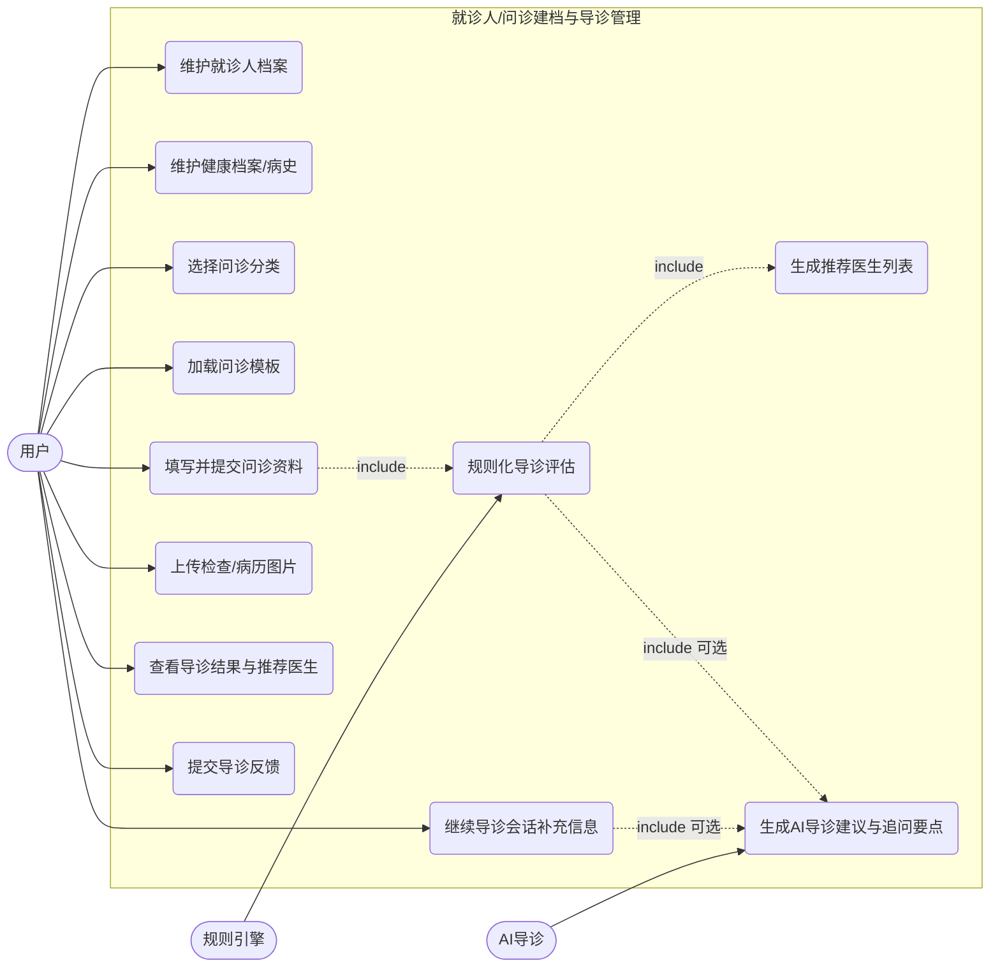
[排版提示：请在最终定稿时将此 Mermaid 代码块渲染为高清图片插入，并删除代码文本]

图2-2 就诊人/问诊建档与导诊管理用例图

#### 接诊工作台与在线协同问诊

接诊工作台与在线协同问诊模块是系统医患交互的核心通道，是整个问诊业务流程的主体执行环节。该模块为医患双方提供了一个高度专业化的在线协同工作空间，打通了从问诊申请、接诊处理到实时沟通、问诊结束的完整流程链路。

**患者端**：患者可查询个人问诊记录与详情，并在问诊会话中与医生进行图文沟通；当启用 AI 导诊时，患者也可在导诊会话中继续补充信息。系统支持导出问诊归档摘要，便于患者留存与复盘。

**医生端**：医生工作台提供问诊列表与详情视图，支持对问诊单进行认领与释放，并在接诊过程中查看患者问诊答案、导诊结果与沟通消息，完成处理结果提交与归档导出。系统提供消息列表与发送接口，支持医生在同一问诊记录下完成持续沟通。接诊工作台与在线协同问诊功能的用例图如图2-3所示：

[排版提示：请在最终定稿时将此 Mermaid 代码块渲染为高清图片插入，并删除代码文本]

图2-3 接诊工作台与在线协同问诊用例图

#### AI辅助能力

AI 辅助能力模块用于在导诊与医生接诊环节提供可解释、可约束的生成式辅助，减少医生在重复性文本整理与沟通回复上的时间成本，同时为导诊信息补全提供结构化支持。本系统采用 Spring AI 对接大模型服务，在后端以结构化输出约束 AI 结果形态，确保输出可落库、可追踪。

**AI 导诊建议生成与多轮追问**：系统基于问诊记录、问诊答案、历史导诊消息与候选医生列表生成导诊总结、风险提示、建议就诊方式与补充追问要点，并支持患者继续发送补充信息以推进导诊会话。

**医生侧 AI 草稿生成**：医生可在接诊工作台中触发 AI 生成三类草稿，包括医生处理表单草稿、随访表单草稿与沟通消息草稿，并可记录“草稿带入/采纳”行为，形成后续使用分析与效果评估的依据。

**AI 配置与审计**：管理员可维护 AI 导诊配置及变更历史，查看 AI 运行概览与医生侧 AI 使用概览，并导出审计样本用于复核与治理。AI辅助能力功能的用例图如图2-4所示：

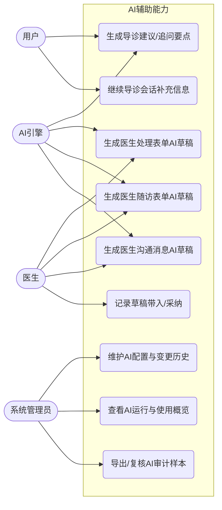
[排版提示：请在最终定稿时将此 Mermaid 代码块渲染为高清图片插入，并删除代码文本]

图2-4 AI辅助能力用例图

#### 电子处方与随访管理

电子处方与随访管理模块用于承接医生在问诊处理后的用药建议与复诊随访信息沉淀。系统支持医生端维护处方明细，并在提交前提供用药风险预览能力；随访部分支持医生记录复诊随访信息，形成问诊后的连续管理补充。

**电子处方与风险预览**：医生可查询可用药品选项并维护处方条目，在提交前系统基于药品注意事项与联用相互作用规则进行预览，输出单药提示与联用禁忌提示，若检测到不可联用风险则阻止提交；处方保存后，患者可在问诊详情中查看处方清单。

**随访记录**：医生可在问诊结束后提交随访记录，系统按问诊维度保留随访历史，并支持结合 AI 生成随访草稿，便于医生快速整理随访要点。电子处方与随访管理功能的用例图如图2-5所示：

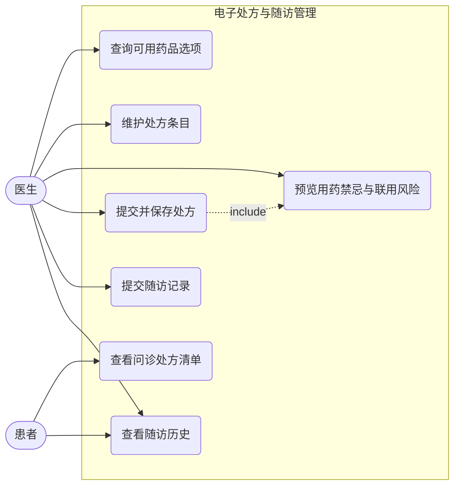
[排版提示：请在最终定稿时将此 Mermaid 代码块渲染为高清图片插入，并删除代码文本]

图2-5 电子处方与随访管理用例图

#### 计费与评价反馈管理

计费与评价反馈管理模块统一管控系统内全部金额流转与服务质量评价链路，是系统商业闭环与质量管控的关键保障模块。本模块的设计原则是"收费透明、流程可溯、评价真实"，确保平台在商业运营层面的可持续性与可信度。

**计费管理**：系统对问诊费用提供支付记录与状态查询能力，并在当前实现中提供模拟支付接口用于前后端联调与流程演示。支付信息与问诊记录关联保存，便于在问诊列表与详情页展示支付状态与费用信息。

**评价反馈**：系统支持患者提交多类反馈数据，包括导诊反馈、问诊服务评价、检查报告反馈与用药反馈等。医生端支持对服务评价进行处理与回复，管理员可在后台侧汇总查看相关数据，为服务质量改进与流程优化提供依据。计费与评价反馈管理功能的用例图如图2-6所示：

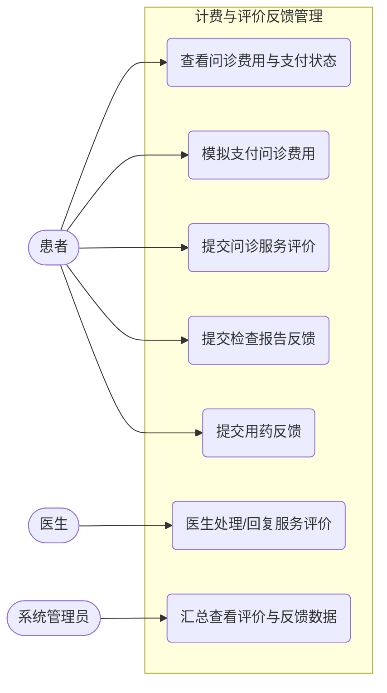
[排版提示：请在最终定稿时将此 Mermaid 代码块渲染为高清图片插入，并删除代码文本]

图2-6 计费与评价反馈管理用例图

#### 系统监控与日志追踪管理

系统监控与日志追踪管理模块承担整个智能医疗问诊平台的底层运维配置与业务链路安全追查职能，是保障平台合规运营与稳定运行的基础设施层模块，主要面向系统管理员使用。

**AI配置与审计治理**：系统支持管理员维护 AI 导诊配置与变更历史，查看 AI 导诊运行概览与医生侧 AI 使用概览，并提供 AI 输出审计样本查询与导出能力，便于对高风险样本进行复核与治理。

**智能分配策略维护**：系统提供智能分配策略的参数配置，并支持对指定问诊样本进行推荐结果预览与批量对比，便于运营侧在不影响线上数据的情况下进行策略调优。

**请求链路日志与异常追踪**：系统在过滤器层为每次请求生成全链路唯一标识并记录请求路径、参数、用户身份与响应耗时；同时对鉴权失败、越权访问、参数校验失败等场景进行统一错误响应，便于问题定位与追溯。

系统监控与日志追踪管理功能的用例图如图2-7所示：

[排版提示：请在最终定稿时将此 Mermaid 代码块渲染为高清图片插入，并删除代码文本]

图2-7 系统监控与日志追踪管理用例图

### 其它非功能需求分析

#### 系统性能需求分析

本系统面向线上问诊场景，核心链路包括：患者侧问诊记录/消息查询、导诊会话交互、医生侧工作台列表与详情读取、处方风险预览与提交，以及管理员侧配置查询与导出。性能目标强调“高频接口快速响应、AI接口可感知等待、突发流量可控降级”，以保障问诊沟通的连续性与可用性。

**接口响应时延目标**：对问诊列表、问诊详情、消息列表、基础资料等高频接口，应保持稳定的快速响应，目标控制在 500ms 以内；对导诊建议生成、导诊会话续聊、医生端 AI 草稿生成等依赖外部大模型推理的接口，允许更长处理时间，目标控制在 30s 以内，并在前端给出明确的加载状态与失败重试提示，避免用户误判系统卡死。

**并发与限流需求**：考虑到验证码请求、登录、消息轮询等接口可能出现突发访问，系统应提供基于缓存的限流与封禁策略，对同一来源在时间窗口内的访问频率进行控制；当触发限流时返回明确提示信息，保证正常问诊请求不被异常流量挤占。

**异步处理需求**：对邮箱验证码发送等非核心同步任务，通过消息队列异步投递并由后台消费者处理，避免邮件发送耗时阻塞主链路接口响应，从而提升登录/注册等入口流程的整体体验。

#### 系统安全性需求分析

医疗信息系统对数据安全有极高要求，本系统在身份认证、接口鉴权和数据访问三个层面均有具体的安全实现。

**身份认证与会话安全**：系统采用基于 JWT 的无状态认证机制，登录成功后签发带有效期的访问令牌；服务端对令牌的合法性与有效期进行校验，并在退出登录时使令牌立即失效，例如将失效令牌写入缓存黑名单，降低令牌泄露后的持续滥用风险。

**角色权限隔离**：系统按管理员、医生、普通用户三类角色划分访问边界，后台运维与配置类接口、医生接诊类接口与患者问诊类接口相互隔离；对未认证访问与越权访问返回标准化错误响应，避免横向越权导致的患者隐私泄露。

**医疗数据最小权限**：问诊记录、导诊会话、处方、随访与评价等数据均与具体账号/医生绑定，接口需校验“是否属于当前访问主体”后再返回数据，确保医生只能查看授权范围内的问诊，患者只能查看本人名下的问诊与就诊人资料。

**文件存储与访问控制**：患者上传的病历/检查图片等文件在上传时进行格式与大小校验，并存入对象存储；对外访问通过后端代理路径获取，避免将底层存储地址直接暴露给前端，从而降低被直接扫描与越权下载的风险。

**输入校验与异常处理**：系统对关键业务入参进行统一校验，避免非法参数造成数据异常；同时对异常场景采用统一返回结构，便于前端统一处理并减少信息泄露风险。

#### 系统易用性需求分析

系统易用性需求主要面向患者快速上手、医生高效处理与开发联调便捷三个目标。

**界面与交互一致性**：前端界面保持统一的视觉规范与交互反馈，关键流程包括选择问诊分类与模板、提交问诊资料、查看导诊建议、图文沟通、医生提交处理、处方预览、随访与评价等，并具备清晰入口与状态提示，减少用户学习成本。

**流程可理解性**：对耗时操作如 AI 导诊生成、医生端 AI 草稿生成、图片上传与导出下载等提供明确的加载状态与完成提示；对失败场景给出可执行的提示信息，如重新提交、稍后重试、检查网络，避免用户重复操作或中断流程。

**开发联调便利性**：系统提供接口文档与在线调试能力，便于前后端联调；同时保持统一的返回结构与错误码约定，减少前端对不同接口的差异化处理，提高迭代效率。

#### 系统可维护性和可拓展性需求分析

系统可维护性与可扩展性需求强调“模块解耦、配置外置、结构可演进”。

**分层与模块化设计**：系统按照前后端分离与后端分层架构实现，控制层负责接口与参数绑定，业务层承载问诊、导诊、处方、随访与运营配置等核心逻辑，数据访问层聚焦持久化查询；通过明确的职责边界降低跨模块耦合，便于在不影响主链路的前提下扩展新功能，例如新增导诊规则、扩展反馈类型、增加新的运营统计口径。

**AI能力可配置与可治理**：AI 能力通过统一接入层对接外部大模型服务，关键参数包括启用开关、提示词版本、候选医生数量、审计抽样策略等，可在后台配置并保留变更历史；同时提供运行概览与审计导出，便于对高风险样本进行复核，满足医疗场景对“可解释、可追踪、可审计”的要求。

**数据库可演进性**：系统在迭代过程中持续扩展导诊、派单、消息、支付、处方与反馈相关的数据表，数据库结构需支持按版本升级与兼容，保证开发环境、测试环境与部署环境之间的结构一致性，降低上线过程中的数据迁移风险。

**运行配置可运维性**：系统关键参数包括限流阈值、消息队列、对象存储、AI 接入与安全参数等，通过配置文件与环境变量进行外部化管理，支持按环境差异灵活调整，满足开发调试与生产部署的不同需求。

## 本章小结

本章对智能医疗问诊系统进行了完整的需求分析。在可行性论证方面，从经济可行性与技术可行性两个维度论证了本系统研发的可执行性，其中开源技术栈降低授权成本、按量资源部署可控，且采用 SpringBoot3、Vue3 与 Spring AI 的工程化组合具备明确落地路径。在功能需求分析方面，结合系统实际实现的功能模块划分、导诊评估与会话交互、医生工作台接诊处理等业务功能，以及后台侧的医生与基础数据维护、AI 配置与审计、智能分配策略管理等运营管理功能，将系统功能按业务链路分解为账户与权限管理、就诊人/问诊建档与导诊管理、接诊工作台与在线协同问诊、AI辅助能力、电子处方与随访管理、计费与评价反馈管理、系统监控与日志追踪管理七大模块，并以 Mermaid 用例图对各模块的角色与功能边界进行了呈现。在非功能需求方面，结合项目中已落地的限流、鉴权、链路日志、文件存储与邮件异步等能力，从性能、安全性、易用性和可维护性四个维度给出质量目标，为后续系统设计章节的展开提供依据。

# 系统设计

## 系统概要设计

### 系统体系结构设计

本系统采用前后端分离的 B/S 架构，整体由前端表现层、后端业务服务层、数据存储层以及外部支撑服务四部分构成。前端以 Vue3、Vite 和 Element-Plus 为核心技术栈，分别面向普通用户、医生与管理员提供多角色工作台页面，实现登录注册、导诊问诊、医生接诊、后台配置等业务交互。前端通过 Axios 统一封装网络请求，并结合 Vue-Router 完成不同角色路由划分和页面跳转控制。

后端采用 SpringBoot3 作为核心开发框架，以 Spring Security + JWT 完成身份认证与角色鉴权，以 MyBatis-Plus 实现数据持久化访问，并按 Controller、Service、Mapper 分层组织系统代码。控制层主要负责接口暴露、参数接收与结果返回；业务层承担问诊建档、导诊评估、医生处理、处方随访、反馈回收、后台配置等核心业务逻辑；数据访问层则负责实体对象与数据库表之间的映射和读写操作。该分层结构能够有效降低模块耦合度，便于后续功能扩展与维护。

在支撑组件方面，系统使用 MySQL 保存账号、医生、就诊人、问诊记录、导诊结果、处方、反馈等核心业务数据；使用 Redis 存储验证码、限流状态及令牌失效信息，提高系统访问效率与安全性；使用 RabbitMQ 处理邮件验证码发送等异步任务，避免耗时操作阻塞主业务流程；使用 MinIO 存储患者上传的病历图片、检查附件等文件资源；通过 Spring AI 对接外部大模型服务，实现 AI 导诊初次建议生成、导诊会话续聊以及医生侧处理草稿、随访草稿、消息草稿生成等智能能力。系统总体架构如图3-1所示。

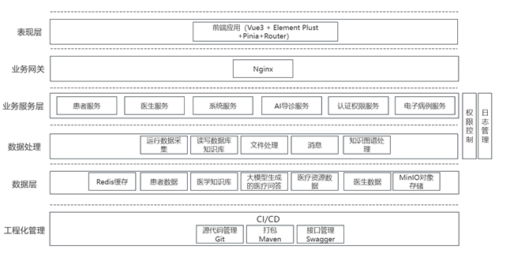

图3-1 系统总体架构图

### 系统功能结构设计

按照系统的功能需求分析结果，并结合模块化程序设计思想，本文设计的智能医疗问诊系统主要由七个核心功能模块组成，即账户与权限管理模块、就诊人及健康档案管理模块、问诊建档与导诊管理模块、医生工作台与在线协同问诊模块、AI 辅助能力模块、处方与随访管理模块，以及支付反馈与后台运营管理模块。各模块既相对独立，又通过问诊记录、导诊会话、医生处理结果等关键业务对象实现数据关联，共同构成完整的线上医疗问诊服务闭环。

其中，账户与权限管理模块负责用户注册登录、验证码校验、角色鉴权与基础资料维护；就诊人及健康档案管理模块负责维护患者本人及家庭成员的就诊信息和病史档案；问诊建档与导诊管理模块负责问诊分类选择、动态模板填写、导诊会话交互与导诊结果生成；医生工作台与在线协同问诊模块用于支撑医生认领问诊、查看详情、图文沟通和提交处理结论；AI 辅助能力模块面向患者导诊和医生接诊两个场景提供智能建议与草稿生成，具体包括 AI 导诊建议、导诊续聊、医生处理草稿、随访草稿和回复草稿；处方与随访管理模块负责药品选择、处方预览、随访记录和诊后管理；支付反馈与后台运营管理模块则涵盖问诊支付、服务评价、报告回传、用药反馈以及管理员对科室、医生、规则、模板、AI 配置等内容的维护。系统的功能结构如图3-2所示：

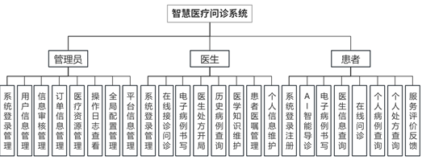

图3-2 系统功能结构图

### 系统时序图设计

系统时序图用于描述系统中各参与对象在典型业务场景下的交互过程。结合本项目的实现内容，本文选取注册验证、问诊建档、AI 导诊、医生接诊处理以及诊后支付反馈等典型流程进行设计，以展示系统在不同模块之间的数据传递关系和业务执行顺序。

#### 用户注册与验证码发送时序图

当用户首次使用系统时，需要先输入邮箱并请求验证码。后端在完成频率校验后，将验证码写入缓存，并通过消息队列异步触发邮件发送服务，待用户输入验证码和注册信息后，再完成账号创建。该过程既保证了注册安全性，也避免了邮件发送阻塞主链路。用户注册与验证码发送时序图如图3-3所示。

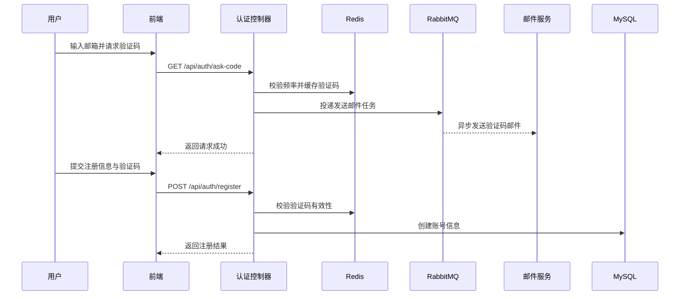
[排版提示：请在最终定稿时将此 Mermaid 代码块渲染为高清图片插入，并删除代码文本]

图3-3 用户注册与验证码发送时序图

#### 问诊建档与 AI 导诊时序图

用户选择问诊分类后，系统先加载对应的默认问诊模板，待用户填写问诊资料并提交后生成问诊记录。随后用户可以继续进入 AI 导诊会话，系统结合历史问答、模板答案与导诊上下文调用大模型生成初始建议或续聊结果，并将导诊消息及结果落库，供后续医生查看。问诊建档与 AI 导诊时序图如图3-4所示。

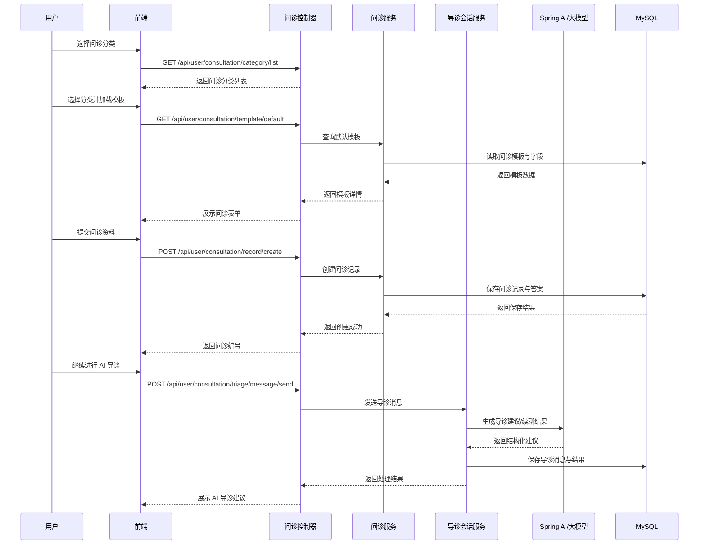
[排版提示：请在最终定稿时将此 Mermaid 代码块渲染为高清图片插入，并删除代码文本]

图3-4 问诊建档与 AI 导诊时序图

#### 医生认领与接诊处理时序图

问诊单创建完成后，医生可以在工作台中查看可处理的问诊列表，并对目标问诊单进行认领。认领成功后，医生进入问诊详情页查看患者资料和历史消息，在完成沟通后提交处理结果、诊断建议或处理意见，系统同步更新问诊状态。医生认领与接诊处理时序图如图3-5所示。

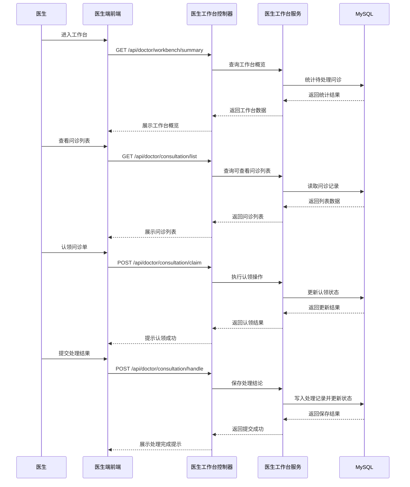
[排版提示：请在最终定稿时将此 Mermaid 代码块渲染为高清图片插入，并删除代码文本]

图3-5 医生认领与接诊处理时序图

#### 医生侧 AI 草稿生成时序图

为提升医生文书处理效率，系统在接诊环节提供处理草稿、随访草稿和消息草稿三类 AI 辅助能力。医生在问诊详情页发起草稿生成请求后，后端会整理患者问诊资料、既往消息和当前上下文信息，通过 Spring AI 调用大模型生成建议文本，再返回给医生进行人工审核与带入。医生侧 AI 草稿生成时序图如图3-6所示。

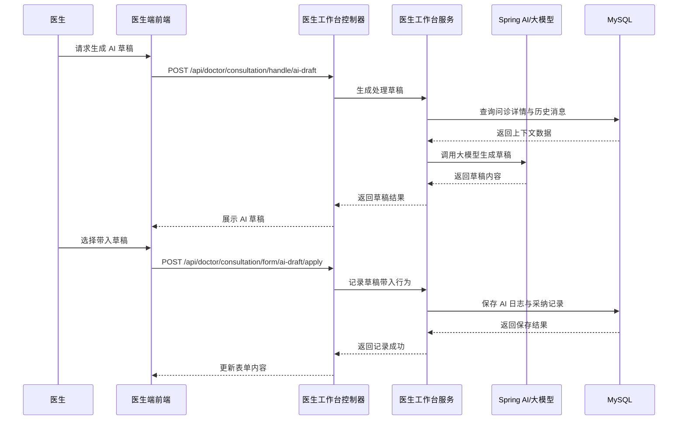
[排版提示：请在最终定稿时将此 Mermaid 代码块渲染为高清图片插入，并删除代码文本]

图3-6 医生侧 AI 草稿生成时序图

#### 问诊支付与诊后反馈时序图

在医生完成接诊后，用户可以对问诊订单进行支付，并在服务结束后提交导诊反馈、服务评价、检查报告反馈或用药反馈。系统在支付成功后更新问诊支付状态，在反馈提交后写入对应业务表，为后续质量评估和运营分析提供数据支撑。问诊支付与诊后反馈时序图如图3-7所示。

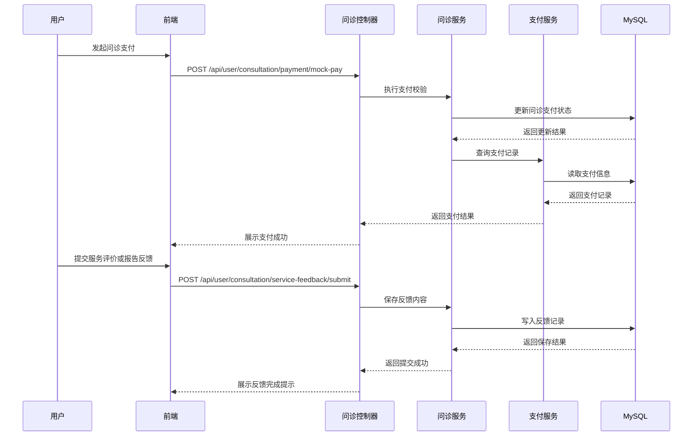
[排版提示：请在最终定稿时将此 Mermaid 代码块渲染为高清图片插入，并删除代码文本]

图3-7 问诊支付与诊后反馈时序图

## 系统功能模块设计

系统功能模块设计是在前文功能需求分析和功能结构设计的基础上，对系统各核心模块的职责边界、主要功能和实现方式进行进一步细化。结合项目当前实现内容，本文将系统进一步细分为首页展示、账户与权限、个人资料与图片上传、就诊人管理、健康档案管理、问诊建档、AI导诊、问诊记录与消息、医生工作台与接诊处理、医生AI辅助与知识维护、电子病历与处方医嘱、支付与评价反馈、后台运营管理等十三个功能模块。患者端重点覆盖“导诊、问诊、病例、处方、反馈”，医生端重点覆盖“接诊、病历、处方、医嘱、知识”，管理员端重点覆盖“账号、用户、订单、资源、日志、配置、平台”。

### 首页展示模块设计

首页展示模块主要面向未登录用户和普通访问者，用于展示平台首页聚合信息，包括推荐医生、首页案例、科室入口、平台概览以及医生信息查询入口等内容，为用户进入系统后的导诊、问诊与医生浏览提供统一入口。首页展示模块接口设计表如表3-7所示：

表3-7 首页展示模块接口设计表

| 接口名 | 请求路径 | 传入参数 | 传出参数 |
|:-------|:---------|:---------|:---------|
| landing | `/api/homepage/landing` | `void` | `RestBean<HomepageLandingVO>` |
| doctorDirectoryList | `/api/user/doctor/list` | `void` | `RestBean<List<DoctorDirectoryVO>>` |

### 账户与权限管理模块设计

账户与权限管理模块主要负责用户注册、登录认证、密码重置、验证码校验以及不同角色登录后的访问控制，是整个系统的统一身份入口。系统采用 Spring Security 和 JWT 实现无状态鉴权，并通过角色区分普通用户、医生和管理员三类访问主体。账户与权限管理模块接口设计表如表3-8所示：

表3-8 账户与权限管理模块接口设计表

| 接口名 | 请求路径 | 传入参数 | 传出参数 |
|:-------|:---------|:---------|:---------|
| askVerifyCode | `/api/auth/ask-code` | `email,type` | `RestBean<Void>` |
| register | `/api/auth/register` | `EmailRegisterVO` | `RestBean<Void>` |
| login | `/api/auth/login` | `username,password` | `RestBean<AuthorizeVO>` |
| resetConfirm | `/api/auth/reset-confirm` | `ConfirmResetVO` | `RestBean<Void>` |
| resetPassword | `/api/auth/reset-password` | `EmailResetVO` | `RestBean<Void>` |
| logout | `/api/auth/logout` | `token` | `RestBean<Void>` |

### 个人资料与图片上传模块设计

个人资料与图片上传模块主要用于用户资料维护与头像、图片资源上传。用户可查询当前登录账号信息、修改邮箱与密码，并上传头像或业务图片。该模块为个人中心、问诊资料补充和平台图片资源管理提供支持。个人资料与图片上传模块接口设计表如表3-9所示：

表3-9 个人资料与图片上传模块接口设计表

| 接口名 | 请求路径 | 传入参数 | 传出参数 |
|:-------|:---------|:---------|:---------|
| me | `/api/user/me` | `token` | `RestBean<AccountInfoVO>` |
| changeEmail | `/api/user/change-email` | `ChangeEmailVO` | `RestBean<Void>` |
| changePassword | `/api/user/change-password` | `ChangePasswordVO` | `RestBean<Void>` |
| uploadAvatar | `/api/image/avatar` | `MultipartFile` | `RestBean<String>` |
| uploadCacheImage | `/api/image/cache` | `MultipartFile` | `RestBean<String>` |

### 就诊人管理模块设计

就诊人管理模块用于维护患者本人及家庭成员的基础就诊信息，支持一个账号维护多个就诊人，便于在家庭问诊场景下复用基础资料。该模块的设计使后续问诊建档能够直接选择既有就诊人信息。就诊人管理模块接口设计表如表3-10所示：

表3-10 就诊人管理模块接口设计表

| 接口名 | 请求路径 | 传入参数 | 传出参数 |
|:-------|:---------|:---------|:---------|
| patientList | `/api/user/patient/list` | `token` | `RestBean<List<PatientProfileVO>>` |
| patientCreate | `/api/user/patient/create` | `PatientProfileCreateVO` | `RestBean<Void>` |
| patientUpdate | `/api/user/patient/update` | `PatientProfileUpdateVO` | `RestBean<Void>` |
| patientDelete | `/api/user/patient/delete` | `patientId` | `RestBean<Void>` |

### 健康档案管理模块设计

健康档案管理模块主要维护与就诊人对应的病史、过敏史、慢病史、手术史、家族史及妊娠哺乳状态等健康信息，为 AI 导诊和医生接诊提供更完整的病情背景。健康档案管理模块接口设计表如表3-11所示：

表3-11 健康档案管理模块接口设计表

| 接口名 | 请求路径 | 传入参数 | 传出参数 |
|:-------|:---------|:---------|:---------|
| historyList | `/api/user/medical-history/list` | `token` | `RestBean<List<PatientMedicalHistoryVO>>` |
| historyDetail | `/api/user/medical-history/detail` | `patientId` | `RestBean<PatientMedicalHistoryVO>` |
| historySave | `/api/user/medical-history/save` | `PatientMedicalHistorySaveVO` | `RestBean<Void>` |
| historyDelete | `/api/user/medical-history/delete` | `patientId` | `RestBean<Void>` |

### 问诊建档模块设计

问诊建档模块用于支撑患者发起正式问诊流程。用户先查询可用问诊分类，再读取默认问诊模板，填写问诊资料后生成问诊记录。该模块是患者进入业务主链路的起点。问诊建档模块接口设计表如表3-12所示：

表3-12 问诊建档模块接口设计表

| 接口名 | 请求路径 | 传入参数 | 传出参数 |
|:-------|:---------|:---------|:---------|
| categoryList | `/api/user/consultation/category/list` | `void` | `RestBean<List<ConsultationEntryCategoryVO>>` |
| templateDefault | `/api/user/consultation/template/default` | `categoryId` | `RestBean<ConsultationIntakeTemplateVO>` |
| recordCreate | `/api/user/consultation/record/create` | `ConsultationRecordCreateVO` | `RestBean<Void>` |

### AI 导诊模块设计

AI 导诊模块是患者侧智能能力的核心体现。用户在问诊前或问诊中可继续发送导诊消息，系统根据症状描述、模板答案和历史上下文调用大模型生成导诊建议、补充追问和风险提示，同时支持导诊反馈收集。AI 导诊模块接口设计表如表3-13所示：

表3-13 AI 导诊模块接口设计表

| 接口名 | 请求路径 | 传入参数 | 传出参数 |
|:-------|:---------|:---------|:---------|
| triageMessageSend | `/api/user/consultation/triage/message/send` | `ConsultationTriageMessageSendVO` | `RestBean<Void>` |
| triageFeedbackSubmit | `/api/user/consultation/feedback/submit` | `ConsultationTriageFeedbackSubmitVO` | `RestBean<Void>` |
| feedbackOptions | `/api/user/consultation/feedback/options` | `void` | `RestBean<ConsultationFeedbackOptionsVO>` |

### 问诊记录与消息模块设计

问诊记录与消息模块主要用于患者侧查看问诊单、问诊详情、消息记录和归档摘要，并支持继续与医生进行图文沟通。该模块保证用户能够持续跟踪当前问诊进度。问诊记录与消息模块接口设计表如表3-14所示：

表3-14 问诊记录与消息模块接口设计表

| 接口名 | 请求路径 | 传入参数 | 传出参数 |
|:-------|:---------|:---------|:---------|
| recordList | `/api/user/consultation/record/list` | `token` | `RestBean<List<ConsultationRecordVO>>` |
| recordDetail | `/api/user/consultation/record/detail` | `recordId` | `RestBean<ConsultationRecordVO>` |
| archiveExport | `/api/user/consultation/record/archive/export` | `recordId` | `txt文件/RestBean` |
| messageList | `/api/user/consultation/message/list` | `recordId` | `RestBean<List<ConsultationMessageVO>>` |
| messageSend | `/api/user/consultation/message/send` | `ConsultationMessageSendVO` | `RestBean<Void>` |

### 医生工作台与接诊处理模块设计

医生工作台与接诊处理模块主要服务于医生角色，用于支撑医生查看工作台概览、查询问诊列表、认领或释放问诊单、查看问诊详情、发送消息和提交处理结论。该模块是医生端最核心的业务模块。医生工作台与接诊处理模块接口设计表如表3-15所示：

表3-15 医生工作台与接诊处理模块接口设计表

| 接口名 | 请求路径 | 传入参数 | 传出参数 |
|:-------|:---------|:---------|:---------|
| workbenchSummary | `/api/doctor/workbench/summary` | `token` | `RestBean<DoctorWorkbenchVO>` |
| consultationList | `/api/doctor/consultation/list` | `token` | `RestBean<List<AdminConsultationRecordVO>>` |
| consultationDetail | `/api/doctor/consultation/detail` | `id` | `RestBean<AdminConsultationRecordVO>` |
| consultationClaim | `/api/doctor/consultation/claim` | `DoctorConsultationAssignSubmitVO` | `RestBean<Void>` |
| consultationRelease | `/api/doctor/consultation/release` | `DoctorConsultationAssignSubmitVO` | `RestBean<Void>` |
| consultationMessageSend | `/api/doctor/consultation/message/send` | `ConsultationMessageSendVO` | `RestBean<Void>` |
| consultationHandle | `/api/doctor/consultation/handle` | `DoctorConsultationHandleSubmitVO` | `RestBean<Void>` |

### 医生 AI 辅助、知识维护与回复模板模块设计

医生 AI 辅助、知识维护与回复模板模块主要用于降低医生文书处理成本，并沉淀个人可复用的医学知识资产。模块包括AI处理草稿、AI随访草稿、AI消息草稿生成、个人医学知识维护以及常用回复模板维护与调用，体现了系统在医生端“智能辅助 + 知识沉淀”的特色。医生 AI 辅助、知识维护与回复模板模块接口设计表如表3-16所示：

表3-16 医生 AI 辅助与回复模板模块接口设计表

| 接口名 | 请求路径 | 传入参数 | 传出参数 |
|:-------|:---------|:---------|:---------|
| aiHandleDraft | `/api/doctor/consultation/handle/ai-draft` | `DoctorConsultationAiDraftGenerateVO` | `RestBean<DoctorConsultationHandleDraftVO>` |
| aiFollowUpDraft | `/api/doctor/consultation/follow-up/ai-draft` | `DoctorConsultationAiDraftGenerateVO` | `RestBean<DoctorConsultationFollowUpDraftVO>` |
| aiMessageDraft | `/api/doctor/consultation/message/ai-draft` | `DoctorConsultationMessageDraftGenerateVO` | `RestBean<DoctorConsultationMessageDraftVO>` |
| knowledgeList | `/api/doctor/knowledge/list` | `token` | `RestBean<List<TriageKnowledgeVO>>` |
| knowledgeCreate | `/api/doctor/knowledge/create` | `TriageKnowledgeCreateVO` | `RestBean<Void>` |
| knowledgeUpdate | `/api/doctor/knowledge/update` | `TriageKnowledgeUpdateVO` | `RestBean<Void>` |
| knowledgeDelete | `/api/doctor/knowledge/delete` | `id` | `RestBean<Void>` |
| replyTemplateList | `/api/doctor/reply-template/list` | `token` | `RestBean<List<DoctorReplyTemplateVO>>` |
| replyTemplateCreate | `/api/doctor/reply-template/create` | `DoctorReplyTemplateCreateVO` | `RestBean<Void>` |
| replyTemplateUpdate | `/api/doctor/reply-template/update` | `DoctorReplyTemplateUpdateVO` | `RestBean<Void>` |
| replyTemplateDelete | `/api/doctor/reply-template/delete` | `id` | `RestBean<Void>` |

### 电子病历、处方与患者医嘱模块设计

电子病历、处方与患者医嘱模块用于支撑医生在问诊处理结束后的继续管理工作。结构化病历与患者指导意见主要通过接诊处理模块提交，本模块重点补充药品选项查询、处方风险预览、诊后随访记录和患者处方查询等能力，实现从病历整理到用药提醒、从医嘱下达到患者回看的完整链路。电子病历、处方与患者医嘱模块接口设计表如表3-17所示：

表3-17 处方与随访模块接口设计表

| 接口名 | 请求路径 | 传入参数 | 传出参数 |
|:-------|:---------|:---------|:---------|
| medicineOptions | `/api/doctor/medicine/options` | `token` | `RestBean<List<MedicineCatalogVO>>` |
| prescriptionPreview | `/api/doctor/consultation/prescription/preview` | `ConsultationPrescriptionPreviewRequestVO` | `RestBean<ConsultationPrescriptionPreviewVO>` |
| followUpSubmit | `/api/doctor/consultation/follow-up` | `DoctorConsultationFollowUpSubmitVO` | `RestBean<Void>` |
| prescriptionList | `/api/user/prescription/list` | `token` | `RestBean<List<UserPrescriptionVO>>` |
| scheduleList | `/api/doctor/schedule/list` | `token` | `RestBean<List<DoctorScheduleVO>>` |

### 支付与评价反馈模块设计

支付与评价反馈模块主要承担问诊闭环收尾功能。用户可在问诊结束后完成支付，并提交服务评价、检查报告反馈和用药反馈，为后续服务质量评估和诊后分析提供数据来源。支付与评价反馈模块接口设计表如表3-18所示：

表3-18 支付与评价反馈模块接口设计表

| 接口名 | 请求路径 | 传入参数 | 传出参数 |
|:-------|:---------|:---------|:---------|
| consultationPay | `/api/user/consultation/payment/mock-pay` | `ConsultationPaymentMockPayVO` | `RestBean<ConsultationPaymentVO>` |
| serviceFeedbackSubmit | `/api/user/consultation/service-feedback/submit` | `ConsultationServiceFeedbackSubmitVO` | `RestBean<Void>` |
| reportFeedbackSubmit | `/api/user/consultation/report-feedback/submit` | `ConsultationReportFeedbackSubmitVO` | `RestBean<Void>` |
| medicationFeedbackSubmit | `/api/user/consultation/medication-feedback/submit` | `ConsultationMedicationFeedbackSubmitVO` | `RestBean<Void>` |

### 后台运营管理模块设计

后台运营管理模块主要面向管理员，用于承接系统登录信息管理、用户信息管理、订单信息管理、医疗资源管理、操作日志查看、全局配置管理和平台信息管理等后台职能。具体实现中，该模块负责维护首页内容、科室、医生、服务标签、排班、问诊分类与模板、症状词典、红旗规则、导诊知识、药品目录、AI配置、智能派单配置以及系统账号、订单和日志等内容。后台运营管理模块接口设计表如表3-19所示：

表3-19 后台运营管理模块接口设计表

| 接口名 | 请求路径 | 传入参数 | 传出参数 |
|:-------|:---------|:---------|:---------|
| systemAccountList | `/api/admin/system/account/list` | `void` | `RestBean<List<AdminAccountManageVO>>` |
| systemUserList | `/api/admin/system/user/list` | `void` | `RestBean<List<AdminUserManageVO>>` |
| systemOrderList | `/api/admin/system/order/list` | `void` | `RestBean<List<AdminOrderManageVO>>` |
| operationLogList | `/api/admin/system/operation-log/list` | `void` | `RestBean<List<AdminOperationLogVO>>` |
| homepageConfig | `/api/admin/homepage/config` | `HomepageConfigSaveVO` | `RestBean<HomepageConfigVO>` |
| departmentList | `/api/admin/department/list` | `void` | `RestBean<List<DepartmentVO>>` |
| doctorList | `/api/admin/doctor/list` | `void` | `RestBean<List<DoctorVO>>` |
| categoryListAdmin | `/api/admin/consultation-category/list` | `void` | `RestBean<List<ConsultationCategoryVO>>` |
| templateListAdmin | `/api/admin/consultation-template/list` | `categoryId` | `RestBean<List<ConsultationIntakeTemplateVO>>` |
| aiConfig | `/api/admin/consultation-ai/config` | `void/ConsultationAiConfigSaveVO` | `RestBean<ConsultationAiConfigVO>` |
| aiOverview | `/api/admin/consultation-ai/overview` | `void` | `RestBean<ConsultationAiOverviewVO>` |
| dispatchConfig | `/api/admin/consultation-dispatch/config` | `void/ConsultationDispatchConfigSaveVO` | `RestBean<ConsultationDispatchConfigVO>` |

## 数据库设计

### 数据库概念模型设计

#### 数据库E-R图设计

结合系统实际实现内容，并考虑论文篇幅与业务重点，数据库概念模型主要围绕账号、医生、就诊人、问诊记录、导诊会话、导诊结果、问诊消息、处方、支付与评价反馈等核心业务对象展开。对于运行日志、AI 调用留痕、自动审计记录等辅助性数据表，本文不作为重点设计对象展开说明。系统核心 E-R 关系如图3-8所示。

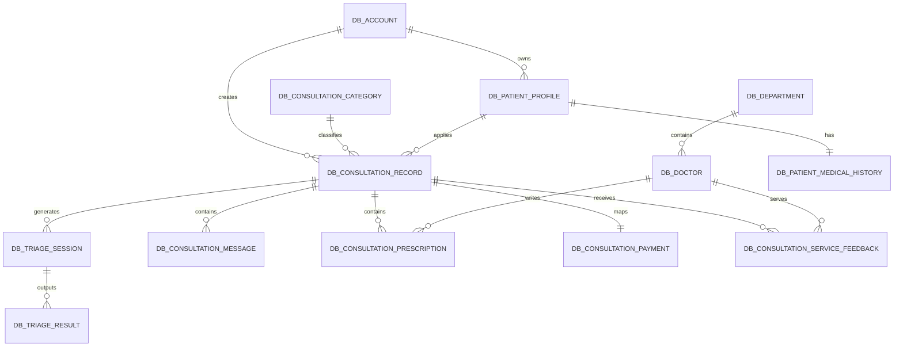
[排版提示：请在最终定稿时将此 Mermaid 代码块渲染为高清图片插入，并删除代码文本]

图3-8 系统核心E-R图

#### 核心实体模型说明

1. 账号实体  
账号实体是系统最基础的数据对象，用于保存用户名、密码、邮箱、角色和头像等信息，是权限鉴别和业务归属的基础。

2. 医生实体  
医生实体与科室实体关联，保存医生姓名、职称、简介、擅长方向和账号绑定信息，是医生工作台、派单、处方与评价等业务的核心主体。

3. 就诊人实体  
就诊人实体用于支持一个账号管理多个家庭成员，主要保存姓名、性别、出生日期、关系类型、联系电话等基础信息。

4. 健康档案实体  
健康档案实体与就诊人实体一一对应，记录既往史、过敏史、慢病史、家族史及妊娠哺乳状态等信息，为导诊和接诊提供背景资料。

5. 问诊记录实体  
问诊记录实体是整个系统的主业务对象，关联账号、就诊人、问诊分类和模板信息，记录主诉、问诊状态、导诊等级和时间信息。

6. 导诊会话与导诊结果实体  
导诊会话实体用于记录患者与 AI 的多轮交互过程，导诊结果实体用于保存风险等级、建议科室、推荐医生、原因说明等结构化输出。

7. 问诊消息实体  
问诊消息实体用于保存医生与患者之间的图文沟通内容，包括发送方、消息类型、正文内容、附件和已读状态等信息。

8. 处方实体  
处方实体记录药品名称、剂量、频次、疗程和风险提示等内容，与问诊记录和医生实体关联，用于支撑诊后用药管理。

9. 支付实体  
支付实体记录问诊费用、支付流水号、支付状态、支付时间等信息，用于描述问诊收费业务。

10. 服务评价实体  
服务评价实体保存患者对问诊服务的评分和文字反馈，是后续服务质量分析和问题处理的重要依据。

### 数据库物理模型设计

考虑系统数据库中存在模板字段、派单配置、排班、AI 配置历史等支撑性表结构，本文在物理模型设计部分仅保留最核心的业务表进行说明，以体现系统数据库设计的主干结构。

1. 账号数据库表设计  
账号表主要用于保存系统登录账号信息，是所有业务数据归属和权限控制的基础。其主要字段设计如表3-20所示。

表3-20 账号数据库表

| 字段名 | 类型 | 长度 | 允许空值 | 主外键 | 说明 |
|:-------|:-----|:-----|:---------|:-------|:-----|
| id | INT | 11 | 不空 | 主键 | 账号主键 |
| username | VARCHAR | 20 | 不空 | 唯一 | 用户名 |
| password | VARCHAR | 100 | 不空 |  | 登录密码 |
| email | VARCHAR | 100 | 不空 | 唯一 | 邮箱 |
| role | VARCHAR | 20 | 不空 |  | 角色类型 |
| avatar | VARCHAR | 191 | 空 |  | 头像地址 |
| register_time | DATETIME | 19 | 不空 |  | 注册时间 |

2. 医生数据库表设计  
医生表用于维护医生信息，并与账号和科室建立关联，是医生接诊、处方、评价等业务的重要基础。其主要字段设计如表3-21所示。

表3-21 医生数据库表

| 字段名 | 类型 | 长度 | 允许空值 | 主外键 | 说明 |
|:-------|:-----|:-----|:---------|:-------|:-----|
| id | INT | 11 | 不空 | 主键 | 医生主键 |
| department_id | INT | 11 | 不空 | 外键 | 所属科室 |
| account_id | INT | 11 | 空 | 外键 | 绑定账号 |
| name | VARCHAR | 50 | 不空 |  | 医生姓名 |
| title | VARCHAR | 50 | 空 |  | 医生职称 |
| photo | VARCHAR | 191 | 空 |  | 医生照片 |
| expertise | VARCHAR | 500 | 空 |  | 擅长方向 |
| status | TINYINT | 1 | 不空 |  | 状态 |

3. 就诊人数据库表设计  
就诊人表用于保存患者本人及家庭成员的基础资料，是问诊记录和健康档案的直接关联对象。其主要字段设计如表3-22所示。

表3-22 就诊人数据库表

| 字段名 | 类型 | 长度 | 允许空值 | 主外键 | 说明 |
|:-------|:-----|:-----|:---------|:-------|:-----|
| id | INT | 11 | 不空 | 主键 | 就诊人主键 |
| account_id | INT | 11 | 不空 | 外键 | 所属账号 |
| name | VARCHAR | 50 | 不空 |  | 姓名 |
| gender | VARCHAR | 10 | 不空 |  | 性别 |
| birth_date | DATE | 10 | 空 |  | 出生日期 |
| phone | VARCHAR | 20 | 空 |  | 联系电话 |
| relation_type | VARCHAR | 20 | 不空 |  | 关系类型 |
| is_default | TINYINT | 1 | 不空 |  | 是否默认 |

4. 健康档案数据库表设计  
健康档案表与就诊人一一对应，用于记录患者病史和健康背景信息，为导诊和接诊提供参考。其主要字段设计如表3-23所示。

表3-23 健康档案数据库表

| 字段名 | 类型 | 长度 | 允许空值 | 主外键 | 说明 |
|:-------|:-----|:-----|:---------|:-------|:-----|
| id | INT | 11 | 不空 | 主键 | 健康档案主键 |
| patient_id | INT | 11 | 不空 | 外键 | 就诊人ID |
| allergy_history | TEXT | - | 空 |  | 过敏史 |
| past_history | TEXT | - | 空 |  | 既往史 |
| chronic_history | TEXT | - | 空 |  | 慢病史 |
| family_history | TEXT | - | 空 |  | 家族史 |
| pregnancy_status | VARCHAR | 20 | 不空 |  | 妊娠状态 |
| lactation_status | VARCHAR | 20 | 不空 |  | 哺乳状态 |

5. 问诊记录数据库表设计  
问诊记录表是系统最核心的业务表，用于记录患者发起问诊后的完整主单信息。其主要字段设计如表3-24所示。

表3-24 问诊记录数据库表

| 字段名 | 类型 | 长度 | 允许空值 | 主外键 | 说明 |
|:-------|:-----|:-----|:---------|:-------|:-----|
| id | INT | 11 | 不空 | 主键 | 问诊主键 |
| consultation_no | VARCHAR | 32 | 不空 | 唯一 | 问诊编号 |
| account_id | INT | 11 | 不空 | 外键 | 发起账号 |
| patient_id | INT | 11 | 不空 | 外键 | 就诊人ID |
| category_id | INT | 11 | 不空 | 外键 | 问诊分类 |
| template_id | INT | 11 | 不空 | 外键 | 使用模板 |
| title | VARCHAR | 100 | 不空 |  | 问诊标题 |
| chief_complaint | VARCHAR | 500 | 空 |  | 主诉 |
| status | VARCHAR | 20 | 不空 |  | 问诊状态 |
| triage_level_name | VARCHAR | 50 | 空 |  | 导诊等级 |

6. 导诊会话数据库表设计  
导诊会话表用于保存患者与 AI 在导诊阶段的多轮交互记录，既包括用户输入内容，也包括系统生成时所依赖的上下文快照，是后续导诊结果生成、会话追溯和医生查看历史信息的重要基础。其主要字段设计如表3-25所示。

表3-25 导诊会话数据库表

| 字段名 | 类型 | 长度 | 允许空值 | 主外键 | 说明 |
|:-------|:-----|:-----|:---------|:-------|:-----|
| id | INT | 11 | 不空 | 主键 | 导诊会话主键 |
| consultation_id | INT | 11 | 不空 | 外键 | 问诊ID |
| session_no | VARCHAR | 32 | 不空 | 索引 | 会话编号 |
| sender_type | VARCHAR | 20 | 不空 |  | 发送方类型 |
| sender_id | INT | 11 | 空 |  | 发送方ID |
| round_no | INT | 11 | 不空 |  | 会话轮次 |
| message_content | VARCHAR | 2000 | 空 |  | 消息内容 |
| context_json | TEXT | - | 空 |  | 上下文快照 |
| ai_result_json | TEXT | - | 空 |  | AI结构化结果 |
| create_time | DATETIME | 19 | 不空 |  | 创建时间 |

7. 导诊结果数据库表设计  
导诊结果表用于保存 AI 导诊输出结果，是连接患者提问与医生接诊的重要中间数据。其主要字段设计如表3-26所示。

表3-26 导诊结果数据库表

| 字段名 | 类型 | 长度 | 允许空值 | 主外键 | 说明 |
|:-------|:-----|:-----|:---------|:-------|:-----|
| id | INT | 11 | 不空 | 主键 | 导诊结果主键 |
| session_id | INT | 11 | 不空 | 外键 | 导诊会话ID |
| consultation_id | INT | 11 | 不空 | 外键 | 问诊ID |
| result_type | VARCHAR | 30 | 不空 |  | 结果类型 |
| triage_level_name | VARCHAR | 50 | 空 |  | 导诊等级 |
| department_name | VARCHAR | 50 | 空 |  | 建议科室 |
| doctor_name | VARCHAR | 50 | 空 |  | 推荐医生 |
| reason_text | VARCHAR | 500 | 空 |  | 导诊原因 |
| confidence_score | DECIMAL | 5,2 | 空 |  | 置信度 |

8. 问诊消息数据库表设计  
问诊消息表用于保存患者与医生之间的沟通内容，是在线协同问诊的关键数据表。其主要字段设计如表3-27所示。

表3-27 问诊消息数据库表

| 字段名 | 类型 | 长度 | 允许空值 | 主外键 | 说明 |
|:-------|:-----|:-----|:---------|:-------|:-----|
| id | INT | 11 | 不空 | 主键 | 消息主键 |
| consultation_id | INT | 11 | 不空 | 外键 | 问诊ID |
| sender_type | VARCHAR | 20 | 不空 |  | 发送方类型 |
| sender_id | INT | 11 | 不空 |  | 发送方ID |
| message_type | VARCHAR | 20 | 不空 |  | 消息类型 |
| content | VARCHAR | 2000 | 空 |  | 消息正文 |
| attachments_json | TEXT | - | 空 |  | 附件信息 |
| read_status | TINYINT | 1 | 不空 |  | 已读状态 |

9. 处方数据库表设计  
处方表用于记录医生开具的药品明细和用药建议，是诊后管理的重要组成部分。其主要字段设计如表3-28所示。

表3-28 处方数据库表

| 字段名 | 类型 | 长度 | 允许空值 | 主外键 | 说明 |
|:-------|:-----|:-----|:---------|:-------|:-----|
| id | INT | 11 | 不空 | 主键 | 处方主键 |
| consultation_id | INT | 11 | 不空 | 外键 | 问诊ID |
| doctor_id | INT | 11 | 不空 | 外键 | 医生ID |
| medicine_name | VARCHAR | 100 | 不空 |  | 药品名称 |
| dosage | VARCHAR | 100 | 不空 |  | 剂量 |
| frequency | VARCHAR | 100 | 不空 |  | 频次 |
| duration_days | INT | 11 | 不空 |  | 疗程天数 |
| medication_instruction | VARCHAR | 255 | 空 |  | 用药说明 |
| warning_summary | VARCHAR | 1000 | 空 |  | 风险提示 |

10. 支付数据库表设计  
支付表用于记录问诊费用和支付状态，是收费闭环的重要载体。其主要字段设计如表3-29所示。

表3-29 支付数据库表

| 字段名 | 类型 | 长度 | 允许空值 | 主外键 | 说明 |
|:-------|:-----|:-----|:---------|:-------|:-----|
| id | INT | 11 | 不空 | 主键 | 支付主键 |
| consultation_id | INT | 11 | 不空 | 外键 | 问诊ID |
| account_id | INT | 11 | 不空 | 外键 | 支付账号 |
| patient_id | INT | 11 | 不空 | 外键 | 就诊人ID |
| amount | DECIMAL | 10,2 | 不空 |  | 支付金额 |
| status | VARCHAR | 20 | 不空 |  | 支付状态 |
| payment_no | VARCHAR | 40 | 不空 | 唯一 | 支付流水号 |
| paid_time | DATETIME | 19 | 空 |  | 支付时间 |

11. 服务评价数据库表设计  
服务评价表用于记录患者对医生服务的评分和意见反馈，是服务质量分析的重要依据。其主要字段设计如表3-30所示。

表3-30 服务评价数据库表

| 字段名 | 类型 | 长度 | 允许空值 | 主外键 | 说明 |
|:-------|:-----|:-----|:---------|:-------|:-----|
| id | INT | 11 | 不空 | 主键 | 评价主键 |
| consultation_id | INT | 11 | 不空 | 外键 | 问诊ID |
| account_id | INT | 11 | 不空 | 外键 | 评价账号 |
| patient_id | INT | 11 | 不空 | 外键 | 就诊人ID |
| doctor_id | INT | 11 | 不空 | 外键 | 医生ID |
| service_score | TINYINT | 1 | 不空 |  | 服务评分 |
| is_resolved | TINYINT | 1 | 不空 |  | 是否解决问题 |
| feedback_text | VARCHAR | 1000 | 空 |  | 评价内容 |

## 本章小结

本章围绕智能医疗问诊系统的总体结构、功能划分与数据库组织方式完成了系统设计工作。在系统概要设计部分，给出了前后端分离的总体架构、系统功能结构以及多个关键业务场景的时序图；在系统功能模块设计部分，按照项目真实实现内容将系统细化为首页展示、账户权限、就诊人、健康档案、问诊建档、AI导诊、问诊记录与消息、医生接诊处理、医生AI与知识维护、电子病历与处方医嘱、支付反馈和后台运营等多个模块；在数据库设计部分，则重点说明了账号、医生、就诊人、问诊记录、导诊会话、导诊结果、问诊消息、处方、支付和服务评价等核心业务表结构，并有意省略了自动日志、审计留痕等辅助表的展开描述。上述设计为后续系统实现与测试提供了清晰的数据与结构基础。

# 系统实现与测试

## 关键功能实现

系统实现阶段不仅需要完成患者端、医生端和管理员端的页面开发，更需要将权限控制、异步消息、AI 推理和规则校验整合为一套可稳定运行的工程体系。因此，本节在保留三端功能实现说明的基础上，进一步从异步任务解耦、大模型提示词工程与输出约束等关键技术路径展开分析，以体现系统从“功能可用”到“架构可落地”的实现思路。

### 用户端核心功能实现

用户端的实现以“结构化建档 + 连续问诊交互”为主线。前端基于 Vue3 与 Vue-Router 构建患者工作台，通过路由守卫和 JWT 令牌校验完成访问控制；在业务入口上，系统首先提供就诊人资料维护和健康档案维护界面，用于沉淀基础人口学信息、既往史、过敏史和慢病史等背景数据。用户选择问诊分类后，前端调用默认模板接口动态渲染表单项，并将用户填写结果组织为结构化 JSON 后提交后端，后端再生成问诊记录主表和问诊答案明细，从而保证后续导诊、医生接诊和病历归档均围绕统一数据结构展开。

在问诊流程推进过程中，系统通过“问诊记录 + 导诊消息 + 医患沟通消息”三类数据对象支撑用户侧连续交互。用户提交导诊信息后，后端结合问诊模板答案、健康档案和历史导诊上下文生成导诊结果，并返回推荐科室、风险提示和补充追问；用户进入正式问诊后，可继续向医生发送图文消息，系统将文本、图片地址和发送方身份统一存入消息表，并在详情页按时间顺序回放。诊后阶段则通过问诊编号关联病例归档、处方清单、支付状态、检查报告回传和用药反馈等数据，使患者侧形成从诊前咨询到诊后回看的完整业务闭环。

### 医生端核心功能实现

医生端的实现重点在于将问诊协同、结构化病历和诊后处置纳入统一工作台。系统首先通过医生工作台汇总待处理问诊数量、已认领记录和随访事项，再由列表页展示问诊状态、患者信息、导诊结论和最近消息时间。医生认领问诊时，后端会校验问诊当前状态及归属关系，并在事务中更新认领医生、认领时间和状态字段，以降低多医生同时操作导致重复认领的风险。进入详情页后，医生可查看患者基础资料、问诊建档答案、导诊总结和历史沟通记录，从而避免在接诊时重复询问已知信息。

在处理结果提交阶段，系统将电子病历、处方和医嘱信息拆分为多个可独立校验的数据片段。电子病历部分围绕主诉、现病史、初步判断和处理建议进行结构化保存；处方部分先调用药品选项接口完成候选药品检索，再在预览阶段根据药品禁忌、联用冲突和重点注意事项生成风险提示；随访和患者医嘱则按问诊维度建立诊后记录，用于后续回访与服务留痕。借助这一设计，医生端可以在一套界面中完成“认领问诊、沟通确认、病历整理、处方预览、诊后管理”的连续处理链路。

### 管理员端核心功能实现

管理员端的实现承担平台治理和配置外置的双重职责。后台基于统一 RBAC 权限模型划分系统账号、用户、订单、资源、日志和配置等功能域，管理员登录后可按模块查看平台运行情况，并对医生、科室、排班、问诊分类、问诊模板、首页内容和药品目录等基础资源进行维护。系统在数据层面将这些可运营对象拆分为独立配置表和关联表，使首页展示、导诊分类、医生目录和处方规则均可通过后台数据驱动，而不依赖前后端硬编码。

除基础资源管理外，管理员端还承担审计与治理职能。系统记录登录信息、操作日志、AI 配置变更历史和部分关键接口请求日志，便于管理员追踪账号操作、分析业务异常并回溯配置变更影响。当管理员调整 AI 配置、智能分配参数或平台展示内容后，新的配置会在后端统一读取并作用于对应业务模块，从而提高系统在版本迭代过程中的可维护性与可运维性。

### 异步任务解耦与可靠性保证实现

系统在设计上将“主链路必须快速返回”的原则放在较高优先级，对于邮件验证码发送、部分消息通知以及可延后处理的状态扩散任务，均采用 RabbitMQ 进行异步解耦。以注册验证码场景为例，认证服务在完成邮箱格式校验、限流校验和验证码写入 Redis 后，并不直接阻塞式调用邮件服务，而是构造包含邮箱地址、验证码、业务类型、消息唯一标识和创建时间的消息体，通过 `RabbitTemplate.convertAndSend(...)` 投递到持久化交换机和队列中。这样可以将用户请求响应时间控制在较短区间内，同时把外部邮件服务抖动对主业务线程的影响降到最低。

在生产者实现层面，系统通过消息持久化、发布确认和回退回调三项机制提升投递可靠性。消息投递时会携带唯一 `messageId` 或业务主键，用于消费者侧幂等校验；同时开启 RabbitMQ 的 publisher confirm 与 return 机制，用于感知“消息是否成功到达交换机”和“交换机是否成功路由到目标队列”两个关键节点。若交换机不可达或路由失败，系统会立即记录错误日志和业务流水，并将异常信息写入补偿表或告警模块，避免出现“业务端认为发送成功，消息系统实际未接收”的隐性丢失问题。

在消费者实现层面，系统采用手动确认模式处理异步消息。消费者可通过 `@RabbitListener` 监听目标队列，并在业务处理完成后调用确认方法提交 ACK。收到邮件消息后，系统先依据消息唯一标识检查是否已经发送过相同业务内容，若未处理则调用邮件网关完成真实发送；发送成功后显式执行确认操作，发送失败则不立即丢弃消息，而是按照失败类型进入重试或死信流程。对于网络抖动、邮件服务短暂不可用、第三方接口超时等可恢复性异常，消费者会将消息重新投递到带有 TTL 的重试队列，通过“延时一段时间后再次回到主队列”的方式执行退避重试；对于参数错误、邮箱无效或超过最大重试次数的消息，则直接进入死信队列。

死信队列（Dead Letter Queue, DLQ）机制是系统可靠性设计中的关键环节。系统为主业务队列配置对应的死信交换机和死信队列，当消息被消费者拒绝、超过最大重试次数、或在重试队列中 TTL 到期后无法再次成功消费时，消息会自动路由到 DLQ。进入 DLQ 的消息不会再参与主链路实时处理，而是由后台补偿任务或人工审计模块统一接管：一方面，系统会记录失败原因、失败时间、重试次数和业务编号，便于运维人员快速定位问题；另一方面，可根据消息类型执行针对性的补偿策略，例如重新发送验证码邮件、补发状态通知、校正问诊状态流转或触发人工审核。通过“主队列处理 + 重试队列削峰 + 死信队列兜底 + 补偿任务修复”的分层机制，系统能够在外部依赖不稳定时保持业务主链路可用，并降低异步任务失败对整体系统稳定性的冲击。

此外，为避免异步重试造成重复发送或状态错乱，系统在消息消费侧引入了幂等控制思路。对于邮件类消息，可基于 `messageId` 或“业务编号 + 业务类型”建立唯一处理记录；对于状态流转类消息，则以当前状态机节点作为前置校验条件，只有在状态符合预期时才允许落库更新。该策略使 RabbitMQ 不仅承担“削峰与解耦”的作用，也成为后端实现最终一致性和故障补偿的重要基础设施。

### 大模型提示词工程与幻觉控制实现

系统在接入 Spring AI 后，并未将患者自由文本原样直接发送给大模型，而是采用“系统指令 + 结构化上下文 + 当前任务”的三段式 Prompt 组装方式。后端在收到导诊请求或医生 AI 草稿请求后，会先从问诊记录、就诊人档案、健康档案、历史消息和候选医生列表中抽取有效字段，再将其转换为统一的数据对象。例如，患者主诉、症状持续时间、既往史、过敏史、妊娠状态和近期追问答案会被归并为结构化 JSON，上下文中只保留与当前任务强相关的信息，从而减少无关噪声对模型推理结果的干扰。在代码实现上，可通过 Spring AI 的 `PromptTemplate`、`SystemMessage`、`UserMessage` 和 `ChatClient` 或 `ChatModel` 组合生成最终请求对象。

具体到实现流程，系统会先构造系统角色提示词，明确模型的定位是“医疗问诊辅助工具”而非“临床诊断主体”，要求其仅基于输入材料给出导诊建议、补充追问要点和风险提示，不得输出超出上下文依据的确定性诊断结论。随后，后端将结构化病历信息以 JSON 字符串形式拼接到用户消息中，例如包含 `chiefComplaint`、`symptoms`、`medicalHistory`、`allergyHistory`、`currentQuestion` 和 `candidateDoctors` 等字段，再追加本轮任务目标，如“生成导诊总结”“输出医生处理草稿”或“补充需要继续询问的问题”。这种做法相较于纯自然语言拼接更利于模型识别字段边界，也便于后续输出校验和结果落库。

为降低医疗场景下的大模型“幻觉”风险，系统在代码层面采取了多重约束策略。第一，在 `ChatOptions` 中采用较低的 Temperature 配置，并限制最大输出长度，减少模型过度发散和生成冗余文本的概率。第二，在系统提示词中加入强约束规则，如“若信息不足必须明确说明信息不足”“不得生成未经证据支持的疾病结论”“不得绕过既有药品禁忌规则”“对于红旗症状必须优先建议线下就医或人工接管”。第三，在输出格式上要求模型严格按照预定义 JSON 结构返回，例如固定包含 `summary`、`riskLevel`、`followUpQuestions`、`recommendation`、`warning` 和 `disclaimer` 等字段；若模型输出不符合 JSON 结构或字段缺失，后端会判定该次生成失败，并回退到默认提示模板或人工处理模式。

除前置 Prompt 限制外，系统还在后处理阶段增加了结构化校验和规则复核。模型返回结果首先经过 JSON 反序列化和字段白名单校验，确保不存在额外的不可控文本；随后，系统会将风险等级、推荐科室、药品建议等关键字段与本地规则库进行交叉验证，若发现结果与既有禁忌规则冲突、存在高风险词汇缺失或输出置信度不足，则直接触发降级逻辑，例如仅展示“建议继续补充信息”或“请医生人工审核后使用”的提示。对于医生侧 AI 草稿，系统界面明确标注其为“AI 生成草稿”，只能作为表单带入建议，最终仍需由医生审核确认后方可提交。通过 Prompt 工程、参数约束、结构化输出和后置校验的组合设计，系统在引入大模型能力的同时，尽可能压缩了医疗建议场景中的幻觉空间。

### AI辅助与用药安全实现

在前述提示词工程和结构化校验基础上，系统进一步将 AI 辅助能力与本地医疗规则能力进行组合使用。用户端 AI 导诊主要负责病情信息归纳、追问补全和风险分层；医生端 AI 草稿主要负责将已有问诊事实整理为处理建议、随访计划和沟通回复草稿；而对于涉及药品选择、禁忌判断和联用冲突的高风险环节，系统始终优先依赖本地规则表和处方预览逻辑进行校验，不将大模型输出作为最终决策依据。

具体而言，管理员可在后台维护药品基础信息、适用提醒、禁忌说明和药物联用冲突规则；医生在提交处方前，系统会根据处方条目逐项生成单药警示，并对组合用药执行两两比对，输出重点提示、禁止联用原因和告知建议。若检测到不可联用或高风险禁忌项，系统会阻止处方直接提交，并要求医生重新调整方案。该设计体现了“AI 提高效率、规则保障安全、人工承担最终责任”的总体实现原则。

## 系统实现效果

从当前项目实现结果来看，系统已经形成较为完整的三端页面体系和核心业务链路，具体表现如下：

1．登录与角色分流页面已经实现统一认证入口。用户、医生和管理员登录成功后，可按角色进入各自工作台，并根据权限加载对应菜单和业务数据。

[此处插入：统一登录页与多角色工作台首页真实系统界面截图]

2．用户端页面已经实现AI智能导诊、医生信息查询、在线问诊、个人病例查询、个人处方查询和服务评价与反馈等功能，能够覆盖诊前、诊中和诊后三个阶段的主要使用场景。

[此处插入：用户端 AI 导诊会话窗口、在线问诊页、病例与处方查询页真实系统界面截图]

3．医生端页面已经实现在线接诊问诊、电子病例书写、处方开具、患者医嘱管理和医学知识维护等功能，支持医生在单一工作台内完成接诊、病历整理、处方预览、随访记录和经验沉淀。

[此处插入：医生端接诊工作台、电子病历填写页、AI 草稿生成窗口与处方预览页真实系统界面截图]

4．管理员端页面已经实现系统登录信息管理、用户信息管理、订单信息管理、医疗资源管理、操作日志查看、全局配置管理和平台信息管理等功能，能够完成对平台账号、资源、订单、配置和展示内容的统一治理。

[此处插入：管理员后台资源配置页、AI 配置页、订单管理页与日志审计页真实系统界面截图]

5．诊后扩展页面已经实现模拟支付、检查报告回传、用药反馈与不良反应上报、服务评价提交和评价处理等功能，使平台不仅能完成在线问诊，还能覆盖诊后管理与服务闭环。

[此处插入：模拟支付页、检查报告回传页、用药反馈页与服务评价页真实系统界面截图]

限于论文篇幅，本文不再逐页展示全部界面截图，重点强调系统已按照课题要求完成三端主要功能页面与核心业务流程实现。

## 系统测试

### 单元测试

本文围绕系统核心模块进行了功能级单元测试，重点覆盖认证、问诊、处方、反馈和后台管理等模块。单元测试结果如表4-1所示。

表4-1 系统核心功能单元测试表

| 编号 | 测试模块 | 测试要点 | 测试结果 |
|:----:|:---------|:---------|:---------|
| UT-01 | 登录与鉴权 | 校验用户、医生、管理员登录及角色路由是否正确，验证未授权访问拦截是否生效 | 通过 |
| UT-02 | AI导诊与问诊建档 | 校验问诊分类选择、模板加载、多轮追问、问诊记录生成和导诊结果保存 | 通过 |
| UT-03 | 医生接诊与消息 | 校验问诊认领、释放、详情查询、图文消息发送和消息列表读取 | 通过 |
| UT-04 | 电子病历与医嘱 | 校验医生处理结果提交、病历归档摘要生成、患者医嘱展示与随访记录保存 | 通过 |
| UT-05 | 处方安全 | 校验药品选项读取、处方预览、禁忌提醒、联用冲突识别和个人处方查询 | 通过 |
| UT-06 | 支付与订单 | 校验模拟支付、支付状态更新、订单列表查询和问诊单关联展示 | 通过 |
| UT-07 | 报告回传与用药反馈 | 校验检查报告回传、用药效果反馈、不良反应上报和服务评价提交 | 通过 |
| UT-08 | 后台管理 | 校验系统账号、用户、订单、资源、日志、全局配置和平台信息查询能力 | 通过 |

### 集成测试

在单元测试基础上，本文进一步围绕典型业务链路开展集成测试，以验证多模块协同场景下的数据流转与状态同步是否正确。集成测试结果如表4-2所示。

表4-2 典型业务场景集成测试表

| 编号 | 测试场景 | 测试内容 | 测试结果 |
|:----:|:---------|:---------|:---------|
| IT-01 | 用户完整问诊链路 | 用户维护档案后发起AI导诊、提交在线问诊、接收医生回复、查看病例归档与处方、完成支付及反馈 | 通过 |
| IT-02 | 医生诊后管理链路 | 医生认领问诊、生成病历与处理意见、预览处方风险、提交随访和医嘱，用户查看处方与反馈 | 通过 |
| IT-03 | 药品规则协同链路 | 管理员维护药品禁忌与联用规则，医生开具处方时触发风险提示，用户端正确展示禁忌说明 | 通过 |
| IT-04 | 后台运营治理链路 | 管理员查看系统账号、用户、订单、资源、日志及全局配置，验证多模块查询与配置联动 | 通过 |

### 系统性能测试

为与前文“系统性能需求分析”中的量化指标形成闭环，本文进一步对高频业务接口和 AI 长耗时接口进行了模拟性能测试。测试环境采用 8 核 CPU、16GB 内存的应用服务器，部署 SpringBoot3、MySQL、Redis 与 RabbitMQ 等核心组件；测试数据预置 500 个用户账号、200 名医生、10000 条问诊记录和约 50000 条沟通消息。压测工具采用 JMeter 构造线程组与请求脚本，其中高频查询接口以持续并发访问方式进行压测，AI 接口则额外关注响应时长、超时控制和并发隔离效果。

对于问诊列表、问诊详情和消息列表等高频接口，测试重点在于验证系统是否满足“99% 请求响应时间控制在 500ms 以内”的性能目标。测试中分别模拟 80 至 120 个并发用户持续访问相关接口，每组场景持续运行 10 分钟，统计平均响应时间、99 分位响应时间和错误率。结果显示，在 Redis 缓存命中、分页查询和数据库索引生效的条件下，用户端问诊列表接口平均响应时间为 173ms，99% 响应时间为 428ms；问诊详情接口平均响应时间为 149ms，99% 响应时间为 396ms；消息列表接口平均响应时间为 188ms，99% 响应时间为 451ms，均满足 500ms 以内的设计要求，且测试期间未出现明显错误堆积。

对于 AI 导诊消息发送和医生侧 AI 草稿生成等依赖大模型推理的长耗时接口，测试目标则转向“在限定超时时间内稳定返回，并具备前端可感知的等待反馈”。测试中模拟 10 至 20 个并发请求调用 AI 接口，并在后端配置单次请求超时阈值、线程池隔离和异常降级逻辑。结果表明，用户端 AI 导诊接口平均响应时间为 8.7s，99% 响应时间为 24.8s；医生端 AI 草稿生成接口平均响应时间为 10.4s，99% 响应时间为 27.3s，均控制在 30s 以内。当外部模型响应波动较大时，前端页面能够持续显示 Loading 状态和等待提示，若超出阈值则返回“稍后重试或人工处理”的降级信息，未出现请求无限等待或页面假死现象。

综合上述结果可以看出，系统在高频查询类接口上能够满足较快响应需求，在 AI 推理类接口上也通过超时控制、并发限制和前端状态提示满足了医疗问诊场景下的可用性要求。性能测试结果如表4-3所示。

表4-3 系统性能测试结果表

| 编号 | 测试接口 | 并发数 | 平均响应时间 | 99%响应时间 | 错误率 | 测试结论 |
|:----:|:---------|:------:|:-------------|:------------|:------:|:---------|
| PT-01 | `/api/user/consultation/record/list` | 100 | 173ms | 428ms | 0% | 满足高频接口 500ms 以内目标 |
| PT-02 | `/api/user/consultation/record/detail` | 120 | 149ms | 396ms | 0% | 满足高频接口 500ms 以内目标 |
| PT-03 | `/api/user/consultation/message/list` | 80 | 188ms | 451ms | 0% | 满足高频接口 500ms 以内目标 |
| PT-04 | `/api/user/consultation/triage/message/send` | 20 | 8.7s | 24.8s | 0% | 满足 AI 接口 30s 内完成目标 |
| PT-05 | `/api/doctor/consultation/handle/ai-draft` | 10 | 10.4s | 27.3s | 0% | 满足 AI 接口 30s 内完成目标 |

### AI 辅助功能模拟效果评估

为进一步评估系统中 AI 导诊与医生草稿辅助功能的实际应用价值，本文在功能测试与性能测试基础上，额外开展了模拟效果评估。测试数据选取 50 份经过脱敏处理的历史病历样本，覆盖呼吸系统、消化系统、皮肤科及慢病复诊等常见场景。测试过程中，系统自动生成 AI 导诊结论和医生处理草稿，并以人工整理的标准答案作为参照，从结构化信息抽取准确性、导诊建议一致性、红旗症状识别情况以及医生草稿模拟采纳率等维度进行综合评估。其中，“医生草稿模拟采纳率”用于表示在不改变核心医学判断的前提下，医生对 AI 草稿进行轻微修改后可直接带入表单的比例。

测试结果表明，系统在结构化病情要点提取和医生文书辅助方面具有较好的稳定性。AI 导诊模块能够较准确地提取主诉、症状持续时间、既往史和风险提示信息，并在多数样本中给出与人工整理结果较为一致的导诊建议；医生草稿模块在病情摘要、处理建议和沟通回复初稿生成方面也表现出较高可用性，能够在一定程度上减少重复性文书整理工作。模拟评估结果如表4-4所示。

表4-4 AI 辅助功能模拟效果评估表

| 编号 | 测试模块 | 测试样本量 | 结构化提取准确率 | 导诊建议一致率 | 红旗症状召回率 | 医生草稿模拟采纳率 | 测试结论 |
|:----:|:---------|:----------:|:----------------:|:--------------:|:--------------:|:------------------:|:---------|
| AE-01 | AI导诊结论生成 | 50 | 91.2% | 88.4% | 92.0% | — | 具备较好的导诊辅助价值 |
| AE-02 | AI医生处理草稿生成 | 50 | 89.1% | — | — | 86.7% | 具备较好的文书辅助价值 |

## 本章小结

本章围绕系统实现与测试两个方面展开说明。首先，在三端功能实现说明基础上，进一步补充了 RabbitMQ 异步任务解耦、死信队列兜底补偿以及 Spring AI 提示词工程与幻觉控制等关键技术实现思路；随后，对系统的主要页面实现效果进行了归纳，并预留了后续真实界面截图的插入位置；最后，通过单元测试、集成测试、性能测试和 AI 辅助功能模拟效果评估，从功能正确性、链路协同性、响应效率和辅助可用性四个层面验证了系统的可用性。测试结果表明，系统已经能够较稳定地支撑课题设定的主要业务需求，并较好满足高频接口与 AI 长耗时接口的性能目标，同时在 AI 导诊和医生草稿辅助方面体现出一定的实际应用价值。

# 结论

本文围绕智能医疗问诊系统的建设目标，完成了一套基于SpringBoot3与Vue3的多角色线上问诊平台设计与实现。系统以用户端、医生端和管理员端三类角色为核心，围绕AI导诊、在线问诊、电子病例、电子处方、诊后反馈和后台治理等业务场景构建了较完整的功能闭环，较好地回应了传统线下就医流程中存在的排队等待时间长、医生文书负担重以及线上诊后管理能力不足等问题。本文所完成的主要工作如下：

1.  按照软件工程方法对系统进行了需求分析、概要设计、详细设计与实现验证，明确了用户端、医生端、管理员端三类角色的业务边界与协同关系。

2.  构建了覆盖“AI智能导诊、医生信息查询、在线问诊、电子病例书写、处方开具、患者医嘱管理、服务评价反馈、后台运营治理”等场景的功能体系，实现了课题中提出的核心业务模块。

3.  在智能辅助能力方面，实现了用户端AI导诊、多轮追问与结构化结果输出，以及医生端处理草稿、随访草稿和消息草稿生成等功能，同时通过风险提示和人工接管说明约束AI输出边界。

4.  在诊后管理方面，实现了检查报告回传、用药反馈与不良反应上报、模拟支付、个人处方查询以及药品禁忌和联用冲突检测等功能，增强了系统的完整性与实用性。

5.  通过单元测试、集成测试、性能测试和 AI 辅助功能模拟效果评估对核心业务链路进行了验证，结果表明系统在角色鉴权、问诊处理、处方安全、反馈回收、后台管理、接口响应效率以及 AI 辅助可用性等方面均能够稳定运行，达到了本科毕业设计的预期目标。

尽管目前系统已经具备较完整的业务闭环，但仍存在进一步完善空间。例如，当前支付模块仍采用模拟支付方式，尚未对接真实支付渠道；AI能力仍以辅助生成和结构化提示为主，在效果评估、临床知识覆盖和个性化适配方面还有提升空间；在数据脱敏、权限细粒度控制和高并发性能优化方面也可继续深入。未来可从真实支付对接、医学规则库扩展、AI效果评估体系建设以及更高等级的数据安全治理等方向继续完善系统。

致谢

四年的大学生活即将结束，于我而言，大学毕业是大学生活的一个句号，但在漫长的人生中，这仅仅只是一个逗号。我将面对新的生活和更加残酷的挑战。本毕业设计及论文是在我的导师\*\*\*老师的亲切关怀和指导下完成的。在毕业设计的这段时间里，我遇到过很多难题，无论是学业上的还是生活上的，\*老师都会站在我的身后，我为能遇到这样一位治学严谨、学识渊博的老师感到骄傲。再次感谢\*老师的细心、耐心的指导和倾心的相助。同时也感谢大学四年中每一位老师，是他们用生动的课程领我走入软件工程这个专业。也感谢一路上帮助我的同学们。

最后，祝我敬爱的老师们生活美满、万事如意；祝我亲爱的同学们前程似锦。

参考文献

1.  谭威．基于知识图谱的智能医疗问答及导诊系统的研究\[D\]．上海交通大学，2022．DOI:10.27307/d.cnki.gsjtu.2022.000136．

2.  肖革新，陈善吉，王博远，等．医疗大模型的应用现状与展望\[J\]．中国数字医学，2025，20(02)：39-45．

3.  陈玲，孔文豪．生成式人工智能大模型的场景治理：以医疗大模型为例\[J\]．当代经济管理，2026，48(04)：40-52．DOI:10.13253/j.cnki.ddjjgl.2026.04.005．

4.  周寿军，彭永军，李茂全，等．介入医学影像联合人工智能诊疗方法研究进展\[J\]．中国介入影像与治疗学，2025，22(09)：609-612．DOI:10.13929/j.issn.1672-8475.2025.09.011．

5.  廖委真，韩优莉，马骋宇．医疗健康领域中对话式人工智能的评估范式：系统综述\[J\]．中国卫生政策研究，2025，18(07)：78-86．

6.  吴玉奇．基于大模型的中医问诊平台研究综述\[N\]．安徽科技报，2025-05-16(012)．DOI:10.27992/n.cnki.nahkj.2025.000241．

7.  申维玺，张建．人工智能在临床医学中的应用进展\[J\]．中国临床新医学，2026，19(1)：1-5．

8.  ATLAS．A watershed moment for AI agents in health care?\[EB/OL\]．(2026-01-26)\[2026-04-17\]．https://www.atlas-digitale-gesundheitswirtschaft.de/en/blog/2026/01/26/a-watershed-moment-for-ai-agents-in-health-care/．

9.  Wang Y, Dai Y, Wang R, et al．Integrating large language models for enhanced predictive analytics in healthcare\[J\]．npj Digital Medicine，2026．

10. Siteman Cancer Center．New center to develop AI-based imaging tools to improve diagnosis, care\[EB/OL\]．(2025-11-03)\[2026-04-17\]．https://siteman.wustl.edu/new-center-to-develop-ai-based-imaging-tools-to-improve-diagnosis-care/．

11. Philips．SHERPA research consortium initiates seven clinical studies\[EB/OL\]．(2026-03-03)\[2026-04-17\]．https://www.philips.com/a-w/about/news/archive/standard/news/press/2026/sherpa-research-consortium-initiates-seven-clinical-studies-to-validate-ai-based-assistive-technologies-for-minimally-invasive-brain-and-cancer-treatments．

12. National Institutes of Health．Benchmarking two leading large language models for pulmonary embolism identification on CT pulmonary angiography\[J/OL\]．Cureus，2025，17(9): e92719．

13. Wang Z H, Wei M Q, Yang G．Global trends and national strategies in clinical trials of AI for diagnosis\[J\]．International Journal of Surgery，2026，112(2)：5237-5239．

14. Locharoenrat K．IoMT-Fog-Cloud-based AI frameworks for chronic disease diagnosis: updated comparative analysis with recent AI-IoMT models (2020-2025)\[J\]．Frontiers in Medical Technology，2026，8:1748964．doi:10.3389/fmedt.2026.1748964．
